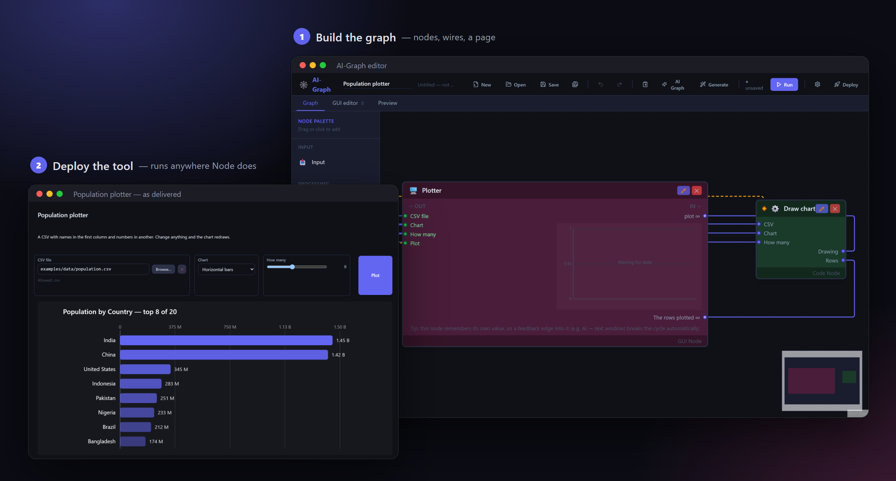

<div align="center">

# AI-Graph

**Wire nodes on a canvas into an AI workflow — then hand the result to someone else<br>
as a tool that runs on their machine: offline, on a local model, with no account and no cloud bill.**

[Quick start](#quick-start) · [Examples](#the-examples) · [Documentation](#documentation) · [Licence](#licence)



</div>

---

## Why

| | |
|---|---|
| 🔒 **Your data stays on the machine** | Ollama and LM Studio are the default, not a fallback. Everything binds to `127.0.0.1`, and there is no telemetry. Contracts, records or personnel files are processed where they already are. |
| 💶 **It is free to run** | A 7B model on an ordinary workstation classifies, extracts, summarises and rewrites. Where that is not enough, pin *one* node to a paid provider instead of moving the whole pipeline into the cloud. |
| ✨ **No AI expertise required** | Describe in plain language what a node should do, and ✨ Generate writes the system prompt or the JavaScript. No prompt engineering, no vector store, no framework, no glue code. |
| 🚀 **You ship a tool, not a prototype** | 🚀 Deploy packages the graph with the real execution engine. The recipient needs Node and nothing else, and the code nodes run there too. A graph with `gui` nodes deploys *with its interface*. |
| 🔍 **Nothing is hidden** | Typed ports say what flows between nodes, generated code stays visible and editable, graphs are plain JSON, and a node's body can live in its own `.js`/`.md` file beside the graph — so `git diff` reads like text. |

> **The cheap option is the private one.** Running locally costs nothing *and* keeps the
> data where it is; the two are not a trade-off.

## What is different about it

- **Cloud is the opt-in, not the default.** In most workflow builders local execution is
  something you assemble; here it is the state you start in.
- **A deploy bundle vendors the engine, not generated code**, so a deployed graph
  behaves identically to the one in the editor — the same components, verbatim.
- **A graph can carry its own interface.** `gui` nodes build a file picker, text window
  or plot from widgets, and the node's ports are always derived from them.

## Use Cases

- **Document batch processing** — a directory of files, a Code/AI node that extracts or
  summarises each one, an Output node that writes the results back to disk.
- **Charts from your own data** — a CSV, a Code node that draws it, a page with a
  dropdown and a slider that redraw it; see [examples/population_plotter.json](examples/population_plotter.json).
- **Local-LLM chat or report tool** — an AI node on Ollama/LM Studio fed by a file input,
  paired with a `gui` node's `text_io` widget: a runnable front-end with zero UI code.
- **A graph as a standalone tool** — once it works in the editor, 🚀 Deploy hands a
  non-technical user or a CI job something that runs without the AI-Graph editor at all.

## Privacy and local processing

Nothing leaves the machine unless the graph itself sends it there.

- The editor and a deployed bundle bind to `127.0.0.1` — reachable from the machine
  itself, not from the network — unless started with `--host` for a container.
- The file browser is tied to that bind: on anything but loopback it switches itself
  off rather than hand the machine's filesystem listing to the network
  (`engine/src/host/serve.ts`).
- No analytics or phone-home calls exist in the code; the only outbound connections are
  the ones your graph is configured to make.
- API keys are write-only, and the code-generation AI belongs to your browser rather
  than to the graph — a graph you hand on carries neither a key nor a model choice of
  yours.
- A deploy bundle runs offline: the engine, `graph.json` and a local
  `~/.ai-graph/code-env`. A graph on a local model works with no internet access at all.

---

## What's in it

- **Visual graph editor** — a ReactFlow canvas with undo/redo; drop a graph `.json` on
  the window to open it, the way the files in `examples/` load.
- **Six node types** — Input (text/file/directory), AI, Code (JavaScript), Data,
  GUI, Output.
- **AI generation** — a node's code or system prompt, a plot transform, or an entire
  graph, written from a plain-language description and left visible and editable. Code
  generation starts from a typed skeleton of the node's real ports — the types and
  example values come from the last run — and the result is executed once and repaired
  before you ever see it.
- **Graph DSL** — versioned JSON with typed ports (`data_type`, `multi`, `format`), so a
  node's inputs and outputs are never ambiguous.
- **Execution engine** — topological order with per-node status, batch items run
  concurrently, a failed item is reported as `partial` while the rest continue, transient
  AI failures are retried, and Stop ends the work rather than just stopping watching it.
  The toolbar counts items *within* the running node and says when a model has gone quiet,
  so a long batch is never mistaken for a hang — and a model that answers with nothing at
  all fails the node instead of quietly passing an empty string on.
- **A project is a graph plus one file per node** — code, prompts and format contracts
  live in `.js`/`.md` files beside the graph, so a language server and `git diff`
  both work on them.
- **GUI nodes** — a page built like a document: type headings in place, press `/` to
  insert a chat, a file picker, a dropdown, a chart or a table, and deploy it together
  with the graph.
- **Triggers** — a graph starts when the tool opens, on a clock, or from its own page: a
  button, a chat message or a dropdown starts the graph *at the node it is wired to*, so
  one page can hold several tools.
- **A prompt you can see** — an AI node shows the exact request the model will get,
  tries it with ▶ Test, and can learn its output format from an answer you liked.
- **Tools (MCP)** — an AI node can call the tools of MCP servers while it answers.
- **A real editor** — code and prompts are written in CodeMirror, full-window on ⤢, or
  in your own editor with one click.
- **Try it, the same way everywhere** — an AI node, a code node and a chart's transform
  are each tried in the same panel: get the inputs from the graph, press ▶ Test, see what
  comes out (a chart is drawn). The same values are what ✨ Generate is written and
  verified against.
- **An MCP server** — `--mcp` lets Claude Code or Claude Desktop generate, validate, save
  and run graphs, confined to one folder.
- **Deployment** — a self-contained bundle, a Docker Compose stack, or one executable.
- **Graph Runner CLI** — run any saved graph from the command line.

## The examples

`examples/` holds the graphs, `examples/data/` the files they start on. Open one with
**Open**, or drop it onto the editor window.

| Graph | What it shows | Needs a model |
|---|---|---|
| [population_plotter.json](examples/population_plotter.json) | A page that plots a CSV as bars, columns or a donut; dropdown, slider and file picker each redraw it at once | no |
| [chat.json](examples/chat.json) | A chatbot in two nodes: a chat block and a model, with a message template laying out history and message | yes |
| [file_summarizer.json](examples/file_summarizer.json) | Read a file and summarize it; each control on the page starts the graph where it is wired to | yes |
| [folder_summaries.json](examples/folder_summaries.json) | Summarize every file in a folder, one call per file, then what they have in common; results in a table | yes |

**Every example is held to the same three things by the test suite**
(`engine/src/examples.test.ts`), and an example added to the folder is held to them
without anyone listing it: it runs with a click on **▶ Run** on nothing but its own
defaults; its page events run what they are wired to; and it can be **deployed** — written
as a bundle into an empty folder and run from there, with the files it starts on carried
along.

They are written by `node scripts/make-examples.mjs`, so their code is
real JavaScript rather than a hand-escaped JSON string; change them there. The ones that
need a model name Google's `gemini-flash-lite-latest` on the node itself — put a key in
`ai-settings.json` (see [docs/ai-providers.md](docs/ai-providers.md)), or pick another
model under the node's *Advanced*; a local LM Studio or Ollama works too.

A path inside a graph resolves against the working directory, so run the examples from
the repository root:

```bash
node engine/src/main.ts examples/population_plotter.json
```

## Quick start

```bash
git clone https://github.com/Archimedes79/AI_Graph.git
cd AI_Graph
.\start.ps1       # Windows, PowerShell (bare `start` is a PowerShell command, not this)
start.cmd          # Windows, cmd -- double-clicking it works too
./start.sh         # macOS, Linux
```

That installs on first use, builds the page, and opens the editor. Node 24 or newer,
nothing else. By hand it is `npm ci`, `npm run build`, `npm start`. The editor opens at <http://127.0.0.1:8000>. `npm run
dev` is the same with live reload; `docker compose up --build` the same in a container
beside Ollama. Details in [docs/install.md](docs/install.md).

**Running a graph needs no editor at all:**

```bash
node engine/src/main.ts examples/population_plotter.json  # once
node engine/src/main.ts my.json --serve                   # with its page
node engine/src/main.ts my.json --bundle ./out            # to hand to someone
```

## Documentation

| Document | What is in it |
|---|---|
| [docs/install.md](docs/install.md) | Running the editor, working on it, containers, tests and CI |
| [docs/graphs.md](docs/graphs.md) | The Graph DSL, code and AI nodes, GUI nodes and widgets |
| [docs/ai-providers.md](docs/ai-providers.md) | Providers, the two AI settings, where the API key goes |
| [docs/deployment.md](docs/deployment.md) | Deploy bundles, Docker, the Graph Runner CLI |
| [docs/mcp-server.md](docs/mcp-server.md) | Letting Claude (or any MCP client) generate, check, save and run graphs |
| [docs/architecture.md](docs/architecture.md) | How the pieces fit, the rules that hold them together, and the known debt; diagrams mapped to files in [arch/](arch/overview.md) |

## Project structure

```
AI-Graph/
├── engine/src/             # Runs a graph, serves the editor, ships as a bundle. No React.
│   ├── elements/           #   one folder per element: nodes/<kind>/<Kind>NodeElement.ts, widgets/<kind>/<Kind>WidgetElement.ts
│   ├── execution/          #   the executor and what starts a run
│   ├── authoring/          #   how an element's body is written, kept and run
│   └── host/  ai/  cli/    #   the server and its contract, model providers, the command line
├── editor/src/             # The page: React + ReactFlow, built on the engine
│   ├── elements/           #   the same folders: <Kind>NodeUi.ts, <Kind>WidgetView.tsx, <Kind>…Panel.tsx
│   ├── authoring/          #   ✨ Generate, Try it, the live transcript
│   └── app/  canvas/  page/  store/  api/  runtime/  ui/
├── examples/               # Example graph JSON files
├── docs/                   # The documents linked above
├── arch/                   # Architecture diagrams, every box mapped to its files
├── scripts/dev.mjs         # npm run dev: engine and Vite in one terminal
└── Dockerfile              # docker compose up: the editor beside Ollama
```

---

## Licence

AI-Graph is **source-available, not open source**: [PolyForm Noncommercial
1.0.0](LICENSE).

- Any **noncommercial** use is permitted — personal, research, teaching, and
  noncommercial organisations. Use it, change it, share it.
- **Commercial use needs a separate licence** from the copyright holder. Open an
  issue to ask for one.

**What you build with AI-Graph is yours.** Your graph, and the code generated
into it, belong to you. A deploy bundle contains nothing but that plus the
runtime engine — no part of the editor (the canvas, the generator, the deploy
tool itself) ever travels in one, and `engine/src/cli/bundle.test.ts`
fails if one starts to. Every bundle carries a copy of the licence, because
whoever receives the software has to receive the terms with it.

Licensing is not final. If you want to use AI-Graph commercially, open an
issue — that conversation is welcome.
