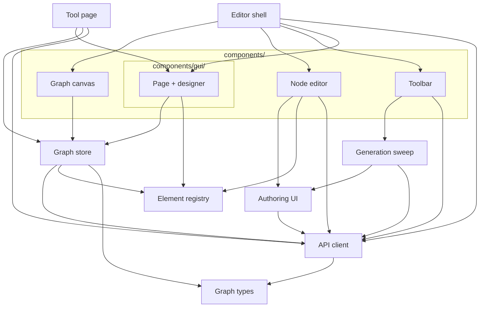

<!-- last verified: 2026-09-19 -->
# Browser — editor/src

The page side of the wire. Two entry points share one set of modules: the editor
(`main.tsx` → `App.tsx`) and the deployed tool's page (`runtime/main.tsx` →
`RuntimeApp.tsx`), which must not reach any editing module. Back to the [overview](overview.md).

| Diagram node | Path | Notes |
|---|---|---|
| `Editor shell` | [`editor/src/App.tsx`](../editor/src/App.tsx), [`main.tsx`](../editor/src/main.tsx) | views (graph · page designer · preview), open/save, drop a file |
| `Tool page` | [`editor/src/runtime/RuntimeApp.tsx`](../editor/src/runtime/RuntimeApp.tsx), [`RuntimeAISettings.tsx`](../editor/src/runtime/RuntimeAISettings.tsx) | the deployed tool; [`boundary.test.ts`](../editor/src/runtime/boundary.test.ts) keeps editor modules out |
| `Graph canvas` | [`editor/src/components/GraphCanvas.tsx`](../editor/src/components/GraphCanvas.tsx), [`nodes/`](../editor/src/components/nodes/) | ReactFlow |
| `Node editor` | [`editor/src/components/NodeEditor.tsx`](../editor/src/components/NodeEditor.tsx) | hosts the element's own config panel |
| `Toolbar` | [`editor/src/components/Toolbar.tsx`](../editor/src/components/Toolbar.tsx) | run, AI Graph, Generate (sweep), deploy |
| `Page + designer` | [`editor/src/components/gui/`](../editor/src/components/gui/) | `GuiPage.tsx` draws a page (shared with the tool page); `DesignerTab.tsx` edits it; `widgets/` one component per block kind |
| `Graph store` | [`editor/src/store/graphStore.ts`](../editor/src/store/graphStore.ts) | the open graph, undo, runs (start → poll `run` → replay `memory`) |
| `Element registry` | [`editor/src/elements/registry.ts`](../editor/src/elements/registry.ts), [`types.ts`](../editor/src/elements/types.ts) | the browser halves, imported from `engine/src/elements/*/editor/definition.ts` |
| `Authoring UI` | [`editor/src/elements/shared/`](../editor/src/elements/shared/) | `AuthoredBodyEditor`, `TryItPanel`, `useGenerate`, `LiveGeneration`, `generation.ts` |
| `Generation sweep` | [`editor/src/services/`](../editor/src/services/) | generate a whole graph node by node, each against the one before |
| `API client` | [`editor/src/utils/api.ts`](../editor/src/utils/api.ts) | the contract's client: `call(route, request)` |
| `Graph types` | [`editor/src/types/graphModel.ts`](../editor/src/types/graphModel.ts), [`graph.ts`](../editor/src/types/graph.ts) | the engine's types plus the typed `NodeConfig` view |

Not drawn: the store and [`utils/guiWidgets.ts`](../editor/src/utils/guiWidgets.ts) import
engine code directly (`@engine/graph.ts`, `@engine/registry.ts`, `@engine/triggers.ts`) —
ports and triggers are the engine's answer, computed in the browser, not a copy of it.
