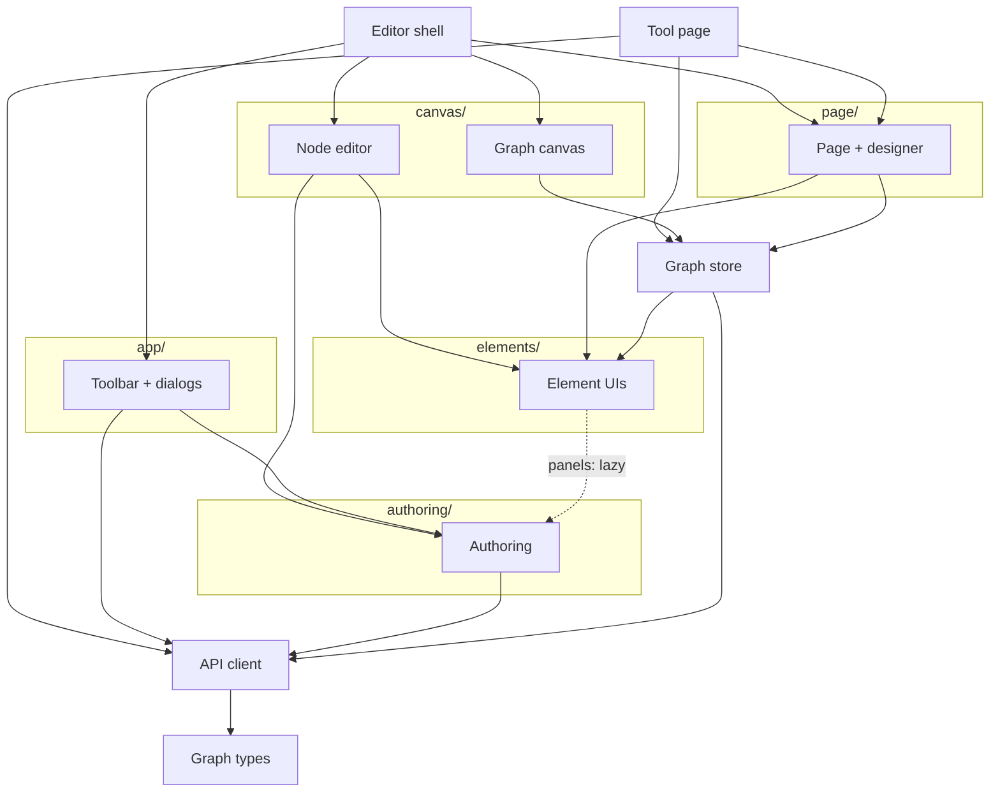

<!-- last verified: 2026-09-19 -->
# Browser — editor/src

The page side of the wire. Two entry points share one set of modules: the editor
(`main.tsx` → `App.tsx`) and the deployed tool's page (`runtime/main.tsx` →
`RuntimeApp.tsx`), which reaches element views but never a panel or an editing module.
Back to the [overview](overview.md).

| Diagram node | Path | Notes |
|---|---|---|
| `Editor shell` | [`editor/src/App.tsx`](../editor/src/App.tsx), [`main.tsx`](../editor/src/main.tsx) | views (graph · page designer · preview), open/save, drop a file |
| `Tool page` | [`editor/src/runtime/`](../editor/src/runtime/) | `RuntimeApp.tsx`, `RuntimeAISettings.tsx` (read-only); [`boundary.test.ts`](../editor/src/runtime/boundary.test.ts) keeps panels and editing modules out |
| `Toolbar + dialogs` | [`editor/src/app/`](../editor/src/app/) | `Toolbar.tsx` (run, AI Graph, Generate, deploy), `Sidebar.tsx`, `SettingsDialog.tsx`, `ResultsPanel.tsx`, `ViewTabs.tsx` |
| `Graph canvas` | [`editor/src/canvas/GraphCanvas.tsx`](../editor/src/canvas/GraphCanvas.tsx), [`GraphNodeView.tsx`](../editor/src/canvas/GraphNodeView.tsx) | ReactFlow; `nodeData.ts`, `nodeRemoval.ts`, `ConnectorEditor.tsx` |
| `Node editor` | [`editor/src/canvas/NodeEditor.tsx`](../editor/src/canvas/NodeEditor.tsx) | draws the element's own `Panel` and `AdvancedPanel` |
| `Page + designer` | [`editor/src/page/`](../editor/src/page/) | `GuiPage.tsx` draws a page (shared with the tool page); `DesignerTab.tsx`, `WidgetEditor.tsx`, `layout.ts`, `scheme.ts`, `tone.ts` |
| `Element UIs` | [`editor/src/elements/`](../editor/src/elements/) | `registry.ts`, `Ui.ts`, one folder per element — see [elements](elements.md) |
| `Authoring` | [`editor/src/authoring/`](../editor/src/authoring/) | `AuthoredBodyEditor`, `TryItPanel`, `useGenerate`, `LiveGeneration`, `generation.ts`, the page-wide sweep (`graphSweep.ts`) |
| `Graph store` | [`editor/src/store/graphStore.ts`](../editor/src/store/graphStore.ts) | the open graph, undo, runs (start → poll `run` → replay `memory`); `settingsStore.ts` |
| `API client` | [`editor/src/api/client.ts`](../editor/src/api/client.ts) | the contract's client: `call(route, request)`, `ApiError`; `errorText.ts` |
| `Graph types` | [`editor/src/graph.ts`](../editor/src/graph.ts) | the engine's types plus the typed `NodeConfig` view |

Not drawn: [`ui/`](../editor/src/ui/) (theme, `Modal`, `Markdown`, `FileBrowserDialog`,
`RequirementsDialog`), used everywhere; and the store's and `guiWidgets.ts`'s direct imports
of engine code (`@engine/graph.ts`, `@engine/elements/registry.ts`,
`@engine/execution/triggers.ts`) — ports and triggers are the engine's answer, computed in
the browser, not a copy of it.
