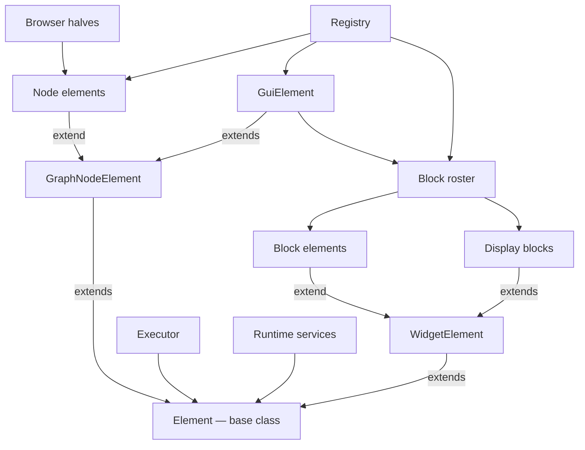

<!-- last verified: 2026-09-19 -->
# Elements — engine/src/elements

What a node or a block *is*. One class per node type and per block kind, each in its own
folder with its browser half beside it under `editor/`. Shared code asks the element and
never switches on a type name. Back to the [overview](overview.md).

| Diagram node | Path | Notes |
|---|---|---|
| `Element — base class` | [`engine/src/element.ts`](../engine/src/element.ts) | `Element<Subject, Config>`: `config()`, ports, `execute()`, `generation()`, `catchesErrors()`; also the `Runtime` service interfaces |
| `GraphNodeElement` | [`engine/src/element.ts`](../engine/src/element.ts) | a node: `derivedPorts`, `display`, `runtimeRequirements`, `settleMemory`, declarations the executor reads |
| `WidgetElement` | [`engine/src/element.ts`](../engine/src/element.ts) | a block: `ports`, `firesRun`, `settle`, `displayValue`; `StaticWidget`, `DisplayWidget` |
| `Node elements` | [`input/`](../engine/src/elements/input/element.ts), [`ai/`](../engine/src/elements/ai/element.ts), [`code/`](../engine/src/elements/code/element.ts), [`data/`](../engine/src/elements/data/element.ts), [`output/`](../engine/src/elements/output/element.ts) | `InputElement`, `AiElement` (+ [`prompt.ts`](../engine/src/elements/ai/prompt.ts)), `CodeElement`, `DataElement`, `OutputElement` |
| `GuiElement` | [`engine/src/elements/gui/element.ts`](../engine/src/elements/gui/element.ts) | a page: a composite of blocks; its ports are theirs (`derivedPorts`), `parseWidget` |
| `Block elements` | [`engine/src/elements/gui/children/<kind>/element.ts`](../engine/src/elements/gui/children/) | picker, text box, dropdown, slider, button, chat; text, divider, spacer |
| `Display blocks` | [`engine/src/elements/gui/children/display.ts`](../engine/src/elements/gui/children/display.ts) | `TransformingDisplay`: chart ([`plot_window/`](../engine/src/elements/gui/children/plot_window/), with `check.ts`), table, image |
| `Block roster` | [`engine/src/elements/gui/children/index.ts`](../engine/src/elements/gui/children/index.ts) | `WIDGET_ELEMENTS`: adding a block kind is one line here |
| `Registry` | [`engine/src/registry.ts`](../engine/src/registry.ts) | node type / block kind → element; adding a node type is one line here |
| `Executor` | [`engine/src/executor.ts`](../engine/src/executor.ts) | reads each element's declarations and runs it; knows no type names |
| `Runtime services` | [`engine/src/host/node.ts`](../engine/src/host/node.ts) | implements `Runtime` (`files`, `code`, `ai`, `tools`) for Node; tests pass fakes |
| `Browser halves` | `engine/src/elements/*/editor/` ([`definition.ts`](../engine/src/elements/ai/editor/definition.ts), `Editor.tsx`) | config panels and block widgets; collected by [`editor/src/elements/registry.ts`](../editor/src/elements/registry.ts); excluded from engine typecheck and bundles |

Shared building blocks, not drawn: [`generation.ts`](../engine/src/generation.ts) (how an
AI writes an element's body), [`logic.ts`](../engine/src/logic.ts) (where the body is kept
and who runs it), [`elements/port.ts`](../engine/src/elements/port.ts).
