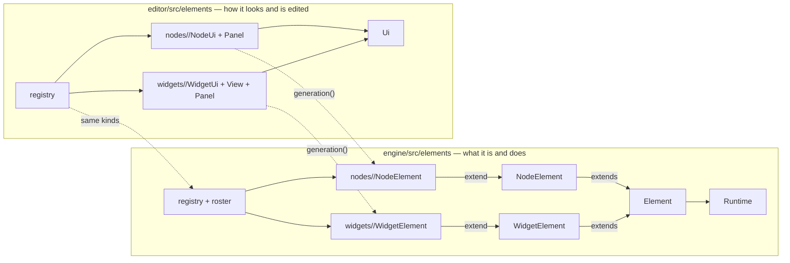

<!-- last verified: 2026-09-19 -->
# Elements — engine/src/elements ⇄ editor/src/elements

What a node or a widget *is*, and how it looks and is edited. One folder per element, at the
same relative path on both sides: the engine half says what it is and does, the editor half
how it looks (`View`), how it is edited (`Panel`) and what the shells ask of it (`<Kind>Ui.ts`).
[`symmetry.test.ts`](../editor/src/elements/symmetry.test.ts) keeps the two sides in step.
Back to the [overview](overview.md).

| Diagram node | Path | Notes |
|---|---|---|
| `Element` | [`engine/src/elements/Element.ts`](../engine/src/elements/Element.ts) | `config()`, `logic()`, `generation()`, `catchesErrors()`, `deployNeeds()`, `runSnippet()` |
| `NodeElement` | [`engine/src/elements/NodeElement.ts`](../engine/src/elements/NodeElement.ts) | a node: `derivedPorts`, `execute`, `display`, `runtimeRequirements`, `settleMemory`, and what the executor reads (`batchMode`, `readsFileInputs`, …) |
| `WidgetElement` | [`engine/src/elements/WidgetElement.ts`](../engine/src/elements/WidgetElement.ts) | a widget on a page: `ports`, `execute`, `firesRun`, `settle`, `displayValue`; `Widget`, `WidgetPresentation` |
| `nodes/<kind>/<Kind>NodeElement` | [`engine/src/elements/nodes/`](../engine/src/elements/nodes/) | `InputNodeElement`, `AiNodeElement` (+ `prompt.ts`), `CodeNodeElement`, `DataNodeElement`, `OutputNodeElement`, `GuiNodeElement` (a composite of widgets; `parseWidget`) |
| `widgets/<kind>/<Kind>WidgetElement` | [`engine/src/elements/widgets/`](../engine/src/elements/widgets/) | 12 kinds; bases [`StaticWidgetElement`](../engine/src/elements/widgets/StaticWidgetElement.ts), [`DisplayWidgetElement`](../engine/src/elements/widgets/DisplayWidgetElement.ts), [`TransformingDisplayElement`](../engine/src/elements/widgets/TransformingDisplayElement.ts); chart check in [`plot_window/check.ts`](../engine/src/elements/widgets/plot_window/check.ts) |
| `registry + roster` | [`engine/src/elements/registry.ts`](../engine/src/elements/registry.ts), [`widgets/roster.ts`](../engine/src/elements/widgets/roster.ts) | node type / widget kind → element; one line each to add a kind |
| `Runtime` | [`engine/src/elements/Runtime.ts`](../engine/src/elements/Runtime.ts) | the services an element is handed: `files`, `code`, `ai`, `tools`; implemented for Node in [`host/node.ts`](../engine/src/host/node.ts) |
| `Ui` | [`editor/src/elements/Ui.ts`](../editor/src/elements/Ui.ts) | `NodeUi`, `WidgetUi`, and the props every panel is handed (`NodePanelProps`, `WidgetPanelProps`) |
| `nodes/<kind>/<Kind>NodeUi + Panel` | [`editor/src/elements/nodes/`](../editor/src/elements/nodes/) | `AiNodeUi.ts`, `AiNodePanel.tsx`, `AiNodeAdvancedPanel.tsx`, …; panels registered lazily |
| `widgets/<kind>/<Kind>WidgetUi + View + Panel` | [`editor/src/elements/widgets/`](../editor/src/elements/widgets/) | `SelectWidgetUi.ts`, `SelectWidgetView.tsx`, `SelectWidgetPanel.tsx`, …; views are what a deployed tool draws |
| `registry` (editor) | [`editor/src/elements/registry.ts`](../editor/src/elements/registry.ts) | `NODE_UIS`, `WIDGET_UIS` |

Shared by elements, not drawn: [`authoring/generation.ts`](../engine/src/authoring/generation.ts)
(how an AI writes a body), [`authoring/logic.ts`](../engine/src/authoring/logic.ts) (where a
body is kept and who runs it), [`elements/port.ts`](../engine/src/elements/port.ts),
[`elements/fileSelection.ts`](../engine/src/elements/fileSelection.ts); on the editor side
[`elements/fields/`](../editor/src/elements/fields/) (settings several panels share) and
[`elements/nodes/gui/guiWidgets.ts`](../editor/src/elements/nodes/gui/guiWidgets.ts) (a page's
widgets and the ports the engine derives from them).
