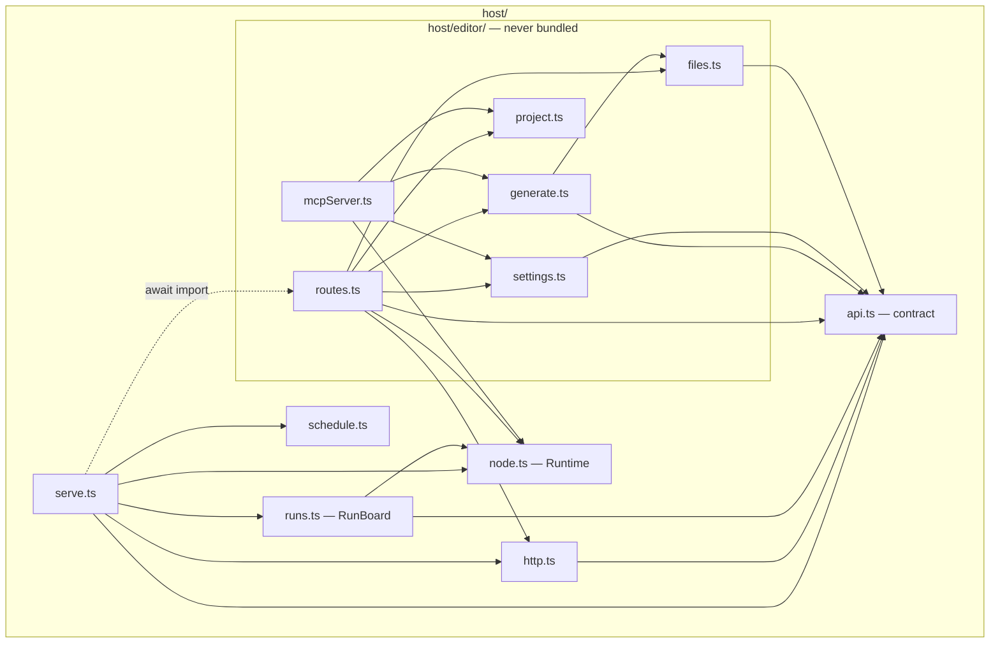

<!-- last verified: 2026-09-19 -->
# Server — engine/src/host

The Node side of the wire. `serve.ts` answers the routes of the contract; the `tool` rows
live beside it, the `editor` rows in `host/editor/`, which is loaded only when the server
is the editor and is never copied into a bundle. Back to the [overview](overview.md).

| Diagram node | Path | Notes |
|---|---|---|
| `api.ts — contract` | [`engine/src/host/api.ts`](../engine/src/host/api.ts) | `API` table, `RequestOf`/`ResponseOf`, `matchRoute`, `pathFor`; wire types (`RunSnapshot`, `AICall`, `SettingsStatus`, …) |
| `http.ts` | [`engine/src/host/http.ts`](../engine/src/host/http.ts) | `Refusal` (thrown with a status), `Download`, `Handler`/`Handlers`, JSON and byte bodies, static page |
| `serve.ts` | [`engine/src/host/serve.ts`](../engine/src/host/serve.ts) | `serve()`: dispatch by the table; `toolRoutes()`: graph, schedule, AI settings (read-only), requirements, run/watch/stop, browse |
| `runs.ts — RunBoard` | [`engine/src/host/runs.ts`](../engine/src/host/runs.ts) | runs in flight: start, snapshot, stop, forget after 5 min |
| `schedule.ts` | [`engine/src/host/schedule.ts`](../engine/src/host/schedule.ts) | on start / every N; `ScheduleState` |
| `node.ts — Runtime` | [`engine/src/host/node.ts`](../engine/src/host/node.ts) | `nodeFiles`, `nodeCode` (sandboxed `node --permission`), `nodeRuntime()` |
| `routes.ts` | [`engine/src/host/editor/routes.ts`](../engine/src/host/editor/routes.ts) | `editorRoutes()`: try a node/block, project files, generation + live transcripts, bundle, settings, attachments |
| `generate.ts` | [`engine/src/host/editor/generate.ts`](../engine/src/host/editor/generate.ts) | write → run on a sample → check → repair once; `generateGraph` with [`graphPrompt.ts`](../engine/src/host/editor/graphPrompt.ts) |
| `project.ts` | [`engine/src/host/editor/project.ts`](../engine/src/host/editor/project.ts) | a graph plus one file per authored body; conflict check (`FileChanged`) |
| `settings.ts` | [`engine/src/host/editor/settings.ts`](../engine/src/host/editor/settings.ts) | the settings dialog's view of `ai-settings.json`; which model generates |
| `files.ts` | [`engine/src/host/editor/files.ts`](../engine/src/host/editor/files.ts) | directory browsing, attachments, format detection, open in own editor |
| `mcpServer.ts` | [`engine/src/host/editor/mcpServer.ts`](../engine/src/host/editor/mcpServer.ts) | `--mcp`: graph tools for Claude, confined to one folder; started from [`cli.ts`](../engine/src/cli.ts) |

Not drawn: every handler also calls into `executor.ts`, `registry.ts` and `graph.ts`
(see the [overview](overview.md)); `zip.ts` and `skeleton.ts` are small helpers of
`routes.ts` and `generate.ts`/`project.ts`.
