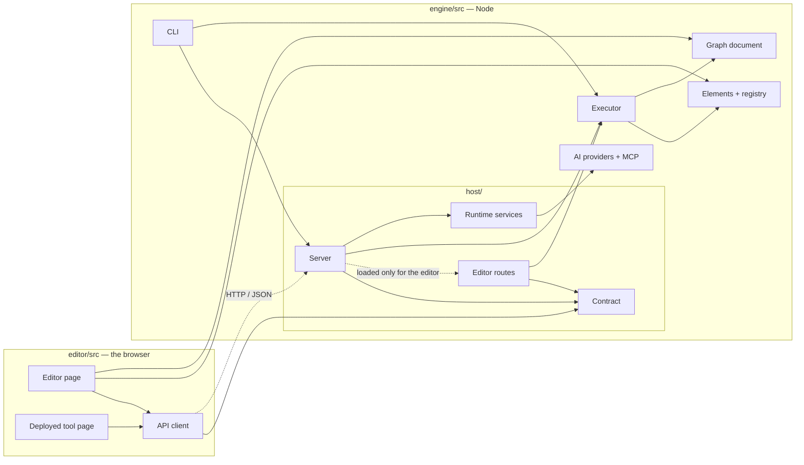

<!-- last verified: 2026-09-19 -->
# AI-Graph — overview

Two processes: **Node** runs graphs, **the browser** draws them. They talk over HTTP,
and the conversation is one table both ends import: the contract. Detail diagrams:
[server](engine-host.md) · [browser](editor.md) · [elements](elements.md).

| Diagram node | Path | Notes |
|---|---|---|
| `Editor page` | [`editor/src/App.tsx`](../editor/src/App.tsx), [`app/`](../editor/src/app/), [`canvas/`](../editor/src/canvas/), [`page/`](../editor/src/page/), [`authoring/`](../editor/src/authoring/), [`store/`](../editor/src/store/) | canvas, node editor, page designer; entry `editor/src/main.tsx` |
| `Deployed tool page` | [`editor/src/runtime/`](../editor/src/runtime/) | entry `runtime/main.tsx` → `runtime.html`; may not reach editor-only modules (`runtime/boundary.test.ts`) |
| `API client` | [`editor/src/api/client.ts`](../editor/src/api/client.ts) | `call(route, request)`; `ApiError`; `EditorView` narrows returned graphs |
| `Contract` | [`engine/src/host/api.ts`](../engine/src/host/api.ts) | every route: method, path, `tool`/`editor`, request and response types |
| `Server` | [`engine/src/host/serve.ts`](../engine/src/host/serve.ts), [`http.ts`](../engine/src/host/http.ts), [`runs.ts`](../engine/src/host/runs.ts), [`schedule.ts`](../engine/src/host/schedule.ts) | serves the page and the `tool` routes; refuses to start if a route has no handler |
| `Editor routes` | [`engine/src/host/editor/routes.ts`](../engine/src/host/editor/routes.ts) | the `editor` routes; dynamic import, never in a bundle |
| `Runtime services` | [`engine/src/host/node.ts`](../engine/src/host/node.ts) | files, sandboxed code, models, tools: the `Runtime` handed to elements |
| `CLI` | [`engine/src/main.ts`](../engine/src/main.ts), [`engine/src/cli/cli.ts`](../engine/src/cli/cli.ts) | run once / on a clock / `--serve` / `--bundle` / `--mcp` / `--editor` |
| `Executor` | [`engine/src/execution/`](../engine/src/execution/): `executor.ts`, `triggers.ts`, `batching.ts` | order, fan-out, memory, displays, stopping |
| `Elements + registry` | [`engine/src/elements/`](../engine/src/elements/), and its mirror [`editor/src/elements/`](../editor/src/elements/) | one class per node type and widget kind, mirrored file for file; see [elements](elements.md) |
| `Graph document` | [`engine/src/graph.ts`](../engine/src/graph.ts), [`editor/src/graph.ts`](../editor/src/graph.ts) | the engine's types; the editor adds only the typed `NodeConfig` view |
| `AI providers + MCP` | [`engine/src/ai/`](../engine/src/ai/) | providers, `ai-settings.json`, MCP client |

The page also runs engine code directly — elements for ports and previews, the graph
types — which is why `Editor page` has arrows into `Elements` and `Graph` without HTTP.
The bundle a deployed tool ships is `engine/src` minus every `editor/` folder, plus the
built `runtime.html` ([`engine/src/cli/bundle.ts`](../engine/src/cli/bundle.ts)).
