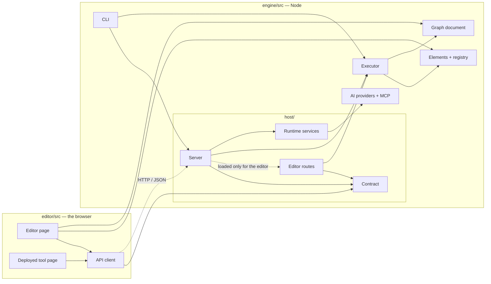
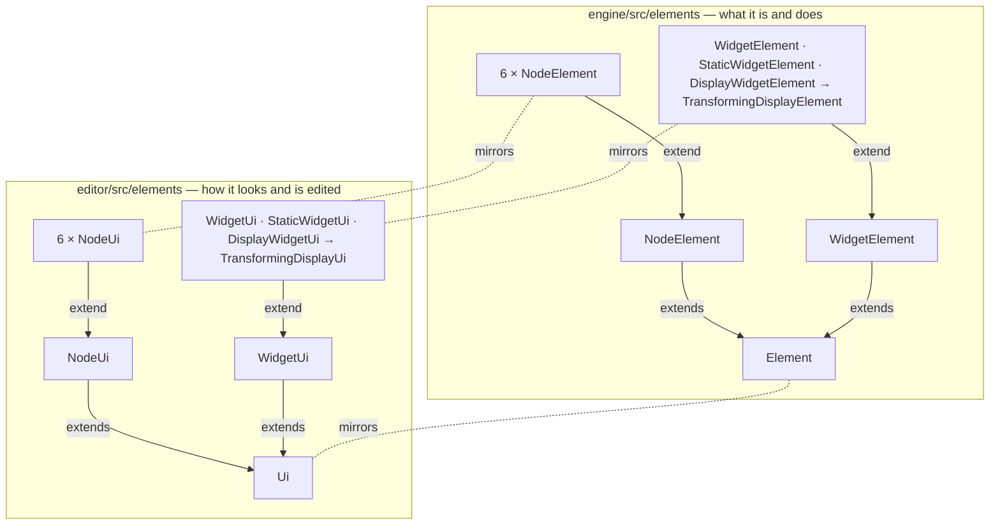
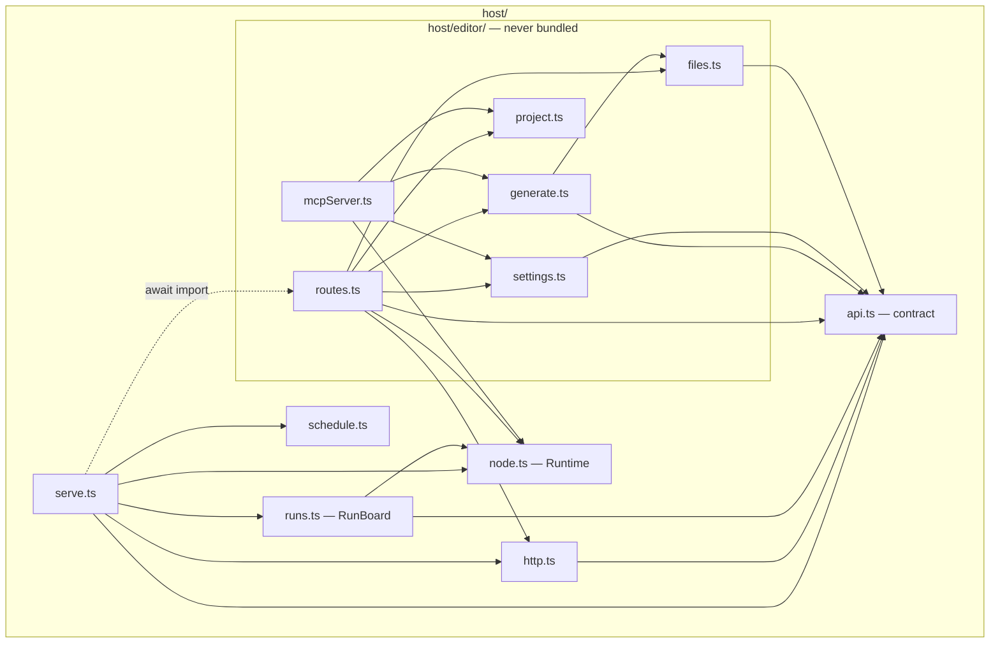
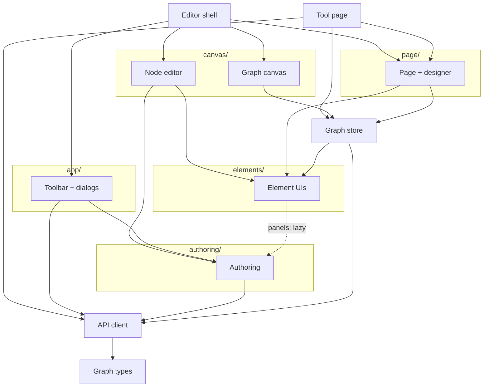

<!-- last verified: 2026-09-19 -->
# AI-Graph — architecture diagrams

Four diagrams, each with a table that maps every box to its files: [the whole](#the-whole),
[elements](#elements), [server](#server), [browser](#browser). The prose that explains them
is [docs/architecture.md](../docs/architecture.md).

## The whole

Two processes: **Node** runs graphs, **the browser** draws them. They talk over HTTP,
and the conversation is one table both ends import: the contract.

| Diagram node | Path | Notes |
|---|---|---|
| `Editor page` | [`editor/src/App.tsx`](../editor/src/App.tsx), [`app/`](../editor/src/app/), [`canvas/`](../editor/src/canvas/), [`page/`](../editor/src/page/), [`authoring/`](../editor/src/authoring/), [`store/`](../editor/src/store/) | canvas, node editor, page designer; entry `editor/src/main.tsx` |
| `Deployed tool page` | [`editor/src/runtime/`](../editor/src/runtime/) | entry `runtime/main.tsx` → `runtime.html`; may not reach editor-only modules (`runtime/boundary.test.ts`) |
| `API client` | [`editor/src/api/client.ts`](../editor/src/api/client.ts) | `call(route, request)`; `ApiError`; `EditorView` narrows returned graphs |
| `Contract` | [`engine/src/host/api.ts`](../engine/src/host/api.ts) | every route: method, path, `tool`/`editor`, request and response types |
| `Server` | [`engine/src/host/serve.ts`](../engine/src/host/serve.ts), [`http.ts`](../engine/src/host/http.ts), [`runs.ts`](../engine/src/host/runs.ts), [`schedule.ts`](../engine/src/host/schedule.ts) | serves the page and the `tool` routes; refuses to start if a route has no handler |
| `Editor routes` | [`engine/src/host/editor/routes.ts`](../engine/src/host/editor/routes.ts) | the `editor` routes; dynamic import, never in a bundle |
| `Runtime services` | [`engine/src/host/node.ts`](../engine/src/host/node.ts) | files, sandboxed code, models, tools: the `Runtime` handed to elements |
| `CLI` | [`engine/src/main.ts`](../engine/src/main.ts), [`engine/src/cli/cli.ts`](../engine/src/cli/cli.ts) | run once / on a clock / `--serve` / `--bundle` / `--mcp` / `--editor` |
| `Executor` | [`engine/src/execution/`](../engine/src/execution/): `executor.ts`, `triggers.ts`, `batching.ts` | order, fan-out, memory, displays, stopping |
| `Elements + registry` | [`engine/src/elements/`](../engine/src/elements/), and its mirror [`editor/src/elements/`](../editor/src/elements/) | one class per node type and widget kind, mirrored file for file; see [elements](#elements) |
| `Graph document` | [`engine/src/graph.ts`](../engine/src/graph.ts), [`editor/src/graph.ts`](../editor/src/graph.ts) | the engine's types; the editor adds only the typed `NodeConfig` view |
| `AI providers + MCP` | [`engine/src/ai/`](../engine/src/ai/) | providers, `ai-settings.json`, MCP client |

The page also runs engine code directly — elements for ports and previews, the graph
types — which is why `Editor page` has arrows into `Elements` and `Graph` without HTTP.
The bundle a deployed tool ships is `engine/src` minus every `editor/` folder, plus the
built `runtime.html` ([`engine/src/cli/bundle.ts`](../engine/src/cli/bundle.ts)).

## Elements

What a node or a widget *is*, and how it looks and is edited. Two class hierarchies, one per
side, mirrored level for level: every engine class ends in `Element`, and its editor
counterpart swaps that for `Ui`, in the same folder. [`symmetry.test.ts`](../editor/src/elements/symmetry.test.ts)
compares the two lineages class by class.

| Diagram node | Path | Notes |
|---|---|---|
| `Element` | [`engine/src/elements/Element.ts`](../engine/src/elements/Element.ts) | `config()`, `logic()`, `generation()`, `catchesErrors()`, `deployNeeds()`, `runSnippet()`; services in [`Runtime.ts`](../engine/src/elements/Runtime.ts) |
| `NodeElement` | [`engine/src/elements/NodeElement.ts`](../engine/src/elements/NodeElement.ts) | `derivedPorts`, `execute`, `display`, `runtimeRequirements`, `settleMemory`, and what the executor reads |
| `WidgetElement` | [`engine/src/elements/WidgetElement.ts`](../engine/src/elements/WidgetElement.ts) | `ports`, `execute`, `firesRun`, `settle`, `displayValue` |
| `6 × <Kind>NodeElement` | [`engine/src/elements/nodes/`](../engine/src/elements/nodes/) | `nodes/<kind>/<Kind>NodeElement.ts`; listed in [`registry.ts`](../engine/src/elements/registry.ts) |
| `<Kind>WidgetElement …` | [`engine/src/elements/widgets/`](../engine/src/elements/widgets/) | 12 kinds, with [`StaticWidgetElement`](../engine/src/elements/widgets/StaticWidgetElement.ts), [`DisplayWidgetElement`](../engine/src/elements/widgets/DisplayWidgetElement.ts), [`TransformingDisplayElement`](../engine/src/elements/widgets/TransformingDisplayElement.ts); listed in [`widgets/roster.ts`](../engine/src/elements/widgets/roster.ts) |
| `Ui` | [`editor/src/elements/Ui.ts`](../editor/src/elements/Ui.ts) | `Panel` (lazy), `generation` |
| `NodeUi` | [`editor/src/elements/NodeUi.ts`](../editor/src/elements/NodeUi.ts) | `create(id)`, `label`, `icon`, `color`, `hint`, `AdvancedPanel`, `describeOutput`; `NodePanelProps` |
| `WidgetUi` | [`editor/src/elements/WidgetUi.ts`](../editor/src/elements/WidgetUi.ts) | `create(label, mode)`, `label`, `View`, `defaultSpan`, `defaultTone`, `runOnChangeHint`; `WidgetPanelProps` |
| `6 × <Kind>NodeUi` | [`editor/src/elements/nodes/`](../editor/src/elements/nodes/) | `nodes/<kind>/<Kind>NodeUi.ts` beside `<Kind>NodePanel.tsx`; listed in [`registry.ts`](../editor/src/elements/registry.ts) |
| `<Kind>WidgetUi …` | [`editor/src/elements/widgets/`](../editor/src/elements/widgets/) | `widgets/<kind>/<Kind>WidgetUi.ts` beside `<Kind>WidgetView.tsx` and, if it has settings, `<Kind>WidgetPanel.tsx`; [`TransformingDisplayUi`](../editor/src/elements/widgets/TransformingDisplayUi.ts) owns the one panel of chart, table and image; listed in [`widgets/roster.ts`](../editor/src/elements/widgets/roster.ts) |

Shared by elements, not drawn: [`authoring/generation.ts`](../engine/src/authoring/generation.ts)
and [`authoring/logic.ts`](../engine/src/authoring/logic.ts) on the engine side;
[`elements/fields/`](../editor/src/elements/fields/) (settings several panels share),
[`nodes/baseNodeConfig.ts`](../editor/src/elements/nodes/baseNodeConfig.ts) and
[`nodes/gui/guiWidgets.ts`](../editor/src/elements/nodes/gui/guiWidgets.ts) (a page's ports, as
the engine derives them) on the editor side.

## Server

The Node side of the wire. `serve.ts` answers the routes of the contract; the `tool` rows
live beside it, the `editor` rows in `host/editor/`, which is loaded only when the server
is the editor and is never copied into a bundle.

| Diagram node | Path | Notes |
|---|---|---|
| `api.ts — contract` | [`engine/src/host/api.ts`](../engine/src/host/api.ts) | `API` table, `RequestOf`/`ResponseOf`, `matchRoute`, `pathFor`; wire types (`RunSnapshot`, `AICall`, `SettingsStatus`, …) |
| `http.ts` | [`engine/src/host/http.ts`](../engine/src/host/http.ts) | `Refusal` (thrown with a status), `Download`, `Handler`/`Handlers`, JSON and byte bodies, static page |
| `serve.ts` | [`engine/src/host/serve.ts`](../engine/src/host/serve.ts) | `serve()`: dispatch by the table; `toolRoutes()`: graph, schedule, AI settings (read-only), requirements, run/watch/stop, browse |
| `runs.ts — RunBoard` | [`engine/src/host/runs.ts`](../engine/src/host/runs.ts) | runs in flight: start, snapshot, stop, forget after 5 min |
| `schedule.ts` | [`engine/src/host/schedule.ts`](../engine/src/host/schedule.ts) | on start / every N; `ScheduleState` |
| `node.ts — Runtime` | [`engine/src/host/node.ts`](../engine/src/host/node.ts) | `nodeFiles`, `nodeCode` (sandboxed `node --permission`), `nodeRuntime()` |
| `routes.ts` | [`engine/src/host/editor/routes.ts`](../engine/src/host/editor/routes.ts) | `editorRoutes()`: try a node/block, project files, generation + live transcripts, bundle, settings, attachments |
| `generate.ts` | [`engine/src/host/editor/generate.ts`](../engine/src/host/editor/generate.ts) | write → run on a sample → check → repair once; `generateGraph` with [`graphPrompt.ts`](../engine/src/host/editor/graphPrompt.ts) |
| `project.ts` | [`engine/src/host/editor/project.ts`](../engine/src/host/editor/project.ts) | a graph plus one file per authored body; conflict check (`FileChanged`) |
| `settings.ts` | [`engine/src/host/editor/settings.ts`](../engine/src/host/editor/settings.ts) | the settings dialog's view of `ai-settings.json`; which model generates |
| `files.ts` | [`engine/src/host/editor/files.ts`](../engine/src/host/editor/files.ts) | directory browsing, attachments, format detection, open in own editor |
| `mcpServer.ts` | [`engine/src/host/editor/mcpServer.ts`](../engine/src/host/editor/mcpServer.ts) | `--mcp`: graph tools for Claude, confined to one folder; started from [`cli/cli.ts`](../engine/src/cli/cli.ts) |

Not drawn: every handler also calls into `executor.ts`, `registry.ts` and `graph.ts`
(see the [overview](#the-whole)); `zip.ts` and `skeleton.ts` are small helpers of
`routes.ts` and `generate.ts`/`project.ts`.

## Browser

The page side of the wire. Two entry points share one set of modules: the editor
(`main.tsx` → `App.tsx`) and the deployed tool's page (`runtime/main.tsx` →
`RuntimeApp.tsx`), which reaches element views but never a panel or an editing module.

| Diagram node | Path | Notes |
|---|---|---|
| `Editor shell` | [`editor/src/App.tsx`](../editor/src/App.tsx), [`main.tsx`](../editor/src/main.tsx) | views (graph · page designer · preview), open/save, drop a file |
| `Tool page` | [`editor/src/runtime/`](../editor/src/runtime/) | `RuntimeApp.tsx`, `RuntimeAISettings.tsx` (read-only); [`boundary.test.ts`](../editor/src/runtime/boundary.test.ts) keeps panels and editing modules out |
| `Toolbar + dialogs` | [`editor/src/app/`](../editor/src/app/) | `Toolbar.tsx` (run, AI Graph, Generate, deploy), `Sidebar.tsx`, `SettingsDialog.tsx`, `ResultsPanel.tsx`, `ViewTabs.tsx` |
| `Graph canvas` | [`editor/src/canvas/GraphCanvas.tsx`](../editor/src/canvas/GraphCanvas.tsx), [`GraphNodeView.tsx`](../editor/src/canvas/GraphNodeView.tsx) | ReactFlow; `nodeData.ts`, `nodeRemoval.ts`, `ConnectorEditor.tsx` |
| `Node editor` | [`editor/src/canvas/NodeEditor.tsx`](../editor/src/canvas/NodeEditor.tsx) | draws the element's own `Panel` and `AdvancedPanel` |
| `Page + designer` | [`editor/src/page/`](../editor/src/page/) | `GuiPage.tsx` draws a page (shared with the tool page); `DesignerTab.tsx`, `WidgetEditor.tsx`, `layout.ts`, `scheme.ts`, `tone.ts` |
| `Element UIs` | [`editor/src/elements/`](../editor/src/elements/) | `registry.ts`, `Ui.ts`, one folder per element — see [elements](#elements) |
| `Authoring` | [`editor/src/authoring/`](../editor/src/authoring/) | `AuthoredBodyEditor`, `TryItPanel`, `useGenerate`, `LiveGeneration`, `generation.ts`, the page-wide sweep (`graphSweep.ts`) |
| `Graph store` | [`editor/src/store/graphStore.ts`](../editor/src/store/graphStore.ts) | the open graph, undo, runs (start → poll `run` → replay `memory`); `settingsStore.ts` |
| `API client` | [`editor/src/api/client.ts`](../editor/src/api/client.ts) | the contract's client: `call(route, request)`, `ApiError`; `errorText.ts` |
| `Graph types` | [`editor/src/graph.ts`](../editor/src/graph.ts) | the engine's types plus the typed `NodeConfig` view |

Not drawn: [`ui/`](../editor/src/ui/) (theme, `Modal`, `Markdown`, `FileBrowserDialog`,
`RequirementsDialog`), used everywhere; and the store's and `guiWidgets.ts`'s direct imports
of engine code (`@engine/graph.ts`, `@engine/elements/registry.ts`,
`@engine/execution/triggers.ts`) — ports and triggers are the engine's answer, computed in
the browser, not a copy of it.
