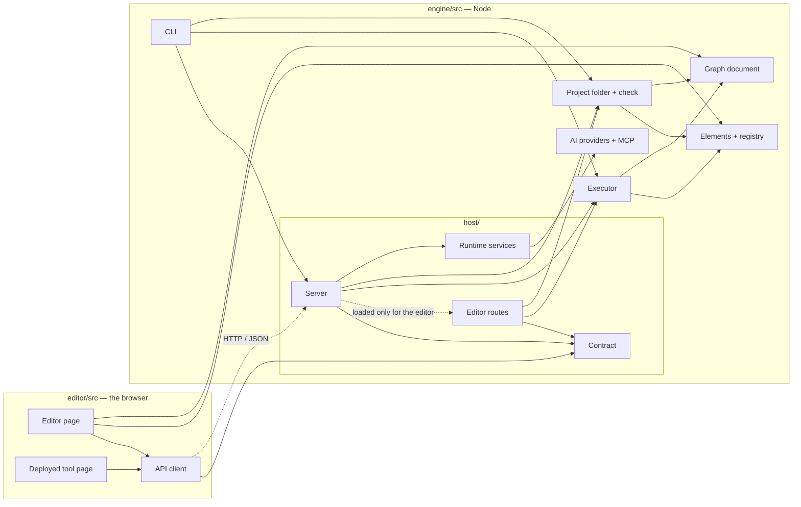
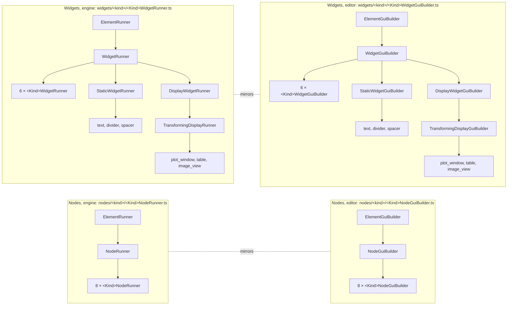
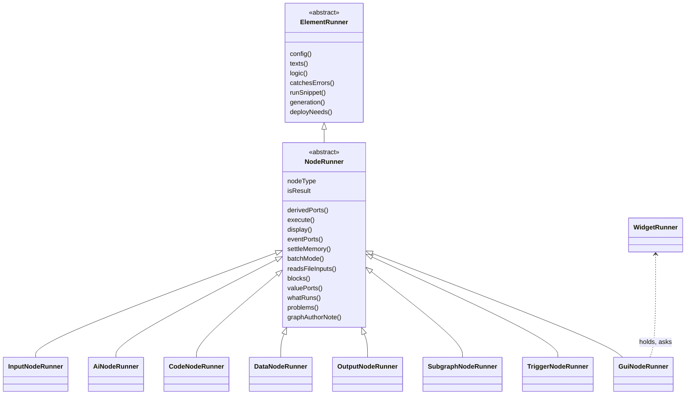
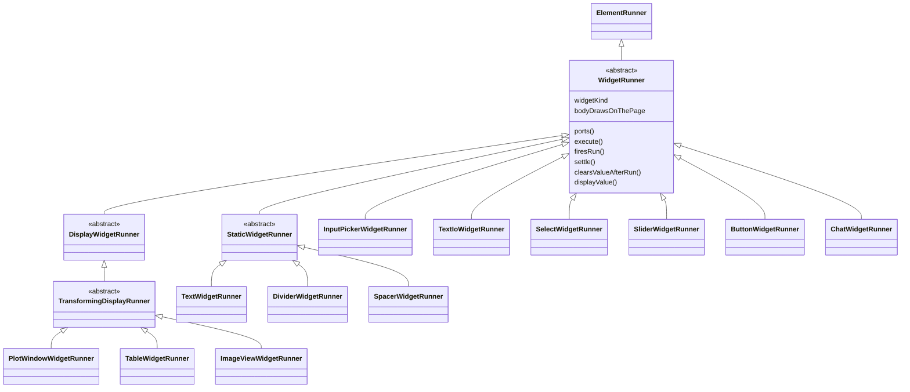
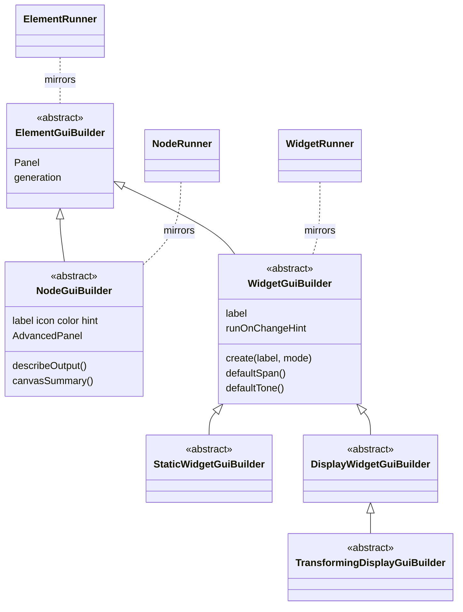
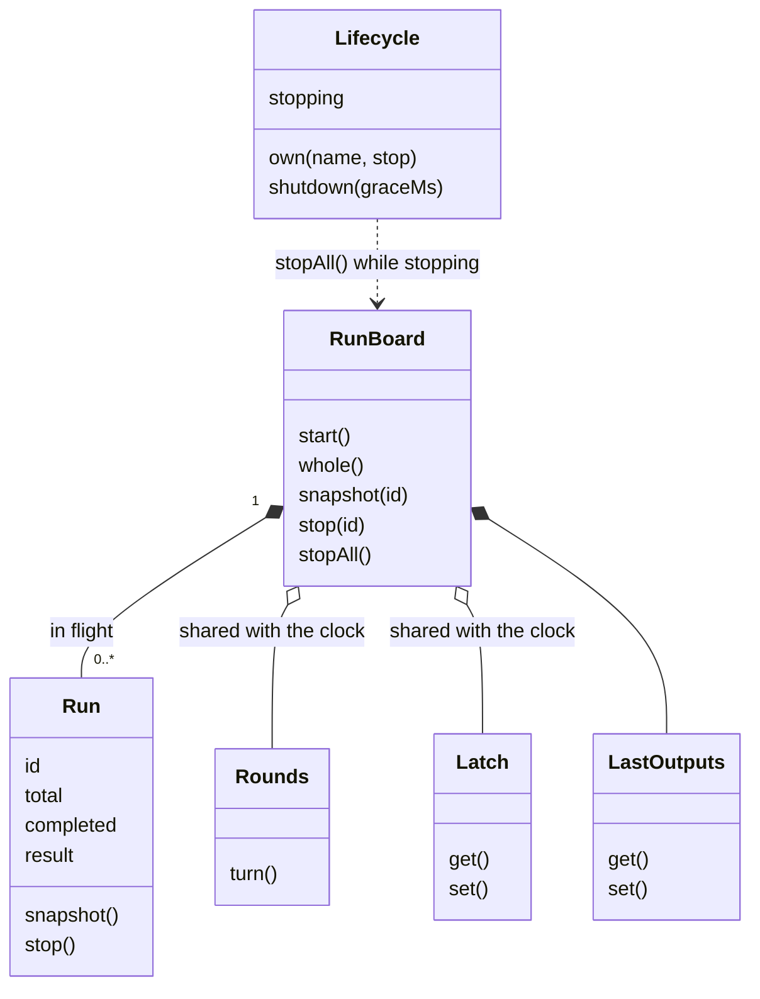
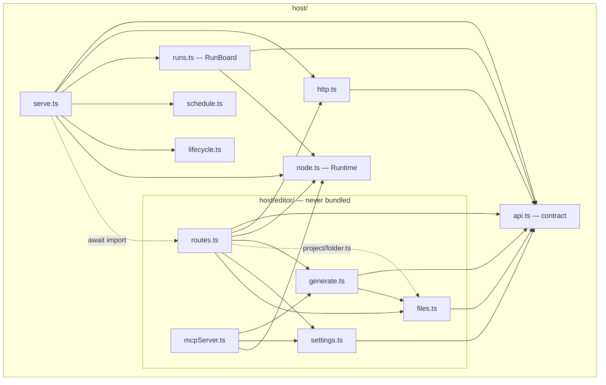
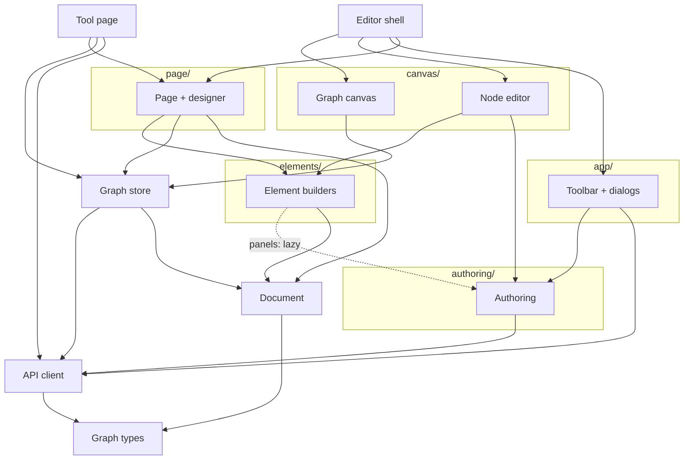

<!-- last verified: 2026-09-21 -->
# AI-Graph — architecture diagrams

Four architecture diagrams and four class diagrams, each with a table that maps every box to
its files: [the whole](#the-whole), [elements](#elements), [server](#server),
[browser](#browser); [node runners](#class-diagram-node-runners),
[widget runners](#class-diagram-widget-runners), [the builder side](#class-diagram-the-builder-side),
[runs and their state](#class-diagram-runs-and-their-state). The prose that explains them
is [docs/architecture.md](../docs/architecture.md); where the code does not yet keep its own
rules is [docs/review-2026-09-20.md](../docs/review-2026-09-20.md).

## The whole

Two processes: **Node** runs graphs, **the browser** draws them. They talk over HTTP,
and the conversation is one table both ends import: the contract.

| Diagram node | Path | Notes |
|---|---|---|
| `Editor page` | [`editor/src/App.tsx`](../editor/src/App.tsx), [`app/`](../editor/src/app/), [`canvas/`](../editor/src/canvas/), [`page/`](../editor/src/page/), [`authoring/`](../editor/src/authoring/), [`store/`](../editor/src/store/) | canvas, node editor, page designer; entry `editor/src/main.tsx` |
| `Deployed tool page` | [`editor/src/runtime/`](../editor/src/runtime/) | entry `runtime/main.tsx` → `runtime.html`; may not reach editor-only modules (`runtime/boundary.test.ts`) |
| `API client` | [`editor/src/api/client.ts`](../editor/src/api/client.ts) | `call(route, request)`; `ApiError`; `EditorView` narrows returned graphs |
| `Contract` | [`engine/src/host/api.ts`](../engine/src/host/api.ts) | every route: method, path, `tool`/`editor`, request and response types |
| `Server` | [`engine/src/host/serve.ts`](../engine/src/host/serve.ts), [`http.ts`](../engine/src/host/http.ts), [`runs.ts`](../engine/src/host/runs.ts), [`schedule.ts`](../engine/src/host/schedule.ts) | serves the page and the `tool` routes; refuses to start if a route has no handler |
| `Editor routes` | [`engine/src/host/editor/routes.ts`](../engine/src/host/editor/routes.ts) | the `editor` routes; dynamic import, never in a bundle |
| `Runtime services` | [`engine/src/host/node.ts`](../engine/src/host/node.ts) | files, sandboxed code, models, tools: the `Runtime` handed to elements |
| `CLI` | [`engine/src/main.ts`](../engine/src/main.ts), [`engine/src/cli/cli.ts`](../engine/src/cli/cli.ts) | run a folder or a file once / on a clock / `--serve` / `--bundle` / `--mcp` / `--editor` / `check` / `test` / `run-node` |
| `Executor` | [`engine/src/execution/`](../engine/src/execution/): `executor.ts`, `triggers.ts`, `batching.ts`, `reuse.ts`, `interface.ts`, `examples.ts` | order, fan-out, memory, displays, stopping; reuses context a page event only needs; holds outputs to a kept output interface; runs a node's `examples.md` |
| `Elements + registry` | [`engine/src/elements/`](../engine/src/elements/), and its mirror [`editor/src/elements/`](../editor/src/elements/) | one class per node type and widget kind, mirrored file for file; see [elements](#elements) |
| `Graph document` | [`engine/src/graph.ts`](../engine/src/graph.ts), [`editor/src/graph.ts`](../editor/src/graph.ts) | the engine's types; the editor adds only the typed `NodeConfig` view |
| `Project folder + check` | [`engine/src/project/`](../engine/src/project/): [`folder.ts`](../engine/src/project/folder.ts), [`check.ts`](../engine/src/project/check.ts) | a graph as a folder (`graph.json`, `layout.json`, `nodes/<id>/<file>` per `ElementRunner.texts`, and a project folder of its own under a node that holds a graph), read and written for every caller; changes on disk; the one list of problems (`check`, MCP) |
| `AI providers + MCP` | [`engine/src/ai/`](../engine/src/ai/) | providers, `ai-settings.json`, MCP client |

The page also runs engine code directly — elements for ports and previews, the graph
types — which is why `Editor page` has arrows into `Elements` and `Graph` without HTTP.
The bundle a deployed tool ships is `engine/src` minus every `editor/` folder, plus the
built `runtime.html` ([`engine/src/cli/bundle.ts`](../engine/src/cli/bundle.ts)).

## Elements

What a node or a widget *is*, and how it looks and is edited. Two class hierarchies, one per
side, mirrored level for level: every engine class ends in `Runner`, and its editor
counterpart swaps that for `GuiBuilder`, in the same folder. [`symmetry.test.ts`](../editor/src/elements/symmetry.test.ts)
compares the two lineages class by class.

| Diagram node | Path | Notes |
|---|---|---|
| `ElementRunner` | [`engine/src/elements/ElementRunner.ts`](../engine/src/elements/ElementRunner.ts) | `config()`, `texts()`, `logic()`, `catchesErrors()`, `runSnippet()` ┊ build time: `generation()`, `deployNeeds()`; `WhatRuns`; services in [`Runtime.ts`](../engine/src/elements/Runtime.ts) |
| `NodeRunner` | [`engine/src/elements/NodeRunner.ts`](../engine/src/elements/NodeRunner.ts) | `derivedPorts`, `execute`, `display`, `runtimeRequirements`, `settleMemory`, `blocks`, `isResult`, `valuePorts`, and what the executor reads ┊ build time: `whatRuns`, `problems`, `graphAuthorNote`, `referencedPaths` |
| `8 × <Kind>NodeRunner` | [`engine/src/elements/nodes/`](../engine/src/elements/nodes/) | `nodes/<kind>/<Kind>NodeRunner.ts`; listed in [`registry.ts`](../engine/src/elements/registry.ts) |
| `WidgetRunner` | [`engine/src/elements/WidgetRunner.ts`](../engine/src/elements/WidgetRunner.ts) | `ports`, `execute`, `firesRun`, `settle`, `displayValue` |
| `6 × <Kind>WidgetRunner` | [`engine/src/elements/widgets/<kind>/<Kind>WidgetRunner.ts`](../engine/src/elements/widgets/) | input_picker, text_io, select, slider, button, chat; listed in [`widgets/roster.ts`](../engine/src/elements/widgets/roster.ts) |
| `StaticWidgetRunner` | [`widgets/StaticWidgetRunner.ts`](../engine/src/elements/widgets/StaticWidgetRunner.ts) | no ports: part of the page, not the graph; its kinds are `text`, `divider`, `spacer` (the diagram's list) |
| `DisplayWidgetRunner` | [`widgets/DisplayWidgetRunner.ts`](../engine/src/elements/widgets/DisplayWidgetRunner.ts) | one input, nothing out |
| `TransformingDisplayRunner` | [`widgets/TransformingDisplayRunner.ts`](../engine/src/elements/widgets/TransformingDisplayRunner.ts) | an optional transform before drawing; its kinds are `plot_window` (with `check.ts`, `view.ts`), `table`, `image_view` (the diagram's list) |
| `ElementGuiBuilder` | [`editor/src/elements/ElementGuiBuilder.ts`](../editor/src/elements/ElementGuiBuilder.ts) | `Panel` (lazy), `generation` |
| `NodeGuiBuilder` | [`editor/src/elements/NodeGuiBuilder.ts`](../editor/src/elements/NodeGuiBuilder.ts) | `label`, `icon`, `color`, `hint`, `AdvancedPanel`, `describeOutput`; `NodePanelProps` |
| `8 × <Kind>NodeGuiBuilder` | [`editor/src/elements/nodes/`](../editor/src/elements/nodes/) | `nodes/<kind>/<Kind>NodeGuiBuilder.ts` beside `<Kind>NodePanel.tsx`; listed in [`registry.ts`](../editor/src/elements/registry.ts) |
| `WidgetGuiBuilder` | [`editor/src/elements/WidgetGuiBuilder.ts`](../editor/src/elements/WidgetGuiBuilder.ts) | `create(label, mode)`, `label`, `defaultSpan`, `defaultTone`, `runOnChangeHint`; `WidgetPanelProps` |
| `6 × <Kind>WidgetGuiBuilder` | [`editor/src/elements/widgets/<kind>/<Kind>WidgetGuiBuilder.ts`](../editor/src/elements/widgets/) | beside `<Kind>WidgetView.tsx` and, if it has settings, `<Kind>WidgetPanel.tsx`; listed in [`widgets/roster.ts`](../editor/src/elements/widgets/roster.ts) |
| `StaticWidgetGuiBuilder` | [`widgets/StaticWidgetGuiBuilder.ts`](../editor/src/elements/widgets/StaticWidgetGuiBuilder.ts) | starts unnamed: page furniture has no ports to name |
| `DisplayWidgetGuiBuilder` | [`widgets/DisplayWidgetGuiBuilder.ts`](../editor/src/elements/widgets/DisplayWidgetGuiBuilder.ts) | nothing to operate, so nothing starts the graph |
| `TransformingDisplayGuiBuilder` | [`widgets/TransformingDisplayGuiBuilder.ts`](../editor/src/elements/widgets/TransformingDisplayGuiBuilder.ts) | owns the one panel of table and image; a chart's own body runs in the page (`plot_window/draw.ts`, a Web Worker) |

Also related, not drawn:

- `flowFile.ts`: [`engine/src/project/flowFile.ts`](../engine/src/project/flowFile.ts), `flow.js`: a graph's wiring said as code, written beside `graph.json` on every save; never read, never run
- `body.ts`: [`engine/src/elements/body.ts`](../engine/src/elements/body.ts), `runBody`: the one way an authored body runs *on Node* — `run(inputs, node)`, sandboxed, with `node.llm`. The one exception is a chart's `draw(data, window)`, which runs in a browser Web Worker: see [`plot_window/draw.ts`](../editor/src/elements/widgets/plot_window/draw.ts)
- `times.test.ts`: [`engine/src/elements/times.test.ts`](../engine/src/elements/times.test.ts) · [`editor/…`](../editor/src/elements/times.test.ts), build time and run time inside one class: the bars, the order, and that no run reaches a build-time member

Shared by elements, not drawn: [`authoring/generation.ts`](../engine/src/authoring/generation.ts)
and [`authoring/logic.ts`](../engine/src/authoring/logic.ts) on the engine side;
[`elements/fields/`](../editor/src/elements/fields/) (settings several panels share),
and, one layer down in [`document/`](../editor/src/document/), [`baseNodeConfig.ts`](../editor/src/document/baseNodeConfig.ts)
(every node's starting config; each `NodeGuiBuilder` names the `settings` a saved file keeps) and
[`guiWidgets.ts`](../editor/src/document/guiWidgets.ts) (a page's ports, as the engine derives them).

## Class diagram: node runners

The engine's half of a node kind. Members are those a subclass answers for; `┊` in
[docs/architecture.md](../docs/architecture.md#build-time-and-run-time-in-one-class) separates run time from
build time, and the bars in each file say the same. Checked against the `extends` clauses in the source.

| Diagram node | Path | Notes |
|---|---|---|
| `ElementRunner` | [`engine/src/elements/ElementRunner.ts`](../engine/src/elements/ElementRunner.ts) | `Logic` ([`authoring/logic.ts`](../engine/src/authoring/logic.ts)) is what `logic()` returns |
| `NodeRunner` | [`engine/src/elements/NodeRunner.ts`](../engine/src/elements/NodeRunner.ts) | 21 methods in three bars; `problems()` is used by Subgraph and Trigger only (see review L1) |
| `InputNodeRunner` … `TriggerNodeRunner` | [`engine/src/elements/nodes/<kind>/<Kind>NodeRunner.ts`](../engine/src/elements/nodes/) | `AiNodeRunner` also has `prompt.ts`, `ask.ts`, `runTemplate.ts`; `SubgraphNodeRunner` has `boundary.ts` |
| `GuiNodeRunner` | [`engine/src/elements/nodes/gui/GuiNodeRunner.ts`](../engine/src/elements/nodes/gui/GuiNodeRunner.ts) | a composite: its ports are its widgets'; `showBlock` hands a value through untouched when `bodyDrawsOnThePage` |
| `WidgetRunner` | [`engine/src/elements/WidgetRunner.ts`](../engine/src/elements/WidgetRunner.ts) | see the next diagram |

## Class diagram: widget runners

This one has 16 boxes instead of 12: it is a plain tree, and cutting it in two would hide the point, which is that
three abstract levels carry what 12 kinds share.

| Diagram node | Path | Notes |
|---|---|---|
| `WidgetRunner` | [`engine/src/elements/WidgetRunner.ts`](../engine/src/elements/WidgetRunner.ts) | `bodyDrawsOnThePage` is true only for the chart |
| `StaticWidgetRunner`, `DisplayWidgetRunner`, `TransformingDisplayRunner` | [`engine/src/elements/widgets/`](../engine/src/elements/widgets/) | no ports · one input, nothing out · an optional transform before drawing |
| `<Kind>WidgetRunner` | [`engine/src/elements/widgets/<kind>/<Kind>WidgetRunner.ts`](../engine/src/elements/widgets/) | listed in [`widgets/roster.ts`](../engine/src/elements/widgets/roster.ts); `PlotWindowWidgetRunner` keeps `check.ts` and `view.ts` beside it |

## Class diagram: the builder side

Every engine class above has a counterpart in the browser that swaps `Runner` for `GuiBuilder`, in the same
relative folder and with the same inheritance; [`symmetry.test.ts`](../editor/src/elements/symmetry.test.ts) compares
the lineages class by class. Only the abstract levels are drawn; below them the trees are the ones above.

| Diagram node | Path | Notes |
|---|---|---|
| `ElementGuiBuilder` | [`editor/src/elements/ElementGuiBuilder.ts`](../editor/src/elements/ElementGuiBuilder.ts) | the two lazily loaded members: `Panel`, `generation` |
| `NodeGuiBuilder` | [`editor/src/elements/NodeGuiBuilder.ts`](../editor/src/elements/NodeGuiBuilder.ts) | builder only; what a node *is* on load and save is in [`document/nodeKinds.ts`](../editor/src/document/nodeKinds.ts) |
| `WidgetGuiBuilder` | [`editor/src/elements/WidgetGuiBuilder.ts`](../editor/src/elements/WidgetGuiBuilder.ts) | what the *page* draws is in [`page/blocks.ts`](../editor/src/page/blocks.ts) and the `<Kind>WidgetView.tsx` files |
| `TransformingDisplayGuiBuilder` | [`editor/src/elements/widgets/TransformingDisplayGuiBuilder.ts`](../editor/src/elements/widgets/TransformingDisplayGuiBuilder.ts) | owns the one panel of table and image; the chart's own body runs in the page (`plot_window/draw.ts`, a Web Worker) |

## Class diagram: runs and their state

The classes that are not elements: what the server keeps while graphs run. `serve()` creates the `Latch`, the
`Rounds` and the `Lifecycle` and hands the first two to the `RunBoard` and the clock.

| Diagram node | Path | Notes |
|---|---|---|
| `Lifecycle` | [`engine/src/host/lifecycle.ts`](../engine/src/host/lifecycle.ts) | what a server stops, in order, once, within a grace period |
| `RunBoard`, `Run` | [`engine/src/host/runs.ts`](../engine/src/host/runs.ts) | two classes in one file (a review-sized exception to "one class per file"); forgets a run after 5 minutes |
| `Rounds` | [`engine/src/host/rounds.ts`](../engine/src/host/rounds.ts) | one round of a graph at a time |
| `Latch` | [`engine/src/execution/latch.ts`](../engine/src/execution/latch.ts) | what every node made last, for rounds its ◆ stays shut; gone at restart |
| `LastOutputs` | [`engine/src/execution/reuse.ts`](../engine/src/execution/reuse.ts) | outputs a page event may hand back for context-only nodes; the file is not named after the class |

Not drawn: the 16 error classes (`Refusal`, `NotFound`, `NotAGraph`, `FileChanged`, …), spread over ten files with two
duplicated names — see [review C1](../docs/review-2026-09-20.md#consistency).

## Server

The Node side of the wire. `serve.ts` answers the routes of the contract; the `tool` rows
live beside it, the `editor` rows in `host/editor/`, which is loaded only when the server
is the editor and is never copied into a bundle.

| Diagram node | Path | Notes |
|---|---|---|
| `api.ts — contract` | [`engine/src/host/api.ts`](../engine/src/host/api.ts) | `API` table, `RequestOf`/`ResponseOf`, `matchRoute`, `pathFor`; wire types (`RunSnapshot`, `AICall`, `SettingsStatus`, …) |
| `http.ts` | [`engine/src/host/http.ts`](../engine/src/host/http.ts) | `Refusal` (thrown with a status), `Download`, `Handler`/`Handlers`, JSON and byte bodies, static page |
| `serve.ts` | [`engine/src/host/serve.ts`](../engine/src/host/serve.ts) | `serve()`: dispatch by the table; `toolRoutes()`: graph, schedule, AI settings (read-only), requirements, run/watch/stop, browse |
| `runs.ts — RunBoard` | [`engine/src/host/runs.ts`](../engine/src/host/runs.ts) | runs in flight: start, snapshot, stop, `stopAll` for a shutdown, forget after 5 min |
| `rounds.ts` | [`engine/src/host/rounds.ts`](../engine/src/host/rounds.ts) | one round of a graph at a time: the clock's and the page's rounds share the queue, and the [`Latch`](../engine/src/execution/latch.ts) that holds what every node made last |
| `schedule.ts` | [`engine/src/host/schedule.ts`](../engine/src/host/schedule.ts) | a clock per trigger node, each round told which began it; `ScheduleState`, kept in `<graph>.last-run.json` across restarts |
| `lifecycle.ts` | [`engine/src/host/lifecycle.ts`](../engine/src/host/lifecycle.ts) | `Lifecycle`: what a server must stop, in order, once, within a grace period; `untilStopped`: signals → shutdown → exit code, used by [`cli/cli.ts`](../engine/src/cli/cli.ts) |
| `node.ts — Runtime` | [`engine/src/host/node.ts`](../engine/src/host/node.ts) | `nodeFiles`, `nodeCode` (sandboxed `node --permission`; a body may ask this process for what it may not do itself — `BodyContext.calls`, how `node.llm` works), `nodeRuntime()` |
| `routes.ts` | [`engine/src/host/editor/routes.ts`](../engine/src/host/editor/routes.ts) | `editorRoutes()`: try a node/block, open/save/reload a project or file and what changed on disk (through [`project/folder.ts`](../engine/src/project/folder.ts)), generation + live transcripts, bundle, settings, attachments |
| `generate.ts` | [`engine/src/host/editor/generate.ts`](../engine/src/host/editor/generate.ts) | write → run on a sample → check → repair once; `generateGraph` with [`graphPrompt.ts`](../engine/src/host/editor/graphPrompt.ts) |
| `settings.ts` | [`engine/src/host/editor/settings.ts`](../engine/src/host/editor/settings.ts) | the settings dialog's view of `ai-settings.json`; which model generates |
| `files.ts` | [`engine/src/host/editor/files.ts`](../engine/src/host/editor/files.ts) | directory browsing, attachments, format detection, open in own editor |
| `mcpServer.ts` | [`engine/src/host/editor/mcpServer.ts`](../engine/src/host/editor/mcpServer.ts) | `--mcp`: graph tools for Claude, confined to one folder, reading and writing projects through [`project/folder.ts`](../engine/src/project/folder.ts) and checking with [`project/check.ts`](../engine/src/project/check.ts); started from [`cli/cli.ts`](../engine/src/cli/cli.ts) |

Not drawn: every handler also calls into `executor.ts`, `registry.ts` and `graph.ts`
(see the [overview](#the-whole)); `zip.ts` and `skeleton.ts` are small helpers of
`routes.ts` and `generate.ts`.

## Browser

The page side of the wire. The areas stand in layers, and [`layers.test.ts`](../editor/src/layers.test.ts)
fails on an import that goes up: `ui` · `graph` · `document`, `api` · `store` · `dialogs` ·
`elements`, `authoring` · `page`, `canvas` · `app` · `App`, `runtime`. Two entry points share one set of modules: the editor
(`main.tsx` → `App.tsx`) and the deployed tool's page (`runtime/main.tsx` →
`RuntimeApp.tsx`), which reaches element views but never a panel or an editing module.

| Diagram node | Path | Notes |
|---|---|---|
| `Editor shell` | [`editor/src/App.tsx`](../editor/src/App.tsx), [`main.tsx`](../editor/src/main.tsx) | views (graph · page designer · preview), open/save, drop a file |
| `Tool page` | [`editor/src/runtime/`](../editor/src/runtime/) | `RuntimeApp.tsx`, `RuntimeAISettings.tsx` (read-only); [`boundary.test.ts`](../editor/src/runtime/boundary.test.ts) keeps panels and editing modules out |
| `Toolbar + dialogs` | [`editor/src/app/`](../editor/src/app/) | `Toolbar.tsx` (run, AI Graph, Generate, deploy), `Sidebar.tsx`, `SettingsDialog.tsx`, `ResultsPanel.tsx`, `ViewTabs.tsx` |
| `Graph canvas` | [`editor/src/canvas/GraphCanvas.tsx`](../editor/src/canvas/GraphCanvas.tsx), [`GraphNodeView.tsx`](../editor/src/canvas/GraphNodeView.tsx) | ReactFlow; `nodeRemoval.ts`, `ConnectorEditor.tsx` |
| `Node editor` | [`editor/src/canvas/NodeEditor.tsx`](../editor/src/canvas/NodeEditor.tsx) | draws the element's own `Panel` and `AdvancedPanel` |
| `Page + designer` | [`editor/src/page/`](../editor/src/page/) | `GuiPage.tsx` draws a page (shared with the tool page); `DesignerTab.tsx`, `WidgetEditor.tsx`, `pageWrite.ts` |
| `Element builders` | [`editor/src/elements/`](../editor/src/elements/) | `registry.ts`, `ElementGuiBuilder.ts`, one folder per element — see [elements](#elements). A chart's view, `plot_window/PlotWindowWidgetView.tsx`, runs the body's `draw(data, window)` in a Web Worker (`draw.ts`), redrawn on a resize or a change of scheme with no run; `PlotChart.tsx` lays a figure `{kind, title, points}` out itself |
| `Authoring` | [`editor/src/authoring/`](../editor/src/authoring/) | `AuthoredBodyEditor`, `TryItPanel`, `useGenerate`, `LiveGeneration`, `generation.ts`, the page-wide sweep (`graphSweep.ts`) |
| `Graph store` | [`editor/src/store/graphStore.ts`](../editor/src/store/graphStore.ts) | the open graph, undo, runs (start → poll `run` → replay `memory`); `settingsStore.ts`, `nodeData.ts`, `executionStatus.ts` |
| `API client` | [`editor/src/api/client.ts`](../editor/src/api/client.ts) | the contract's client: `call(route, request)`, `ApiError`; `errorText.ts` |
| `Document` | [`editor/src/document/`](../editor/src/document/) | what a graph is to the editor: [`nodeKinds.ts`](../editor/src/document/nodeKinds.ts) (a node of each type, loaded and saved), `baseNodeConfig.ts`, `guiWidgets.ts` (a page's ports, as the engine derives them), `layout.ts` (the grid) |
| `Graph types` | [`editor/src/graph.ts`](../editor/src/graph.ts) | the engine's types plus the typed `NodeConfig` view |

Not drawn: [`ui/`](../editor/src/ui/) (theme, `tone.ts`, `scheme.ts`, `Modal`, `Markdown`) and
[`dialogs/`](../editor/src/dialogs/) (`FileBrowserDialog`, `RequirementsDialog`), used from several
layers; and the store's and `guiWidgets.ts`'s direct imports
of engine code (`@engine/graph.ts`, `@engine/elements/registry.ts`,
`@engine/execution/triggers.ts`) — ports and triggers are the engine's answer, computed in
the browser, not a copy of it.
