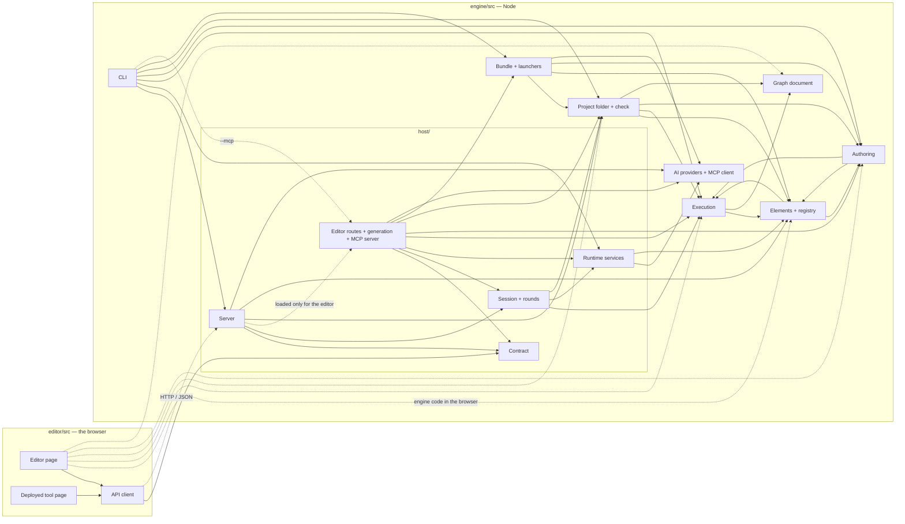
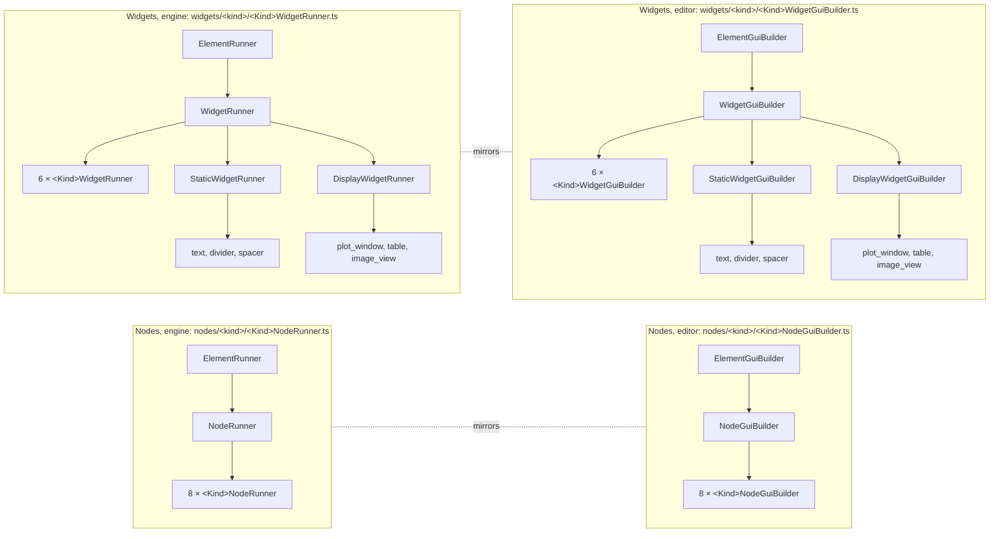
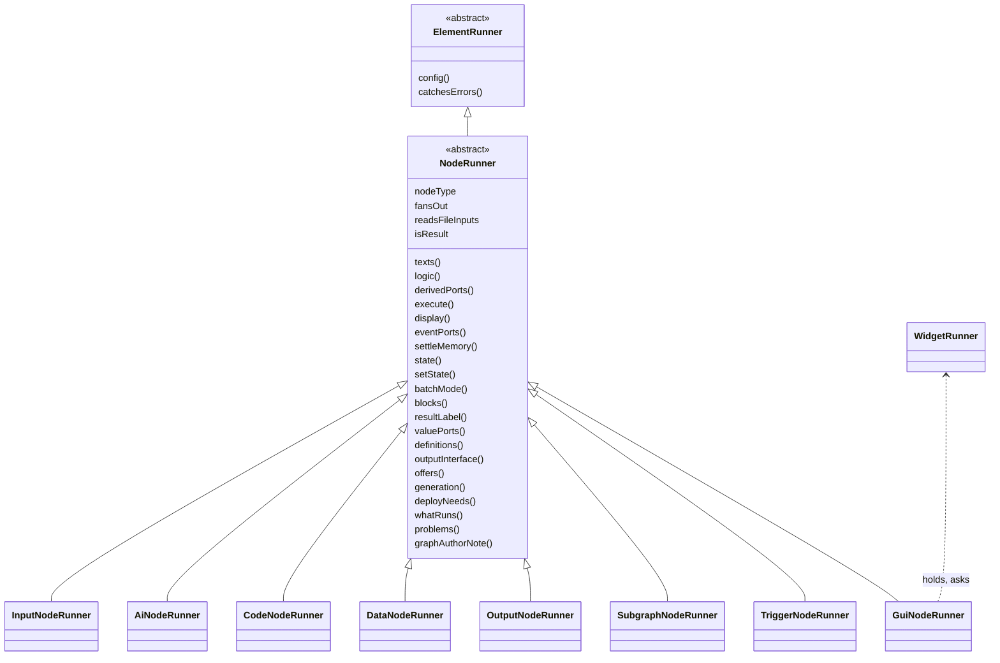
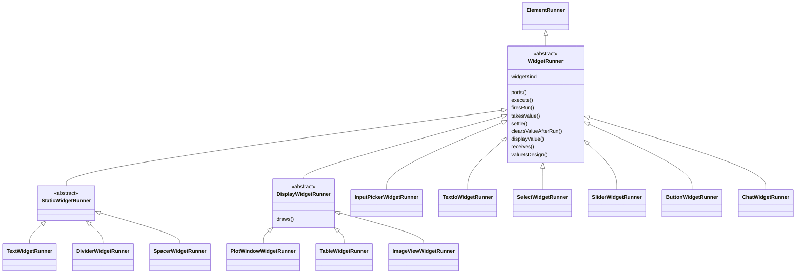
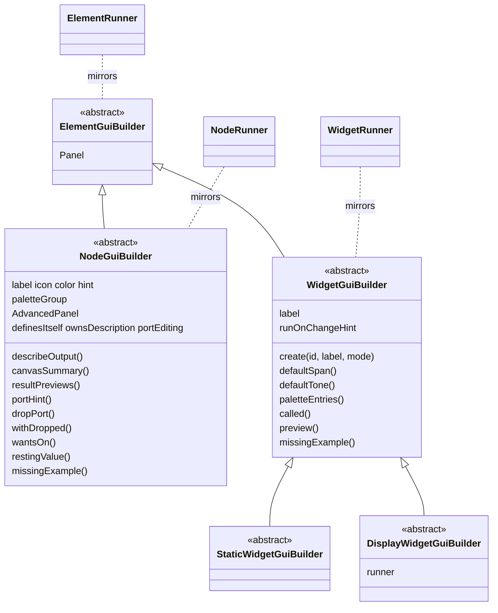
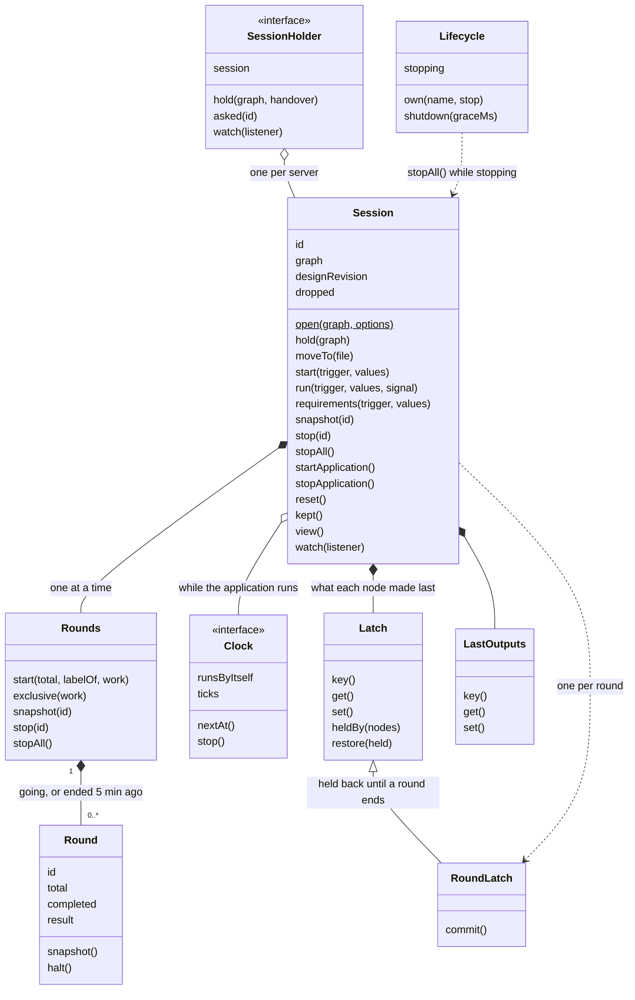
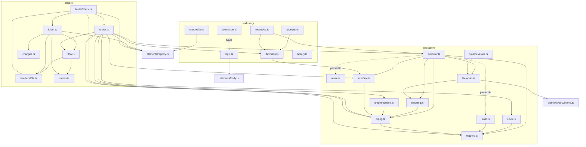
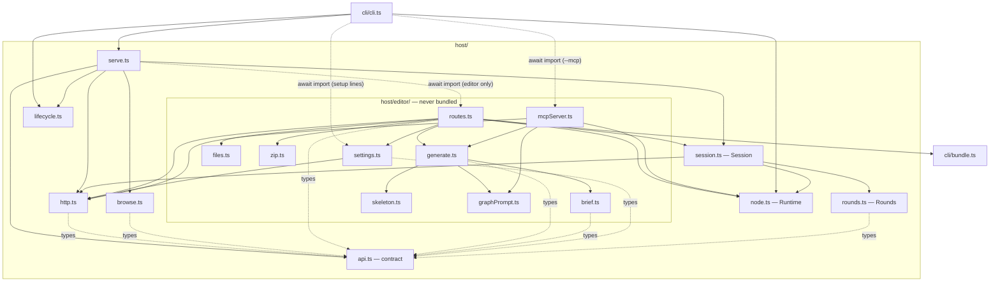
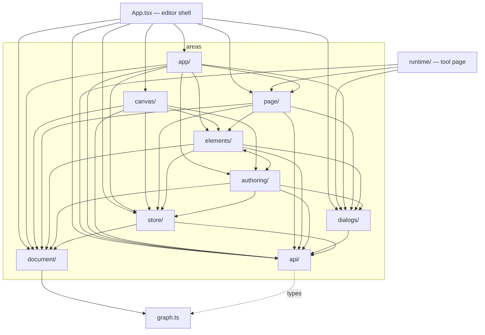

<!-- last verified: 2026-10-03 -->
# AI-Graph — architecture diagrams

Five architecture diagrams and four class diagrams, each with a table that maps every box to
its files: [the whole](#the-whole), [elements](#elements), [run and disk](#run-and-disk),
[server](#server), [browser](#browser); [node runners](#class-diagram-node-runners),
[widget runners](#class-diagram-widget-runners), [the builder side](#class-diagram-the-builder-side),
[runs and their state](#class-diagram-runs-and-their-state). The prose that explains them
is [docs/architecture.md](../docs/architecture.md), whose last section says where the code
does not keep its own rules.

## The whole

Two processes: **Node** runs graphs, **the browser** draws them. They talk over HTTP,
and the conversation is one table both ends import: the contract.

```mermaid
flowchart LR
  subgraph browser["editor/src — the browser"]
    EditorPage["Editor page"]
    ToolPage["Deployed tool page"]
    Client["API client"]
  end

  subgraph engine["engine/src — Node"]
    subgraph host["host/"]
      Contract["Contract"]
      Server["Server"]
      Session["Session + rounds"]
      EditorHost["Editor routes + generation + MCP server"]
      Services["Runtime services"]
    end
    CLI["CLI"]
    Bundle["Bundle + launchers"]
    Executor["Execution"]
    Authoring["Authoring"]
    Elements["Elements + registry"]
    Graph["Graph document"]
    Project["Project folder + check"]
    AI["AI providers + MCP client"]
  end

  EditorPage --> Client
  ToolPage --> Client
  Client --> Contract
  Client -. "HTTP / JSON" .-> Server
  Server --> Contract
  Server --> Session
  Server -. "loaded only for the editor" .-> EditorHost
  EditorHost --> Contract
  EditorHost --> Session
  EditorHost --> Services
  EditorHost --> Executor
  EditorHost --> Authoring
  EditorHost --> Project
  EditorHost --> Bundle
  Session --> Executor
  Session --> Services
  Session --> Project
  Server --> Project
  Server --> Elements
  CLI --> Server
  CLI --> Services
  CLI --> Executor
  CLI --> Authoring
  CLI --> Project
  CLI --> Bundle
  CLI -. "--mcp" .-> EditorHost
  Bundle --> Project
  Bundle --> Elements
  Bundle --> Authoring
  Executor --> Elements
  Executor --> Graph
  Elements --> Executor
  Elements --> Authoring
  Authoring --> Executor
  Authoring --> Elements
  Project --> Elements
  Project --> Executor
  Project --> Authoring
  Project --> Graph
  Services --> AI
  Services --> Elements
  Server --> AI
  EditorHost --> AI
  Bundle --> AI
  EditorPage -. "engine code in the browser" .-> Elements
  EditorPage -.-> Executor
  EditorPage -.-> Project
  EditorPage -.-> Authoring
  EditorPage -.-> Graph
```

| Diagram node | Path | Notes |
|---|---|---|
| `Editor page` | [`editor/src/App.tsx`](../editor/src/App.tsx), [`app/`](../editor/src/app/), [`canvas/`](../editor/src/canvas/), [`page/`](../editor/src/page/), [`authoring/`](../editor/src/authoring/), [`store/`](../editor/src/store/), [`document/`](../editor/src/document/), [`dialogs/`](../editor/src/dialogs/), [`ui/`](../editor/src/ui/) | canvas, node editor, page designer; entry `editor/src/main.tsx`; the areas are drawn in [the browser](#browser) |
| `Deployed tool page` | [`editor/src/runtime/`](../editor/src/runtime/) | entry `runtime/main.tsx` → `runtime.html`; reaches no store, canvas, authoring or editor shell (`runtime/boundary.test.ts`) |
| `API client` | [`editor/src/api/client.ts`](../editor/src/api/client.ts), [`session.ts`](../editor/src/api/session.ts) | `call(route, request)`; `ApiError`; the session a page follows (`useSession`); `EditorView` narrows returned graphs; `watchGeneration` (a generation's calls, polled while it runs; a signal stops the watch at once, and what comes back later is dropped); `downloadBundle` |
| `Contract` | [`engine/src/host/api.ts`](../engine/src/host/api.ts) | every route: method, path, `tool`/`editor`, request and response types |
| `Server` | [`engine/src/host/serve.ts`](../engine/src/host/serve.ts), [`http.ts`](../engine/src/host/http.ts), [`browse.ts`](../engine/src/host/browse.ts) | serves the page and the `tool` rows; refuses to start if a route has no handler; the file picker's listing |
| `Session + rounds` | [`engine/src/host/session.ts`](../engine/src/host/session.ts), [`rounds.ts`](../engine/src/host/rounds.ts), [`lifecycle.ts`](../engine/src/host/lifecycle.ts) | the one session: the graph in use and what using it leaves behind; its rounds, one at a time; what a server stops, in order |
| `Editor routes + generation + MCP server` | [`engine/src/host/editor/`](../engine/src/host/editor/) | the `editor` rows (`routes.ts`), ✨ (`generate.ts`), settings, files, `mcpServer.ts`; dynamic import, never in a bundle |
| `Runtime services` | [`engine/src/host/node.ts`](../engine/src/host/node.ts) | files, sandboxed code, models, tools: the `Runtime` handed to elements |
| `CLI` | [`engine/src/main.ts`](../engine/src/main.ts), [`engine/src/cli/cli.ts`](../engine/src/cli/cli.ts) | run a folder or a file once / on a clock (`--every`, `--limit`) / by event and value (`--event`, `--value`) / `--serve` / `--bundle` / `--mcp` / `--editor` / `check` / `test` / `run-node` |
| `Bundle + launchers` | [`engine/src/cli/bundle.ts`](../engine/src/cli/bundle.ts), [`launchers.ts`](../engine/src/cli/launchers.ts) | what Deploy and `--bundle` write: the project folder, a copy of the engine, the built page (`web/`), the project's `frontend/`, the files the graph starts on, `run.cmd` and `run.sh`; the same launchers the download ([`scripts/package.mjs`](../scripts/package.mjs)) carries |
| `Execution` | [`engine/src/execution/`](../engine/src/execution/) | order, fan-out, memory, displays, stopping, what starts a run; see [run and disk](#run-and-disk) |
| `Authoring` | [`engine/src/authoring/`](../engine/src/authoring/) | what ✨ writes and how it is read: definitions, prompts, history, a node's example tried; see [run and disk](#run-and-disk) |
| `Elements + registry` | [`engine/src/elements/`](../engine/src/elements/), and its mirror [`editor/src/elements/`](../editor/src/elements/) | one class per node type and widget kind, mirrored file for file; see [elements](#elements) |
| `Graph document` | [`engine/src/graph.ts`](../engine/src/graph.ts), [`editor/src/graph.ts`](../editor/src/graph.ts) | the engine's types; `defaultMetadata()` (a graph's settings when nothing says otherwise: a new graph's, and what `flow.json` leaves out); the editor adds only the typed `NodeConfig` view |
| `Project folder + check` | [`engine/src/project/`](../engine/src/project/) | a graph as a folder, read and written for every caller; the one list of problems; see [run and disk](#run-and-disk) |
| `AI providers + MCP client` | [`engine/src/ai/`](../engine/src/ai/): `providers.ts`, `settings.ts`, `mcp.ts` | providers (a model call given ten minutes by default, `AI_GRAPH_TIMEOUT_MS`, and `TimedOutError` past it), `ai-settings.json` and the one AI setting (`aiSetting`), the MCP client (tools only) |

The page also runs engine code directly — elements for ports and previews, the graph
types, `check` — which is why `Editor page` has arrows into the engine without HTTP. The
bundle a deployed tool ships is `engine/src` minus every `editor/` folder and every test,
plus the built `runtime.html` and the files it references
([`engine/src/cli/bundle.ts`](../engine/src/cli/bundle.ts), `cli/bundle.test.ts`).

## Elements

What a node or a widget *is*, and how it looks and is edited. Two class hierarchies, one per
side, mirrored level for level: every engine class ends in `Runner`, and its editor
counterpart swaps that for `GuiBuilder`, in the same folder. [`symmetry.test.ts`](../editor/src/elements/symmetry.test.ts)
compares the two lineages class by class.

```mermaid
flowchart LR
  subgraph NE["Nodes, engine: nodes/#lt;kind#gt;/#lt;Kind#gt;NodeRunner.ts"]
    direction TB
    ER1["ElementRunner"] --> NR["NodeRunner"] --> KNR["8 × #lt;Kind#gt;NodeRunner"]
  end
  subgraph NB["Nodes, editor: nodes/#lt;kind#gt;/#lt;Kind#gt;NodeGuiBuilder.ts"]
    direction TB
    EG1["ElementGuiBuilder"] --> NG["NodeGuiBuilder"] --> KNG["8 × #lt;Kind#gt;NodeGuiBuilder"]
  end
  subgraph WE["Widgets, engine: widgets/#lt;kind#gt;/#lt;Kind#gt;WidgetRunner.ts"]
    direction TB
    ER2["ElementRunner"] --> WR["WidgetRunner"]
    WR --> KWR["6 × #lt;Kind#gt;WidgetRunner"]
    WR --> SR["StaticWidgetRunner"] --> KSR["text, divider, spacer"]
    WR --> DR["DisplayWidgetRunner"] --> KTR["plot_window, table, image_view"]
  end
  subgraph WB["Widgets, editor: widgets/#lt;kind#gt;/#lt;Kind#gt;WidgetGuiBuilder.ts"]
    direction TB
    EG2["ElementGuiBuilder"] --> WG["WidgetGuiBuilder"]
    WG --> KWG["6 × #lt;Kind#gt;WidgetGuiBuilder"]
    WG --> SG["StaticWidgetGuiBuilder"] --> KSG["text, divider, spacer"]
    WG --> DG["DisplayWidgetGuiBuilder"] --> KTG["plot_window, table, image_view"]
  end
  NE -. mirrors .- NB
  WE -. mirrors .- WB
```

| Diagram node | Path | Notes |
|---|---|---|
| `ElementRunner` | [`engine/src/elements/ElementRunner.ts`](../engine/src/elements/ElementRunner.ts) | what a node and a block share: `config()`, `catchesErrors()`; services in [`Runtime.ts`](../engine/src/elements/Runtime.ts) (`files`, `code`, `ai`, `tools`, `subgraph`, `fired`); a port is made by [`port.ts`](../engine/src/elements/port.ts) |
| `NodeRunner` | [`engine/src/elements/NodeRunner.ts`](../engine/src/elements/NodeRunner.ts) | what it is: `texts` (a node's files of its own), `logic` (its body), `derivedPorts`, `nestedGraph`/`blocks` (and their setters), `isResult`, `resultLabel`, `boundaryRole`, `valuePorts`, `definitions` (a code or ai node's input.js and output.js) and `outputInterface` (the shape of its output.js example) ┊ run time: `execute`, `display`, `eventPorts`, `keepsTime`, `hasInterface`, `isMemory`, `settlesOnArrival`, `settleMemory`, `state`/`setState`/`clearDelivered` (the node's slots in a session), `fansOut`, `batchMode`, `readsFileInputs`, `needsInput`, `runtimeRequirements`, `offers` (what the graph offers by name), `value`/`setValue`/`shows` ┊ build time: `generation`, `deployNeeds`, `whatRuns` (a `WhatRuns`), `problems`, `graphAuthorNote`, `asksModel`, `referencedPaths`; the file also holds `resultKeys` (the key each result node is handed on under: the first under a label keeps it) |
| `8 × <Kind>NodeRunner` | [`engine/src/elements/nodes/`](../engine/src/elements/nodes/) | input, ai, code, data, output, gui, subgraph, trigger: `nodes/<kind>/<Kind>NodeRunner.ts`; listed in [`registry.ts`](../engine/src/elements/registry.ts), which also says which `Generation` a node type has (`registry.generation`; a block has none) |
| `WidgetRunner` | [`engine/src/elements/WidgetRunner.ts`](../engine/src/elements/WidgetRunner.ts) | what it is: `widgetKind`, `ports` ┊ run time: `execute`, `firesRun` (an event, by the block's id), `takesValue` and `setValue` (a value, by the block's id), `keepsState`, `settle`, `clearsValueAfterRun`, `displayValue`, `runtimeRequirements` (what a block asks before a run -- a picker with nothing chosen) ┊ build time: `receives`, `graphAuthorNote`, `referencedPaths` (the file a picker starts on, for a bundle to carry), `valueIsDesign` (a conversation is the session's, never the design's); a block writes nothing, so it has no body, no files and no ✨ |
| `6 × <Kind>WidgetRunner` | [`engine/src/elements/widgets/<kind>/<Kind>WidgetRunner.ts`](../engine/src/elements/widgets/) | input_picker, text_io, select, slider, button, chat; listed in [`widgets/roster.ts`](../engine/src/elements/widgets/roster.ts). A folder picker lists its folder through [`folderListing.ts`](../engine/src/elements/folderListing.ts), the function an input node's directory mode lists with. The small modules a page's views read a value by (`chat/value.ts`, `slider/range.ts`, `text_io/role.ts`, `text_io/text.ts`, `select/choice.ts`, `text/role.ts`) are the only engine code besides `host/api.ts` that a deployed page loads |
| `StaticWidgetRunner` | [`widgets/StaticWidgetRunner.ts`](../engine/src/elements/widgets/StaticWidgetRunner.ts) | no ports: part of the page, not the graph; its kinds are `text`, `divider`, `spacer` (the diagram's list) |
| `DisplayWidgetRunner` | [`widgets/DisplayWidgetRunner.ts`](../engine/src/elements/widgets/DisplayWidgetRunner.ts) | one input, nothing out: shows what arrives, runs no code, and says what it draws (`draws`, what a node wired into it `receives`); its kinds are `plot_window`, `table`, `image_view` (the diagram's list; an image reads a path into the picture, `displayValue`, through [`images.ts`](../engine/src/elements/images.ts), which an ai node sends a picture through as well) |
| `ElementGuiBuilder` | [`editor/src/elements/ElementGuiBuilder.ts`](../editor/src/elements/ElementGuiBuilder.ts) | `Panel` (lazy) |
| `NodeGuiBuilder` | [`editor/src/elements/NodeGuiBuilder.ts`](../editor/src/elements/NodeGuiBuilder.ts) | `label`, `icon`, `color`, `hint`, `paletteGroup`, `AdvancedPanel`, `describeOutput`/`canvasSummary`, `resultPreviews` (what the canvas shows of the last result, beside which port: [`resultPreview.ts`](../editor/src/elements/resultPreview.ts) reads a value by its shape; a page asks each block); what the shells ask instead of naming a kind: `definesItself` (its ports under Advanced), `ownsDescription`, `portEditing`/`portHint`, `wantsOn`, `restingValue`, `missingExample`, `dropPort`/`withDropped` (what a file dropped on the node on the canvas gives it: one more file its ✨ Input writes from, or what a data node holds); `NodePanelProps` |
| `8 × <Kind>NodeGuiBuilder` | [`editor/src/elements/nodes/`](../editor/src/elements/nodes/) | `nodes/<kind>/<Kind>NodeGuiBuilder.ts` beside `<Kind>NodePanel.tsx`; listed in [`registry.ts`](../editor/src/elements/registry.ts). A code, an ai and a data node's panel is `authoring/NodeDefinition.tsx` |
| `WidgetGuiBuilder` | [`editor/src/elements/WidgetGuiBuilder.ts`](../editor/src/elements/WidgetGuiBuilder.ts) | `create(id, label, mode)`, `label`, `defaultSpan`, `defaultTone`, `runOnChangeHint`, `paletteEntries` (what the Page tab's palette offers of the kind), `called` (what a block is called in a sentence, as {Context} tells ✨ the page: "a file picker block"), `InlineEditor` (a block typed where it stands: the text kind's [`TextInPlace.tsx`](../editor/src/elements/widgets/text/TextInPlace.tsx)), `preview` (what the block shows, small, under its port on the canvas: a chart reads points as a chart), `missingExample`; `WidgetPanelProps` |
| `6 × <Kind>WidgetGuiBuilder` | [`editor/src/elements/widgets/<kind>/<Kind>WidgetGuiBuilder.ts`](../editor/src/elements/widgets/) | beside `<Kind>WidgetView.tsx` and, if it has settings, `<Kind>WidgetPanel.tsx`; listed in [`widgets/roster.ts`](../editor/src/elements/widgets/roster.ts) |
| `StaticWidgetGuiBuilder` | [`widgets/StaticWidgetGuiBuilder.ts`](../editor/src/elements/widgets/StaticWidgetGuiBuilder.ts) | starts unnamed: page furniture has no ports to name |
| `DisplayWidgetGuiBuilder` | [`widgets/DisplayWidgetGuiBuilder.ts`](../editor/src/elements/widgets/DisplayWidgetGuiBuilder.ts) | owns the one panel of chart, table and image ([`DisplayWidgetPanel.tsx`](../editor/src/elements/widgets/DisplayWidgetPanel.tsx)): one sentence of what the kind's runner `draws`; no output, so the block editor offers no "starts the graph" |

Also related, not drawn:

- `body.ts`: [`engine/src/elements/body.ts`](../engine/src/elements/body.ts), `runBody`: the one way an authored body runs — `run(inputs, node)`, on Node, sandboxed, with `node.llm`. Only nodes have bodies: a block writes nothing
- `documents.ts`: [`engine/src/elements/documents.ts`](../engine/src/elements/documents.ts), what a node that reads a file is handed for one that is not plain text: a Word document as Markdown, a picture or a PDF as a `data:` URL (an ai node sends it to the model as the file it is, `nodes/ai/ask.ts`)
- `FolderListing.tsx`: [`editor/src/elements/fields/FolderListing.tsx`](../editor/src/elements/fields/FolderListing.tsx), what a folder adds to its path and file types, for the input node and the folder picker alike: subfolders, the one line that choosing some files is a code node after it, and the list as a run makes it; the other shared settings are in [`fields/`](../editor/src/elements/fields/) (`RunOncePerItem`, `RunOptions`, `WhatRuns`, `ProviderModelSelect`)
- `download.ts`, `SaveButton.tsx`: [`editor/src/elements/widgets/`](../editor/src/elements/widgets/), "⤓ Save" on a block that shows something -- a text as .txt, a chart as .svg, a table as .csv -- in the browser, wherever the page is drawn
- `times.test.ts`: [`engine/src/elements/times.test.ts`](../engine/src/elements/times.test.ts) · [`editor/…`](../editor/src/elements/times.test.ts), build time and run time inside one class: the bars, the order, and (in the engine) that no run reaches a build-time member; in the editor, that a `GuiBuilder`'s run-time bar is empty, with `runtime/boundary.test.ts` holding that a tool never loads one
- `shells.test.ts`: [`engine/src/shells.test.ts`](../engine/src/shells.test.ts) · [`editor/…`](../editor/src/elements/shells.test.ts), no code outside `elements/` compares a node type with a literal

Shared by elements, not drawn: [`authoring/generation.ts`](../engine/src/authoring/generation.ts) (a node's `Generation`),
[`authoring/logic.ts`](../engine/src/authoring/logic.ts),
[`authoring/definition.ts`](../engine/src/authoring/definition.ts) (input.js and output.js: a
typedef, then one example as plain JSON, read without running anything -- code.js's lines
that run it on its own run input.js apart, in `node:vm` -- and `textOutput`: one output that
holds text is an ai node's answer as it came),
[`authoring/prompts.ts`](../engine/src/authoring/prompts.ts) (the standard prompts and their
variables), [`authoring/history.ts`](../engine/src/authoring/history.ts) (history.md) and
[`authoring/handedOn.ts`](../engine/src/authoring/handedOn.ts) (`withoutAuthoring`: a graph
as it leaves the project -- a bundle, a served tool's page, a run the editor posts, an answer
over MCP, a model asked to change the graph -- without any node's history) on the engine
side;
[`elements/fields/`](../editor/src/elements/fields/) (settings several panels share),
and, one layer down in [`document/`](../editor/src/document/), [`baseNodeConfig.ts`](../editor/src/document/baseNodeConfig.ts)
(every node's starting config), [`nodeKinds.ts`](../editor/src/document/nodeKinds.ts) (`NODE_KINDS`: each node type's
`create`, and `savedNode`, which keeps only what differs from `baseNodeConfig`) and
[`guiWidgets.ts`](../editor/src/document/guiWidgets.ts) (a page's ports, as the engine derives them).

## Class diagram: node runners

The engine's half of a node kind. Members are those a subclass answers for; `┊` in
[docs/architecture.md](../docs/architecture.md#build-time-and-run-time-in-one-class) separates run time from
build time, and the bars in each file say the same. Checked against the `extends` clauses in the source.

```mermaid
classDiagram
  class ElementRunner {
    <<abstract>>
    config()
    catchesErrors()
  }
  class NodeRunner {
    <<abstract>>
    nodeType
    texts()
    logic()
    derivedPorts()
    execute()
    display()
    eventPorts()
    settleMemory()
    state()
    setState()
    fansOut
    batchMode()
    readsFileInputs
    blocks()
    isResult
    resultLabel()
    valuePorts()
    definitions()
    outputInterface()
    offers()
    generation()
    deployNeeds()
    whatRuns()
    problems()
    graphAuthorNote()
  }
  ElementRunner <|-- NodeRunner
  NodeRunner <|-- InputNodeRunner
  NodeRunner <|-- AiNodeRunner
  NodeRunner <|-- CodeNodeRunner
  NodeRunner <|-- DataNodeRunner
  NodeRunner <|-- OutputNodeRunner
  NodeRunner <|-- SubgraphNodeRunner
  NodeRunner <|-- TriggerNodeRunner
  NodeRunner <|-- GuiNodeRunner
  WidgetRunner <.. GuiNodeRunner : holds, asks
```

| Diagram node | Path | Notes |
|---|---|---|
| `ElementRunner` | [`engine/src/elements/ElementRunner.ts`](../engine/src/elements/ElementRunner.ts) | what a node and a block share |
| `NodeRunner` | [`engine/src/elements/NodeRunner.ts`](../engine/src/elements/NodeRunner.ts) | its members in three bars; `Logic` ([`authoring/logic.ts`](../engine/src/authoring/logic.ts)) is what `logic()` returns, `Definitions` ([`authoring/definition.ts`](../engine/src/authoring/definition.ts)) what `definitions()` does; `problems()` is answered by code, data, gui, subgraph and trigger; `offers()` (what the graph offers by name) by gui, input, output and trigger |
| `InputNodeRunner` … `TriggerNodeRunner` | [`engine/src/elements/nodes/<kind>/<Kind>NodeRunner.ts`](../engine/src/elements/nodes/) | `AiNodeRunner` also has `prompt.ts`, `ask.ts`; `SubgraphNodeRunner` has `boundary.ts` |
| `GuiNodeRunner` | [`engine/src/elements/nodes/gui/GuiNodeRunner.ts`](../engine/src/elements/nodes/gui/GuiNodeRunner.ts) | a composite: its ports are its widgets'; `display` shows each display block what arrived, through its `displayValue` |
| `WidgetRunner` | [`engine/src/elements/WidgetRunner.ts`](../engine/src/elements/WidgetRunner.ts) | see the next diagram |

## Class diagram: widget runners

```mermaid
classDiagram
  class WidgetRunner {
    <<abstract>>
    widgetKind
    ports()
    execute()
    firesRun()
    takesValue()
    settle()
    clearsValueAfterRun()
    displayValue()
    receives()
    valueIsDesign()
  }
  class StaticWidgetRunner {
    <<abstract>>
  }
  class DisplayWidgetRunner {
    <<abstract>>
    draws()
  }
  ElementRunner <|-- WidgetRunner
  WidgetRunner <|-- InputPickerWidgetRunner
  WidgetRunner <|-- TextIoWidgetRunner
  WidgetRunner <|-- SelectWidgetRunner
  WidgetRunner <|-- SliderWidgetRunner
  WidgetRunner <|-- ButtonWidgetRunner
  WidgetRunner <|-- ChatWidgetRunner
  WidgetRunner <|-- StaticWidgetRunner
  WidgetRunner <|-- DisplayWidgetRunner
  StaticWidgetRunner <|-- TextWidgetRunner
  StaticWidgetRunner <|-- DividerWidgetRunner
  StaticWidgetRunner <|-- SpacerWidgetRunner
  DisplayWidgetRunner <|-- PlotWindowWidgetRunner
  DisplayWidgetRunner <|-- TableWidgetRunner
  DisplayWidgetRunner <|-- ImageViewWidgetRunner
```

This one has 15 boxes instead of 12: it is a plain tree, and cutting it in two would hide the point, which is that
two abstract levels carry what 12 kinds share.

| Diagram node | Path | Notes |
|---|---|---|
| `WidgetRunner` | [`engine/src/elements/WidgetRunner.ts`](../engine/src/elements/WidgetRunner.ts) | no block writes a body: `logic()`, `texts()` and `generation()` are a node's (`NodeRunner`), and a block has none of them |
| `StaticWidgetRunner`, `DisplayWidgetRunner` | [`engine/src/elements/widgets/`](../engine/src/elements/widgets/) | no ports · one input, nothing out: shows what arrives, and says what it draws |
| `<Kind>WidgetRunner` | [`engine/src/elements/widgets/<kind>/<Kind>WidgetRunner.ts`](../engine/src/elements/widgets/) | listed in [`widgets/roster.ts`](../engine/src/elements/widgets/roster.ts); how a chart is laid out, margins and all, is the page's ([`PlotChart.tsx`](../editor/src/elements/widgets/plot_window/PlotChart.tsx)), at the block's real size |

## Class diagram: the builder side

Every engine class above has a counterpart in the browser that swaps `Runner` for `GuiBuilder`, in the same
relative folder and with the same inheritance; [`symmetry.test.ts`](../editor/src/elements/symmetry.test.ts) compares
the lineages class by class. Only the abstract levels are drawn; below them the trees are the ones above.

```mermaid
classDiagram
  class ElementGuiBuilder {
    <<abstract>>
    Panel
  }
  class NodeGuiBuilder {
    <<abstract>>
    label icon color hint
    paletteGroup
    AdvancedPanel
    describeOutput()
    canvasSummary()
    resultPreviews()
    definesItself ownsDescription portEditing
    portHint()
    dropPort()
    withDropped()
    wantsOn()
    restingValue()
    missingExample()
  }
  class WidgetGuiBuilder {
    <<abstract>>
    label
    create(id, label, mode)
    defaultSpan()
    defaultTone()
    runOnChangeHint
    paletteEntries()
    called()
    preview()
    missingExample()
  }
  class StaticWidgetGuiBuilder {
    <<abstract>>
  }
  class DisplayWidgetGuiBuilder {
    <<abstract>>
    runner
  }
  ElementGuiBuilder <|-- NodeGuiBuilder
  ElementGuiBuilder <|-- WidgetGuiBuilder
  WidgetGuiBuilder <|-- StaticWidgetGuiBuilder
  WidgetGuiBuilder <|-- DisplayWidgetGuiBuilder
  ElementRunner .. ElementGuiBuilder : mirrors
  NodeRunner .. NodeGuiBuilder : mirrors
  WidgetRunner .. WidgetGuiBuilder : mirrors
```

| Diagram node | Path | Notes |
|---|---|---|
| `ElementGuiBuilder` | [`editor/src/elements/ElementGuiBuilder.ts`](../editor/src/elements/ElementGuiBuilder.ts) | `Panel`, loaded lazily |
| `NodeGuiBuilder` | [`editor/src/elements/NodeGuiBuilder.ts`](../editor/src/elements/NodeGuiBuilder.ts) | builder only; `generation` is a node's, as no block has a body to write; what a node *is* on creation and save is in [`document/nodeKinds.ts`](../editor/src/document/nodeKinds.ts) |
| `WidgetGuiBuilder` | [`editor/src/elements/WidgetGuiBuilder.ts`](../editor/src/elements/WidgetGuiBuilder.ts) | what the *page* draws is in [`page/blocks.ts`](../editor/src/page/blocks.ts) and the `<Kind>WidgetView.tsx` files |
| `DisplayWidgetGuiBuilder` | [`editor/src/elements/widgets/DisplayWidgetGuiBuilder.ts`](../editor/src/elements/widgets/DisplayWidgetGuiBuilder.ts) | owns the one panel of chart, table and image: one sentence of what its `runner` draws |

## Class diagram: runs and their state

The classes that are not elements: what the server keeps while graphs run. `serve()` opens one `Session` --
the graph in use and what using it leaves behind -- or, for the editor, holds none until a graph is handed
over (`SessionHolder`, an interface made by `holderOf`). The session keeps the clock too: its rounds are rounds like any other.

```mermaid
classDiagram
  class Lifecycle {
    own(name, stop)
    shutdown(graceMs)
    stopping
  }
  class SessionHolder {
    <<interface>>
    session
    hold(graph, handover)
    asked(id)
    watch(listener)
  }
  class Session {
    id
    graph
    designRevision
    dropped
    open(graph, options)$
    hold(graph)
    moveTo(file)
    start(trigger, values)
    run(trigger, values, signal)
    requirements(trigger, values)
    snapshot(id)
    stop(id)
    stopAll()
    startApplication()
    stopApplication()
    reset()
    kept()
    view()
    watch(listener)
  }
  class Rounds {
    start(total, labelOf, work)
    exclusive(work)
    snapshot(id)
    stop(id)
    stopAll()
  }
  class Round {
    id
    total
    completed
    result
    snapshot()
    halt()
  }
  class Clock {
    <<interface>>
    runsByItself
    ticks
    nextAt()
    stop()
  }
  class Latch {
    key()
    get()
    set()
    heldBy(nodes)
    restore(held)
  }
  class RoundLatch {
    commit()
  }
  class LastOutputs {
    key()
    get()
    set()
  }
  SessionHolder o-- Session : one per server
  Session *-- Rounds : one at a time
  Rounds "1" *-- "0..*" Round : going, or ended 5 min ago
  Session *-- Latch : what each node made last
  Session *-- LastOutputs
  Session o-- Clock : while the application runs
  Latch <|-- RoundLatch : held back until a round ends
  Session ..> RoundLatch : one per round
  Lifecycle ..> Session : stopAll() while stopping
```

| Diagram node | Path | Notes |
|---|---|---|
| `Lifecycle` | [`engine/src/host/lifecycle.ts`](../engine/src/host/lifecycle.ts) | what a server stops, in order, once, within a grace period (8 s); `untilStopped` maps Ctrl+C, SIGTERM, SIGHUP and Ctrl+Break to it for the CLI |
| `Session`, `RoundLatch`, `SessionHolder` | [`engine/src/host/session.ts`](../engine/src/host/session.ts) | the application's clock (`startApplication`, [`execution/clock.ts`](../engine/src/execution/clock.ts)); a round runs on a working copy -- the design, each node's slots put back (`NodeRunner.state`/`setState`) -- and commits only when it ran to its end; slots are kept with the design value they started from and dropped, said, when their node, block or design changed; `state.json` ([`stateFileOf`](../engine/src/project/folder.ts)) after every round, read back by `open`, moved by `moveTo` when the document is saved elsewhere, deleted by `reset`; `holderOf` makes the `SessionHolder`: `hold` hands over the editor's document (the same session when it is the same document, else a session of its own), `watch` follows whichever session is held |
| `Rounds`, `Round` | [`engine/src/host/rounds.ts`](../engine/src/host/rounds.ts) | the rounds of one session: queued in the order asked, watched (`RoundSnapshot`), stopped -- a waiting one at once; `exclusive` for a reset; forgets a round 5 minutes after it ended |
| `Clock` | [`engine/src/execution/clock.ts`](../engine/src/execution/clock.ts) | `startClock`: when each trigger is due, and each round handed to the session |
| `Latch` | [`engine/src/execution/latch.ts`](../engine/src/execution/latch.ts) | what every node made last, for rounds its ◆ stays shut, kept under the graph and what the node is made from as written; one entry a node is written to `state.json` (`heldBy`) |
| `LastOutputs` | [`engine/src/execution/reuse.ts`](../engine/src/execution/reuse.ts) | outputs a page event may hand back for context-only nodes; the file is not named after the class; not kept beyond the process |

Not drawn: the error classes (`Refusal`, `NotFound`, `NotAGraph`, `FileChanged`, …), spread over the
files that throw them; `errors.ts` holds `NotFound` and `NotAGraph`, the two more than one file needs.

## Run and disk

What runs a graph, what a graph is on disk, and what ✨ writes into it: the three folders of the
engine that are not elements, and the few element files they lean on. Edges are value imports
(`import type` is dotted).

```mermaid
flowchart TD
  subgraph execution["execution/"]
    Executor["executor.ts"]
    Triggers["triggers.ts"]
    Clock["clock.ts"]
    Latch["latch.ts"]
    Reuse["reuse.ts"]
    Batching["batching.ts"]
    FileInputs["fileInputs.ts"]
    GraphInterface["graphInterface.ts"]
    RuntimeValues["runtimeValues.ts"]
    Interface["interface.ts"]
    Wiring["wiring.ts"]
  end
  subgraph project["project/"]
    Folder["folder.ts"]
    Flow["flow.ts"]
    InterfaceFile["interfaceFile.ts"]
    Names["names.ts"]
    Changes["changes.ts"]
    Check["check.ts"]
    FolderCheck["folderCheck.ts"]
  end
  subgraph authoring["authoring/"]
    Definition["definition.ts"]
    Prompts["prompts.ts"]
    Examples["examples.ts"]
    HandedOn["handedOn.ts"]
    Logic["logic.ts"]
    Generation["generation.ts"]
    History["history.ts"]
  end
  Registry["elements/registry.ts"]
  Body["elements/body.ts"]
  Documents["elements/documents.ts"]

  Executor --> Batching
  Executor --> FileInputs
  Executor --> Triggers
  Executor --> Interface
  Executor --> Wiring
  Executor -. "passed in" .-> Latch
  Executor -. "passed in" .-> Reuse
  Clock --> Triggers
  Latch --> Triggers
  Batching --> Wiring
  FileInputs --> Batching
  FileInputs --> Documents
  GraphInterface --> Wiring
  RuntimeValues --> FileInputs
  Interface --> Wiring
  Wiring --> Triggers

  Flow --> InterfaceFile
  Flow --> Names
  Folder --> Flow
  Folder --> InterfaceFile
  Folder --> Names
  Folder --> Changes
  Folder --> Registry
  Check --> Flow
  Check --> Executor
  Check --> Triggers
  Check --> Clock
  Check --> Wiring
  Check --> Interface
  Check --> GraphInterface
  Check --> Definition
  Check --> Registry
  FolderCheck --> Folder
  FolderCheck --> Check
  FolderCheck --> InterfaceFile
  FolderCheck --> Wiring
  FolderCheck --> Registry

  Definition --> Interface
  Prompts --> Definition
  Examples --> Definition
  Examples --> Executor
  HandedOn --> Registry
  Logic --> Body
  Generation -. "types" .-> Logic
```

| Diagram node | Path | Notes |
|---|---|---|
| `executor.ts` | [`engine/src/execution/executor.ts`](../engine/src/execution/executor.ts) | `executeGraph`: order (`topologicalLevels`, `memoryFeedbackEdges`), what runs, per node, after the round; `callNode` (one call of a node on its input.js example), `executeNode` (one node on given inputs), `inputsFor` (run what feeds a node), `runNodeAlone`; a node that holds a graph runs it with the same function, at most `NESTING_LIMIT` deep |
| `triggers.ts` | [`engine/src/execution/triggers.ts`](../engine/src/execution/triggers.ts) | what starts a run: `Trigger`, the ◆ port (`RUN_PORT`), `graphTriggers`, `startEvents`/`pageStarts` (what starting the application runs), `triggeredNodes`/`firedNodes`/`neededFor` (the slice an event runs), `parseInterval`, `after` |
| `clock.ts` | [`engine/src/execution/clock.ts`](../engine/src/execution/clock.ts) | `startClock`, `Clock`: when a trigger is due; the one clock, kept by the server's session for a served tool and for the editor's ▶ Run alike |
| `latch.ts`, `reuse.ts` | [`engine/src/execution/latch.ts`](../engine/src/execution/latch.ts), [`reuse.ts`](../engine/src/execution/reuse.ts) | what a node stood still with (meaning); what a context-only node made from the same inputs (an optimisation): the session holds both and hands them to the executor |
| `batching.ts`, `fileInputs.ts` | [`engine/src/execution/batching.ts`](../engine/src/execution/batching.ts), [`fileInputs.ts`](../engine/src/execution/fileInputs.ts) | fan-out over a list and merging what the items made; reading the file on each input that says so (a Word document or a PDF as [`documents.ts`](../engine/src/elements/documents.ts) says) |
| `graphInterface.ts` | [`engine/src/execution/graphInterface.ts`](../engine/src/execution/graphInterface.ts) | what the whole graph offers by name -- events, values, outputs (`NodeRunner.offers`): `interfaceOf`, `eventOf`, `checkValues`, `applyValues`, `valuesOf`, `outputsOf`; `NotOffered` |
| `runtimeValues.ts` | [`engine/src/execution/runtimeValues.ts`](../engine/src/execution/runtimeValues.ts) | what a round asks first ("before running": an input set to ask, a file picker with nothing chosen), under the names the graph offers |
| `interface.ts` | [`engine/src/execution/interface.ts`](../engine/src/execution/interface.ts) | what one node hands on: the shape of its output.js example (a JSON Schema subset), every run held to it, a wire into a port that takes something else found before anything runs |
| `wiring.ts` | [`engine/src/execution/wiring.ts`](../engine/src/execution/wiring.ts) | whether the wiring holds together (`wiringProblems`; `fatalProblems` is what a run refuses on); `ERROR_PORT` and `errorOutput`, the error output spelled once |
| `folder.ts` | [`engine/src/project/folder.ts`](../engine/src/project/folder.ts) | a graph as a folder: `loadGraph`, `readProject`, `writeProject`, `saveGraph`, `nodeFolders` (the page in `page/`, a node in `nodes/<id>/`), `nestedGraphs` (a node's graph is a project folder in its own folder), `frontendOf` (`frontend/`), `stateFileOf` (`state.json`), `nodeFileOf`, `changesOnDisk` (what changed since last asked), `FileChanged` (a save that would overwrite a file changed since refuses); every file there from the start, a stub until something is written into it |
| `flow.ts` | [`engine/src/project/flow.ts`](../engine/src/project/flow.ts) | `flow.json`: the graph's name, which nodes there are and every wire; `graphFrom` puts a graph together from files' contents without a disk; `unsavableIds` |
| `interfaceFile.ts`, `names.ts`, `changes.ts` | [`engine/src/project/`](../engine/src/project/) | `interface.json`, a node's ports; `folderName`, what an id is called on disk; `TextChange`, what changed in a folder as whoever has it open is told (a leaf: the browser takes it too) |
| `check.ts`, `folderCheck.ts` | [`engine/src/project/check.ts`](../engine/src/project/check.ts), [`folderCheck.ts`](../engine/src/project/folderCheck.ts) | the one list of problems (`problemsIn` reads no disk: the CLI's `check`, MCP, and the editor before it loads a graph pasted in or designed by ✨ AI Graph); what only a folder gets wrong (`folderProblems`, `checkPath`) |
| `definition.ts` | [`engine/src/authoring/definition.ts`](../engine/src/authoring/definition.ts) | input.js and output.js: a typedef, then one example as plain JSON, read without running anything (`definitionExample`); `misfits` holds a result to an output.js; `textOutput` |
| `prompts.ts` | [`engine/src/authoring/prompts.ts`](../engine/src/authoring/prompts.ts) | the standard prompts and their variables (`VARIABLES`); filled by [`host/editor/brief.ts`](../engine/src/host/editor/brief.ts) |
| `generation.ts`, `logic.ts` | [`engine/src/authoring/generation.ts`](../engine/src/authoring/generation.ts), [`logic.ts`](../engine/src/authoring/logic.ts) | how an element says its body is written (`Generation`); where a node's body is kept and how it runs (`Logic`, through [`elements/body.ts`](../engine/src/elements/body.ts)) |
| `examples.ts` | [`engine/src/authoring/examples.ts`](../engine/src/authoring/examples.ts) | a node's example tried and held to its output.js: `runExample`, `testGraph` at every depth -- for ▶ Try, the CLI's `test` and MCP alike |
| `history.ts`, `handedOn.ts` | [`engine/src/authoring/history.ts`](../engine/src/authoring/history.ts), [`handedOn.ts`](../engine/src/authoring/handedOn.ts) | history.md (about 500 KB kept); `withoutAuthoring`: a graph as it leaves the project -- a bundle, a run the editor posts, an answer over MCP -- without any node's history, prompts or example files |
| `registry.ts`, `body.ts`, `documents.ts` | [`engine/src/elements/`](../engine/src/elements/) | see [elements](#elements) |

## Server

The Node side of the wire. `serve.ts` answers the routes of the contract; the `tool` rows
live beside it, the `editor` rows in `host/editor/`, which is loaded only when the server
is the editor and is never copied into a bundle.

```mermaid
flowchart TD
  Cli["cli/cli.ts"]
  Bundle["cli/bundle.ts"]
  subgraph host["host/"]
    Api["api.ts — contract"]
    Http["http.ts"]
    Serve["serve.ts"]
    Browse["browse.ts"]
    Session["session.ts — Session"]
    Rounds["rounds.ts — Rounds"]
    Lifecycle["lifecycle.ts"]
    Node["node.ts — Runtime"]
    subgraph editor["host/editor/ — never bundled"]
      Routes["routes.ts"]
      Generate["generate.ts"]
      Brief["brief.ts"]
      Skeleton["skeleton.ts"]
      GraphPrompt["graphPrompt.ts"]
      Settings["settings.ts"]
      Files["files.ts"]
      Zip["zip.ts"]
      Mcp["mcpServer.ts"]
    end
  end

  Cli --> Serve
  Cli --> Lifecycle
  Cli --> Node
  Cli -. "await import (--mcp)" .-> Mcp
  Cli -. "await import (setup lines)" .-> Settings
  Serve --> Http
  Serve --> Browse
  Serve --> Session
  Serve --> Lifecycle
  Serve -. "await import (editor only)" .-> Routes
  Serve --> Api
  Http -. "types" .-> Api
  Browse -. "types" .-> Api
  Routes -. "types" .-> Api
  Generate -. "types" .-> Api
  Brief -. "types" .-> Api
  Settings -. "types" .-> Api
  Session --> Rounds
  Session --> Node
  Session --> Http
  Rounds -. "types" .-> Api
  Routes --> Session
  Routes --> Http
  Routes --> Node
  Routes --> Generate
  Routes --> Settings
  Routes --> Files
  Routes --> Zip
  Routes --> Bundle
  Generate --> Brief
  Generate --> Skeleton
  Generate --> GraphPrompt
  Settings --> Http
  Mcp --> Generate
  Mcp --> GraphPrompt
  Mcp --> Node
  Mcp --> Http
```

The dotted `types` edges are the files that import only the contract's types; `serve.ts`
imports its `API` table as a value (the dispatch, and the check that every route has a
handler).

| Diagram node | Path | Notes |
|---|---|---|
| `api.ts — contract` | [`engine/src/host/api.ts`](../engine/src/host/api.ts) | `API` table, `RequestOf`/`ResponseOf`, `matchRoute`, `pathFor`; wire types (`RoundSnapshot`, `SessionView`, `InterfaceView`, `PageView`, `AICall`, `SettingsStatus`, …) |
| `http.ts` | [`engine/src/host/http.ts`](../engine/src/host/http.ts) | `Refusal` (thrown with a status), `Download`, `EventStream`, `Handler`/`Handlers`, JSON (only as `application/json`) and byte bodies, static page; `foreignRequest`: a loopback host -- with the server's port on a loopback bind; bound wider, on any port, or the address bound to, or a name `AI_GRAPH_ALLOWED_HOSTS` lists (`namesFor`) -- and no foreign origin or cross-site call |
| `serve.ts` | [`engine/src/host/serve.ts`](../engine/src/host/serve.ts) | `serve()`: dispatch by the table, one session held (`holderOf`), a deployed tool's started with the server; `toolRoutes()`: the runtime API -- interface, session and its stream, page, requirements, rounds started, watched and stopped, run, reset -- AI settings (read-only), browse; serves the editor's build, else the project's own `frontend/`, else `runtime.html` |
| `browse.ts` | [`engine/src/host/browse.ts`](../engine/src/host/browse.ts) | what `serve.ts`'s browse route lists a folder with -- saying which folders in it are projects, and whether the folder shown is one; loopback only |
| `session.ts — Session` | [`engine/src/host/session.ts`](../engine/src/host/session.ts) | the graph in use and what using it leaves behind, the clock's rounds and the page's alike: see the class diagram above |
| `rounds.ts — Rounds` | [`engine/src/host/rounds.ts`](../engine/src/host/rounds.ts) | the rounds of one session, one at a time: start, snapshot, stop, `stopAll` for a shutdown, forget after 5 min |
| `lifecycle.ts` | [`engine/src/host/lifecycle.ts`](../engine/src/host/lifecycle.ts) | `Lifecycle`: what a server must stop, in order, once, within a grace period; `untilStopped`: signals → shutdown → exit code, used by [`cli/cli.ts`](../engine/src/cli/cli.ts) |
| `node.ts — Runtime` | [`engine/src/host/node.ts`](../engine/src/host/node.ts) | `nodeFiles`, `nodeCode` (sandboxed `node --permission`, an environment without keys, `bodyEnvironment`; a body may ask this process for what it may not do itself — `BodyContext.calls`, how `node.llm` works), `nodeRuntime()` |
| `routes.ts` | [`engine/src/host/editor/routes.ts`](../engine/src/host/editor/routes.ts) | `editorRoutes(held)`: try a node, open/save a project or file (reload is an open again) and what changed on disk (through [`project/folder.ts`](../engine/src/project/folder.ts)), finding dropped folders and files, open in the person's own editor, generation + live transcripts, bundle, settings, and the graph handed to the session (`holdGraph`, `startApplication`, `stopApplication`) |
| `generate.ts` | [`engine/src/host/editor/generate.ts`](../engine/src/host/editor/generate.ts) | a node's `prompt.md`, filled, and the frame: write → run on a sample → check → repair once; `write`: the body, an example with its files, or the output definition; `refine`: the body there is changed as said (the text restated with it, and the new output.js where the change needs other outputs -- the body held to it, never repaired back toward the old one), or repaired from how it failed (an output.js that cannot be read, corrected with it); `generateGraph` with [`graphPrompt.ts`](../engine/src/host/editor/graphPrompt.ts) |
| `brief.ts`, `skeleton.ts` | [`engine/src/host/editor/brief.ts`](../engine/src/host/editor/brief.ts), [`skeleton.ts`](../engine/src/host/editor/skeleton.ts) | the variables of a ✨'s prompt, filled -- a definition with its ports as wired after it -- and cut to a budget; the empty body ✨ Code completes, written from the node's definitions |
| `settings.ts` | [`engine/src/host/editor/settings.ts`](../engine/src/host/editor/settings.ts) | the settings dialog's view of `ai-settings.json`: keys, endpoints, and saving the one AI setting |
| `files.ts` | [`engine/src/host/editor/files.ts`](../engine/src/host/editor/files.ts) | finding projects and dropped files (by name and size), open in own editor |
| `zip.ts` | [`engine/src/host/editor/zip.ts`](../engine/src/host/editor/zip.ts) | a zip archive written by hand (Deploy, and `scripts/package.mjs`) |
| `mcpServer.ts` | [`engine/src/host/editor/mcpServer.ts`](../engine/src/host/editor/mcpServer.ts) | `--mcp`: graph tools for Claude (`authoring_guide`, `generate_graph`, `validate_graph`, `save_graph`, `run_graph`, `describe_graph`, `run_node`, `test_graph`, `list_graphs`), confined to one folder, reading and writing projects through [`project/folder.ts`](../engine/src/project/folder.ts) and checking with [`project/check.ts`](../engine/src/project/check.ts) and [`folderCheck.ts`](../engine/src/project/folderCheck.ts); started from [`cli/cli.ts`](../engine/src/cli/cli.ts) |
| `cli/bundle.ts` | [`engine/src/cli/bundle.ts`](../engine/src/cli/bundle.ts) | what `routes.ts`'s bundle route and `--bundle` write: see [the whole](#the-whole) |

Not drawn: every handler also calls into the executor, `registry.ts` and `graph.ts` (see the
[overview](#the-whole)), and `session.ts` into `execution/` (`executor`, `clock`, `latch`,
`reuse`, `graphInterface`, `runtimeValues`, `triggers`) and `project/folder.ts`; `routes.ts` and
`generate.ts` into `authoring/`.

## Browser

The page side of the wire. The areas stand in layers, and [`layers.test.ts`](../editor/src/layers.test.ts)
fails on an import that goes up: `ui` · `graph` · `document`, `api` · `store` · `dialogs` ·
`elements`, `authoring` · `page`, `canvas` · `app` · `App`, `runtime` · `main`. Two entry points share one set of modules: the editor
(`main.tsx` → `App.tsx`) and the deployed tool's page (`runtime/main.tsx` →
`RuntimeApp.tsx`), which reaches element views but never a panel or an editing module, and
nothing in `store/`, `canvas/`, `authoring/` or `app/` (`runtime/boundary.test.ts`).

```mermaid
flowchart TD
  Shell["App.tsx — editor shell"]
  Tool["runtime/ — tool page"]

  subgraph top["areas"]
    AppDir["app/"]
    Canvas["canvas/"]
    Page["page/"]
    Elements["elements/"]
    Authoring["authoring/"]
    Dialogs["dialogs/"]
    Store["store/"]
    Document["document/"]
    Client["api/"]
  end
  Graph["graph.ts"]

  Shell --> AppDir
  Shell --> Canvas
  Shell --> Page
  Shell --> Dialogs
  Shell --> Store
  Shell --> Document
  Shell --> Client
  Tool --> Page
  Tool --> Dialogs
  Tool --> Client
  AppDir --> Authoring
  AppDir --> Elements
  AppDir --> Page
  AppDir --> Dialogs
  AppDir --> Store
  AppDir --> Document
  AppDir --> Client
  Canvas --> Authoring
  Canvas --> Elements
  Canvas --> Store
  Canvas --> Document
  Canvas --> Client
  Page --> Elements
  Page --> Dialogs
  Page --> Store
  Page --> Document
  Page --> Client
  Elements <--> Authoring
  Elements --> Dialogs
  Elements --> Store
  Elements --> Document
  Elements --> Client
  Authoring --> Dialogs
  Authoring --> Store
  Authoring --> Document
  Authoring --> Client
  Dialogs --> Client
  Store --> Document
  Store --> Client
  Document --> Graph
  Client -. "types" .-> Graph
```

Not drawn: [`ui/`](../editor/src/ui/), which every area above `document` and `api` imports,
and `main.tsx` → `App.tsx`. The edges are the value imports between areas (`layers.test.ts`
holds that none goes up); elements and authoring import each other on purpose, and a
panel is a lazy chunk, so there is no static cycle.

| Diagram node | Path | Notes |
|---|---|---|
| `App.tsx — editor shell` | [`editor/src/App.tsx`](../editor/src/App.tsx), [`main.tsx`](../editor/src/main.tsx) | views (Graph · Page, and App while the application runs), open/save, drop a file, taking in what changed on disk (every 1.5 s it asks `projectChanges`, says what it took as "↻ From disk: …", and holds what the open graph cannot yet take in [`app/diskChanges.ts`](../editor/src/app/diskChanges.ts)) |
| `runtime/ — tool page` | [`editor/src/runtime/`](../editor/src/runtime/) | `RuntimeApp.tsx` (holds no graph: asks the server for its page and interface, follows the session, starts rounds by name), `RuntimeAISettings.tsx` (read-only); [`boundary.test.ts`](../editor/src/runtime/boundary.test.ts) keeps panels, editing modules, the store, the canvas, authoring and the shell out |
| `app/` | [`editor/src/app/`](../editor/src/app/) | `Toolbar.tsx`, the header (the app's and the graph's name, `ViewTabs.tsx`; Undo and Redo as icons; the one ▶ Run, on every tab, which runs the application -- [`application.ts`](../editor/src/app/application.ts): with a page, the App tab and the page runs the graph; without, what starts it; ■ Stop ends it --; Generate, Settings, Deploy: the zip; below 1280 pixels its buttons are their icons), [`FileMenu.tsx`](../editor/src/app/FileMenu.tsx) (New, ✨ AI Graph -- a new graph from a description --, Open, Save, Save as…, Reload, JSON: `fileActions`, each saying why it waits during a run), [`ChangeBar.tsx`](../editor/src/app/ChangeBar.tsx) (the bar under the canvas: say what to change on the node selected -- a code, ai or data node's panel takes it up (`askChange`) -- or on the whole graph, which ✨ AI Graph changes, each node's history kept, and the bar shows before Apply) and [`graphChange.ts`](../editor/src/app/graphChange.ts) (what the bar is on, where a change goes, and what a changed graph adds, removes and changes), [`lastAsked.ts`](../editor/src/app/lastAsked.ts) (of requests that take a while, only the last is still wanted), `Sidebar.tsx` (the palette: every node but the page, under the heading its kind says, `paletteGroup`; its icons below 1280 pixels), `SettingsDialog.tsx` with `AICredentialsSection.tsx`, `ResultsPanel.tsx` (beside the canvas while no node's panel is open); [`SubgraphTrail.tsx`](../editor/src/app/SubgraphTrail.tsx) (the breadcrumb into a node's graph and back out, which waits for a run in flight); [`GraphProblems.tsx`](../editor/src/app/GraphProblems.tsx) (what the engine's `check` finds in a graph about to be taken in from outside, said before Load or Apply); [`windowDrops.ts`](../editor/src/app/windowDrops.ts) (what is dropped anywhere on the window: which project a folder is, said with where the engine looked when it is none -- and a file dropped into a code box is the box's, typed in by its editor) |
| `canvas/` | [`editor/src/canvas/GraphCanvas.tsx`](../editor/src/canvas/GraphCanvas.tsx), [`GraphNodeView.tsx`](../editor/src/canvas/GraphNodeView.tsx) | ReactFlow; a node is a card -- [`NodeKind.tsx`](../editor/src/canvas/NodeKind.tsx) (its kind as a tag in its tint, and its id: on the card and atop its panel), its heading and its text's first line, its ports as dots on its edges (measured again when their ids change); the page's ports as rows, the card no wider than `PAGE_CARD_MAX_WIDTH` while it has no size of its own -- and one click opens its panel, as a palette click or drop does for the node it adds; [`inView.ts`](../editor/src/canvas/inView.ts) (`viewDue`: another document fitted whole, a node added shown with the rest where they fit readably, one opened brought into sight, once measured on screen); [`wireLook.ts`](../editor/src/canvas/wireLook.ts) (soft grey wires, the selected node's in the accent, a ◆'s amber and dashed); a file dropped on a node is one more file its ✨ Input writes from -- or what a data node holds -- where the element takes one (`dropPort`, `authoring/droppedFile.ts`); [`ResultPreview.tsx`](../editor/src/canvas/ResultPreview.tsx) (what a node made last, drawn small on its card: a line, a count and its first row, a sketch, a thumbnail, or its error's first line), `nodeRemoval.ts` (Delete only as pressed on the canvas; one question -- a page's blocks, the wires -- for Delete and a card's ✕ alike, and one undo step), `PortsEditor.tsx`, [`portIds.ts`](../editor/src/canvas/portIds.ts) (the port names a node's panel will not store: none, twice, the error port's) |
| `canvas/` (node panel) | [`editor/src/canvas/NodeEditor.tsx`](../editor/src/canvas/NodeEditor.tsx), [`PageCardPanel.tsx`](../editor/src/canvas/PageCardPanel.tsx) | a node's panel, docked beside the canvas while the node is selected (`ui/SidePanel`), with no Save -- the page's is the way to the Page tab: at its top the node's kind and id (`NodeKind.tsx`, as on its card) and its heading below them (`authoring/HeadingField.tsx`, never empty), then the element's own `Panel` — for a code, ai or data node `authoring/NodeDefinition.tsx`: its text, a row per ✨, ▶ Try and history.md — and `AdvancedPanel` folded under it, with the ports of a node that `definesItself`; the one ✨ handler: what is missing first (`writesFor`), each written in as it comes; [`nodePanel.ts`](../editor/src/canvas/nodePanel.ts) (what is changed is shown at once and written a moment later, one undo step per field typed into, and on close; a change from outside is taken with what waits kept on top); [`nodeDraft.ts`](../editor/src/canvas/nodeDraft.ts) (`withSetting`: a setting's change, its ports following -- or a function of the setting, for a write that lands after a wait; `withPorts`: a ports edit, the keys of input.js and output.js following the ports; `saveDraft`: the write, the wires following the ports) |
| `page/` | [`editor/src/page/`](../editor/src/page/) | `GuiPage.tsx` draws a page (shared with the tool page) -- or, while it has no blocks, the tool without one: what it does and `RunResult.tsx`, the run's result, each output under its label -- from a `PageModel`, never the store: the design with what the session says of each block by name ([`pageInUse.ts`](../editor/src/page/pageInUse.ts)); [`blocks.ts`](../editor/src/page/blocks.ts) (what the page draws for each block kind: its view, whether it owns its value); `DesignerTab.tsx` with `DesignerSurface.tsx` (the grid the blocks are placed on) and `QuickInsert.tsx` (`/` on the page: type what you want, Enter), `DesignerPalette.tsx` (where each block kind's own `paletteEntries` stand, and `newBlock`: the block an entry adds, named for its kind and numbered beside another of that name), `WidgetEditor.tsx`, `pageWrite.ts` (the page is one node, which its first block makes, beside what is on the canvas and in that block's undo step, and its last block takes away; `patchBlock`: one block changed on the page as the store holds it when the change lands -- set in its panel, or typed into on the Page tab); [`PageHeading.tsx`](../editor/src/page/PageHeading.tsx) (above the page, the graph's name and description: the tool is called what the graph is, and the delivered header shows the same) and `DeliveredHeader.tsx` (how a round went, in a word); `ApplicationView.tsx` (the running application: the delivered page, against the session the document is handed to, and the pop-out ⧉ Open as a tool); [`usePage.ts`](../editor/src/page/usePage.ts) (the page of the document the editor has open); [`TopGraphOnly.tsx`](../editor/src/page/TopGraphOnly.tsx) (the designer and the running page only in the graph at the top, where a page can be); [`typedValues.ts`](../editor/src/page/typedValues.ts) (what was typed into a live block, shown while the block still holds it); [`useRound.ts`](../editor/src/page/useRound.ts) (a round by name: what it asks first, the session's `requirements`, then the round with the answers as values -- for the tool page, the running application and the rounds ▶ Run starts alike); `useContainerCell.ts` and `useSchemeOnRoot.ts` (the cell size and the colour scheme, the same in the designer and the delivered page) |
| `elements/` | [`editor/src/elements/`](../editor/src/elements/) | `registry.ts`, `ElementGuiBuilder.ts`, one folder per element — see [elements](#elements). A chart's view, `plot_window/PlotWindowWidgetView.tsx`, measures the block and hands what arrived to `PlotChart.tsx`, which lays a figure `{kind, title, points}` out at that size (or shows finished SVG), redrawn on a resize with no run. [`resultPreview.ts`](../editor/src/elements/resultPreview.ts) reads a value small, by its shape, for the canvas |
| `authoring/` | [`editor/src/authoring/`](../editor/src/authoring/) | a node's text and what ✨ writes from it: `NodeDefinition.tsx` (its text, a row per ✨ -- the button, the prompt it is written with, its file's content in a box (`CodeField`/`CodeSurface`, CodeMirror, lazy) and a chip beside it that opens the file (`FileChip.tsx`) -- the files ✨ Input and ✨ Output write from, ▶ Try (`TryExample.tsx`) and history.md; a change said in the bar for the node, `pendingChange`, is made here), `HeadingField.tsx`; the request and what comes back written in (`generation.ts`: `generateRequest`, `writtenInto`, `writesFor`, `unfitDefinition`), {Context} (`graphContext.ts`), the wiring ✨ is told (`generationContext.ts`), the files ✨ Input reads from the graph (`exampleFile.ts`), a port's keys in the definitions (`definitionPorts.ts`), "Run once per item" and "whole list" (`perItem.ts`); a dropped file (`droppedFile.ts`) and a folder's listing read as a run reads it (`readAsRun.ts`); `useGenerate` (the ✨ state machine, and its Stop), `LiveGeneration`, `GenerationTranscript`; the graph-wide sweep over the nodes (`graphSweep.ts`, `useGraphSweep.ts`); `useTyped.ts` (a box keeps what is typed while its stored form comes back tidied) |
| `store/` | [`editor/src/store/graphStore.ts`](../editor/src/store/graphStore.ts) | the open graph, undo, a new one (`newGraph`, from the engine's `defaultMetadata`), which document is open (`document`, `opened`), the node the person is on (`editingNodeId`, `clearSelection`), a change said for a node's panel (`pendingChange`, `askChange`, `clearChange`), the graph changed as one undo step (`changeGraph`), saving it (`save`: what counts as saved is what was sent), the document handed to the server's session (`holdDocument`) and what a round shows on the graph as the session tells it, kept nowhere (`followRound`); `nodeData.ts`, `executionStatus.ts`; [`portRenames.ts`](../editor/src/store/portRenames.ts) (which port became which across an edit of a node's ports, so a renamed port keeps its wires -- and, edit by edit, its keys in input.js and output.js: `renamedPorts`) |
| `api/` | [`editor/src/api/client.ts`](../editor/src/api/client.ts), [`session.ts`](../editor/src/api/session.ts) | the contract's client: `call(route, request)`, `ApiError`, `watchGeneration`, `downloadBundle`; `errorText.ts`; the session a page follows over its stream (`useSession`, `watchSession`), what was set on a page by name until a round takes it (`setEdit`, `heldValue`), and rounds by event and values (`startRound`, `stopRound`) |
| `document/` | [`editor/src/document/`](../editor/src/document/) | what a graph is to the editor: [`nodeKinds.ts`](../editor/src/document/nodeKinds.ts) (`NODE_KINDS`: a node of each type, `savedNode`: what a save keeps -- a new code or ai node runs once, on what arrives whole; a new one's numbered heading, `heading.ts`, and its id, `ids.ts`), `baseNodeConfig.ts`, `givenFiles.ts` (the files a node's ✨ Input and ✨ Output are given), `guiWidgets.ts` (a page's ports, as the engine derives them; `pageOf`: which node is the page, and its blocks; and `blockShows`: what a run put on a block, for the page and the canvas alike), `layout.ts` (the grid), [`wires.ts`](../editor/src/document/wires.ts) (`graphEdge`: a canvas wire as the saved edge, for every place that asks the wiring as a file has it) |
| `dialogs/` | [`editor/src/dialogs/`](../editor/src/dialogs/) | `FileBrowserDialog`; `PathField`, a path box with 📂 Browse… wherever a path is asked for, and `FileTypesField`; `RequirementsDialog` ("before running": what a round asks first) |
| `graph.ts` | [`editor/src/graph.ts`](../editor/src/graph.ts) | the engine's types plus the typed `NodeConfig` view |

Not drawn: [`ui/`](../editor/src/ui/) (theme, `tone.ts`, `scheme.ts`, `Modal` with `hearsEscape`, `SidePanel` with `panelHearsEscape`, `Markdown`, `ToolbarButton`), used from every layer; and
the direct imports of engine code in the store, `document/`, `authoring/`, `canvas/`, `elements/`,
`app/` and `page/` (`@engine/elements/registry.ts`, `@engine/execution/triggers.ts`,
`wiring.ts`, `@engine/project/flow.ts`, `check.ts`, `@engine/authoring/definition.ts`, …) --
ports, triggers and `check` are the engine's answer, computed in the browser, not a copy of it.
