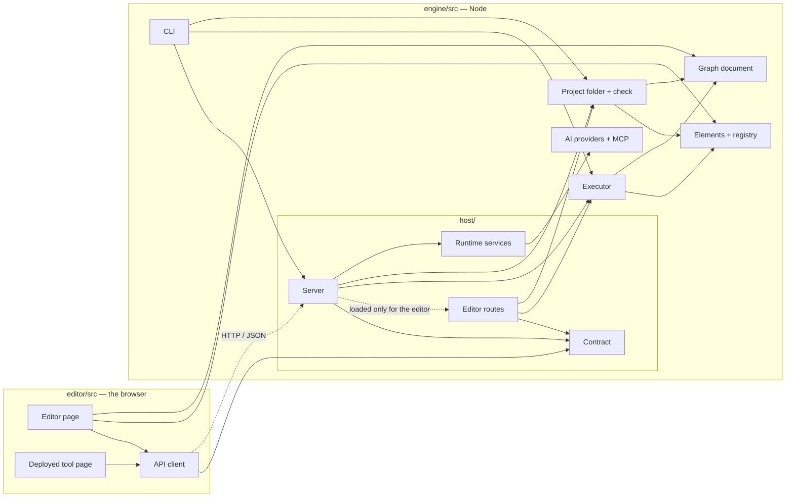
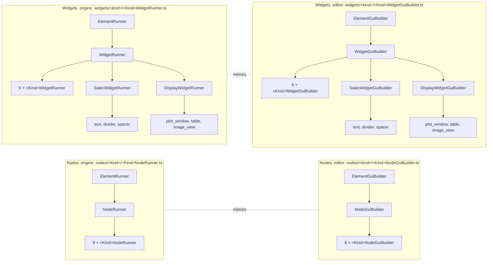
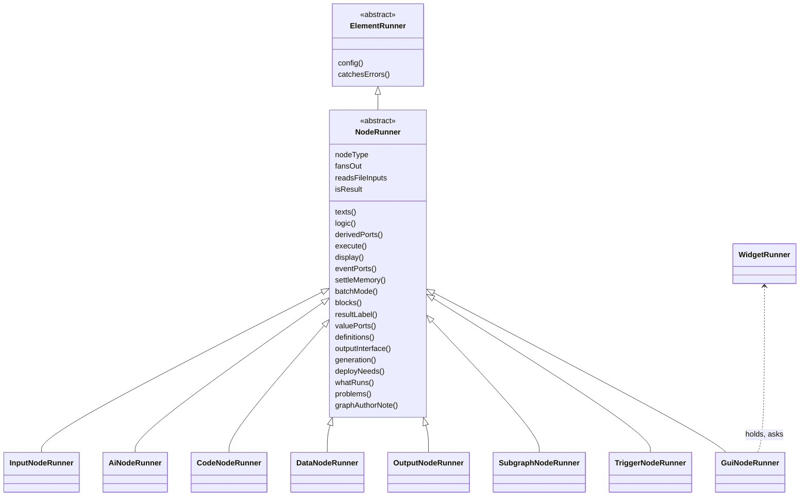
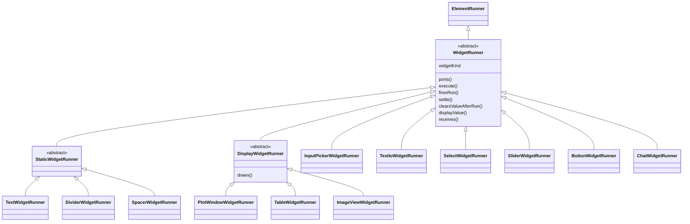
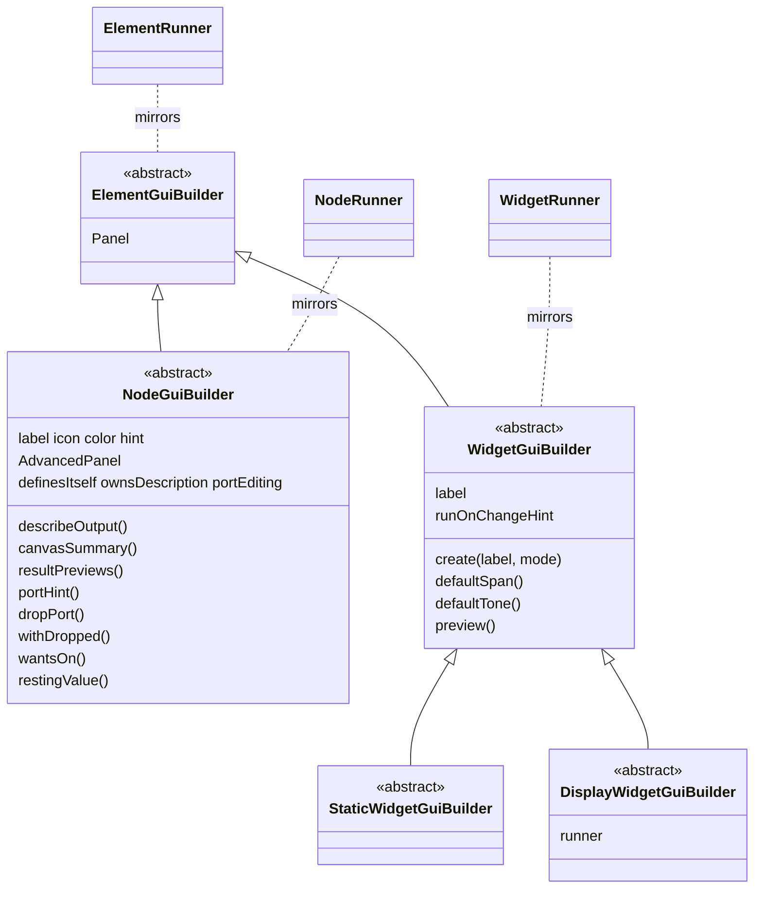
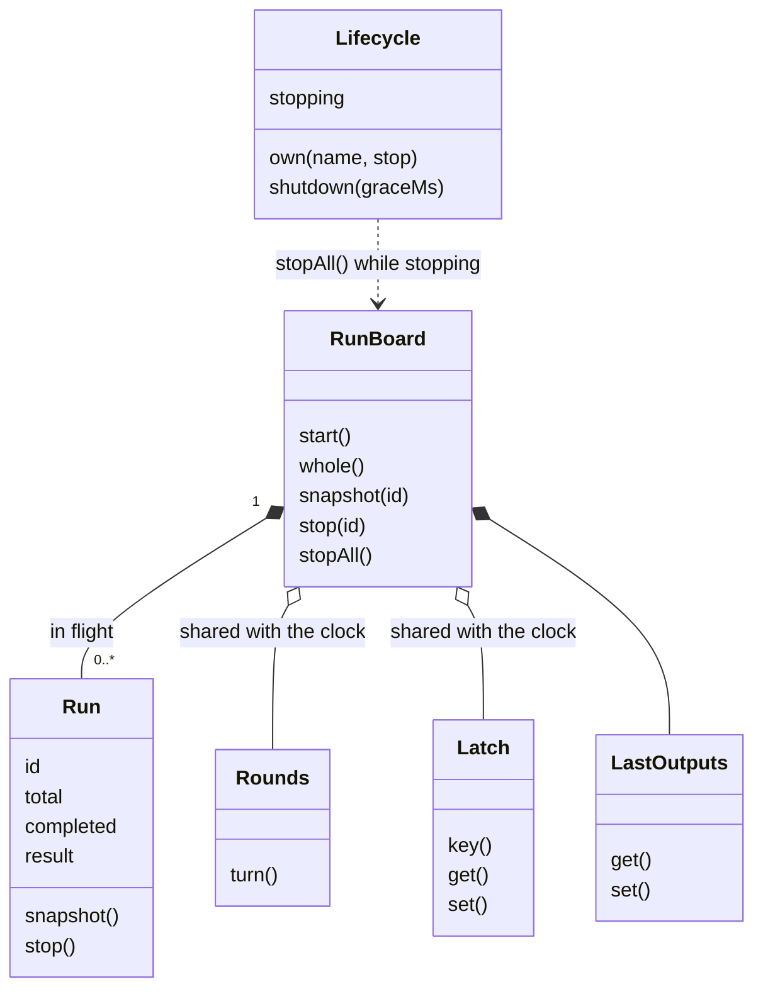
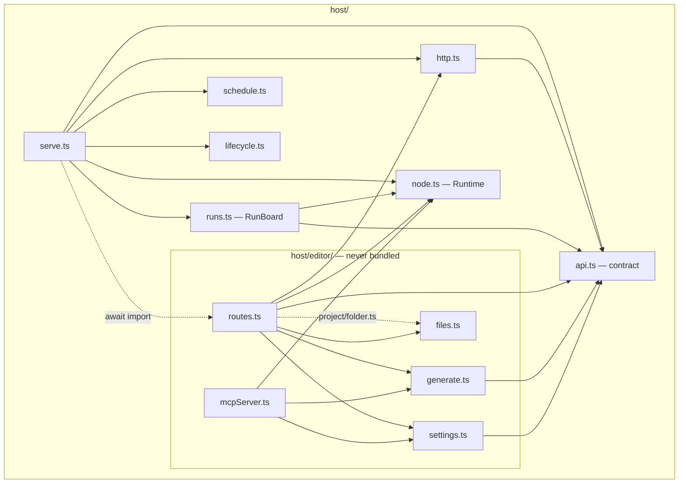
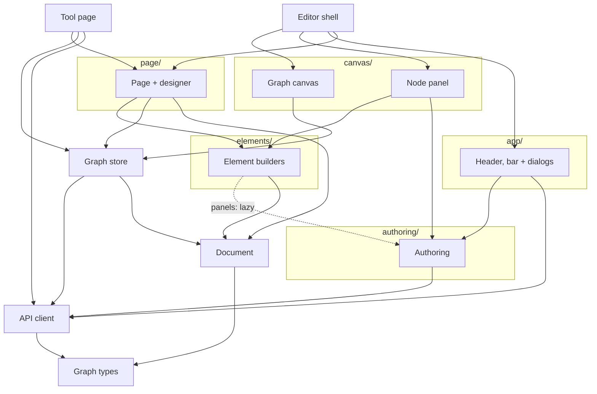

<!-- last verified: 2026-09-27 -->
# AI-Graph — architecture diagrams

Four architecture diagrams and four class diagrams, each with a table that maps every box to
its files: [the whole](#the-whole), [elements](#elements), [server](#server),
[browser](#browser); [node runners](#class-diagram-node-runners),
[widget runners](#class-diagram-widget-runners), [the builder side](#class-diagram-the-builder-side),
[runs and their state](#class-diagram-runs-and-their-state). The prose that explains them
is [docs/architecture.md](../docs/architecture.md), whose last section names where the code
does not yet keep its own rules.

## The whole

Two processes: **Node** runs graphs, **the browser** draws them. They talk over HTTP,
and the conversation is one table both ends import: the contract.

```mermaid
flowchart LR
  subgraph browser["editor/src — the browser"]
    EditorPage["Editor page"]
    ToolPage["Deployed tool page"]
    Client["API client"]
  end

  subgraph engine["engine/src — Node"]
    subgraph host["host/"]
      Contract["Contract"]
      Server["Server"]
      EditorRoutes["Editor routes"]
      Services["Runtime services"]
    end
    CLI["CLI"]
    Executor["Executor"]
    Elements["Elements + registry"]
    Graph["Graph document"]
    Project["Project folder + check"]
    AI["AI providers + MCP"]
  end

  EditorPage --> Client
  ToolPage --> Client
  Client --> Contract
  Client -. "HTTP / JSON" .-> Server
  Server --> Contract
  Server -. "loaded only for the editor" .-> EditorRoutes
  EditorRoutes --> Contract
  Server --> Executor
  EditorRoutes --> Executor
  CLI --> Server
  CLI --> Executor
  CLI --> Project
  Server --> Project
  EditorRoutes --> Project
  Project --> Elements
  Project --> Graph
  Executor --> Elements
  Executor --> Graph
  Server --> Services
  Services --> AI
  EditorPage --> Elements
  EditorPage --> Graph
```

| Diagram node | Path | Notes |
|---|---|---|
| `Editor page` | [`editor/src/App.tsx`](../editor/src/App.tsx), [`app/`](../editor/src/app/), [`canvas/`](../editor/src/canvas/), [`page/`](../editor/src/page/), [`authoring/`](../editor/src/authoring/), [`store/`](../editor/src/store/) | canvas, node editor, page designer; entry `editor/src/main.tsx` |
| `Deployed tool page` | [`editor/src/runtime/`](../editor/src/runtime/) | entry `runtime/main.tsx` → `runtime.html`; may not reach editor-only modules (`runtime/boundary.test.ts`) |
| `API client` | [`editor/src/api/client.ts`](../editor/src/api/client.ts) | `call(route, request)`; `ApiError`; `EditorView` narrows returned graphs; `watchGeneration` (a generation's calls, polled while it runs) |
| `Contract` | [`engine/src/host/api.ts`](../engine/src/host/api.ts) | every route: method, path, `tool`/`editor`, request and response types |
| `Server` | [`engine/src/host/serve.ts`](../engine/src/host/serve.ts), [`http.ts`](../engine/src/host/http.ts), [`runs.ts`](../engine/src/host/runs.ts), [`schedule.ts`](../engine/src/host/schedule.ts) | serves the page and the `tool` routes; refuses to start if a route has no handler |
| `Editor routes` | [`engine/src/host/editor/routes.ts`](../engine/src/host/editor/routes.ts) | the `editor` routes; dynamic import, never in a bundle |
| `Runtime services` | [`engine/src/host/node.ts`](../engine/src/host/node.ts) | files, sandboxed code, models, tools: the `Runtime` handed to elements |
| `CLI` | [`engine/src/main.ts`](../engine/src/main.ts), [`engine/src/cli/cli.ts`](../engine/src/cli/cli.ts) | run a folder or a file once / on a clock / `--serve` / `--bundle` / `--mcp` / `--editor` / `check` / `test` / `run-node` |
| `Executor` | [`engine/src/execution/`](../engine/src/execution/): `executor.ts`, `triggers.ts`, `batching.ts`, `reuse.ts`, `interface.ts`, `examples.ts`, `wiring.ts` (`ERROR_PORT` and `errorOutput`, the error output spelled once) | order, fan-out, memory, displays, stopping; reuses context a page event only needs; holds outputs to what a node's output.js says; one call of a node on its input.js example, held to its output.js (`callNode`, `runExample`; `testGraph` at every depth), and one node alone (`runNodeAlone`, `executeNode`), for ▶ Try, the CLI and MCP alike |
| `Elements + registry` | [`engine/src/elements/`](../engine/src/elements/), and its mirror [`editor/src/elements/`](../editor/src/elements/) | one class per node type and widget kind, mirrored file for file; see [elements](#elements) |
| `Graph document` | [`engine/src/graph.ts`](../engine/src/graph.ts), [`editor/src/graph.ts`](../editor/src/graph.ts) | the engine's types; `defaultMetadata()` (a graph's settings when nothing says otherwise: a new graph's, and what `flow.json` leaves out); the editor adds only the typed `NodeConfig` view |
| `Project folder + check` | [`engine/src/project/`](../engine/src/project/): [`folder.ts`](../engine/src/project/folder.ts), [`check.ts`](../engine/src/project/check.ts), [`folderCheck.ts`](../engine/src/project/folderCheck.ts) | a graph as a folder (`flow.json` with nodes and wires via [`flow.ts`](../engine/src/project/flow.ts), `layout.json`, `nodes/<id>/` with `node.json`, `interface.json` via [`interfaceFile.ts`](../engine/src/project/interfaceFile.ts), the files per `NodeRunner.texts` -- every one there from the start, a stub until something is written into it -- and a project folder of its own under a node that holds a graph), read and written for every caller; changes on disk; the one list of problems (`check`, MCP, and the editor before it loads a graph pasted in or designed by ✨ AI Graph: `problemsIn` reads no disk; what a folder gets wrong is `folderCheck.ts`) |
| `AI providers + MCP` | [`engine/src/ai/`](../engine/src/ai/) | providers, `ai-settings.json` and the one AI setting (`aiSetting`), MCP client |

The page also runs engine code directly — elements for ports and previews, the graph
types — which is why `Editor page` has arrows into `Elements` and `Graph` without HTTP.
The bundle a deployed tool ships is `engine/src` minus every `editor/` folder, plus the
built `runtime.html` ([`engine/src/cli/bundle.ts`](../engine/src/cli/bundle.ts)).

## Elements

What a node or a widget *is*, and how it looks and is edited. Two class hierarchies, one per
side, mirrored level for level: every engine class ends in `Runner`, and its editor
counterpart swaps that for `GuiBuilder`, in the same folder. [`symmetry.test.ts`](../editor/src/elements/symmetry.test.ts)
compares the two lineages class by class.

```mermaid
flowchart LR
  subgraph NE["Nodes, engine: nodes/#lt;kind#gt;/#lt;Kind#gt;NodeRunner.ts"]
    direction TB
    ER1["ElementRunner"] --> NR["NodeRunner"] --> KNR["8 × #lt;Kind#gt;NodeRunner"]
  end
  subgraph NB["Nodes, editor: nodes/#lt;kind#gt;/#lt;Kind#gt;NodeGuiBuilder.ts"]
    direction TB
    EG1["ElementGuiBuilder"] --> NG["NodeGuiBuilder"] --> KNG["8 × #lt;Kind#gt;NodeGuiBuilder"]
  end
  subgraph WE["Widgets, engine: widgets/#lt;kind#gt;/#lt;Kind#gt;WidgetRunner.ts"]
    direction TB
    ER2["ElementRunner"] --> WR["WidgetRunner"]
    WR --> KWR["6 × #lt;Kind#gt;WidgetRunner"]
    WR --> SR["StaticWidgetRunner"] --> KSR["text, divider, spacer"]
    WR --> DR["DisplayWidgetRunner"] --> KTR["plot_window, table, image_view"]
  end
  subgraph WB["Widgets, editor: widgets/#lt;kind#gt;/#lt;Kind#gt;WidgetGuiBuilder.ts"]
    direction TB
    EG2["ElementGuiBuilder"] --> WG["WidgetGuiBuilder"]
    WG --> KWG["6 × #lt;Kind#gt;WidgetGuiBuilder"]
    WG --> SG["StaticWidgetGuiBuilder"] --> KSG["text, divider, spacer"]
    WG --> DG["DisplayWidgetGuiBuilder"] --> KTG["plot_window, table, image_view"]
  end
  NE -. mirrors .- NB
  WE -. mirrors .- WB
```

| Diagram node | Path | Notes |
|---|---|---|
| `ElementRunner` | [`engine/src/elements/ElementRunner.ts`](../engine/src/elements/ElementRunner.ts) | what a node and a block share: `config()`, `catchesErrors()`; services in [`Runtime.ts`](../engine/src/elements/Runtime.ts) |
| `NodeRunner` | [`engine/src/elements/NodeRunner.ts`](../engine/src/elements/NodeRunner.ts) | `texts` (a node's files of its own), `logic` (its body), `derivedPorts`, `execute`, `display`, `runtimeRequirements`, `settleMemory`, `blocks`, `isResult`, `resultLabel`, `valuePorts`, `definitions` (a code or ai node's input.js and output.js) and `outputInterface` (the shape of its output.js example), and what the executor reads; `resultKeys` (the key each result node is handed on under: the first under a label keeps it) ┊ build time: `generation`, `deployNeeds`, `whatRuns` (a `WhatRuns`), `problems`, `graphAuthorNote`, `referencedPaths` |
| `8 × <Kind>NodeRunner` | [`engine/src/elements/nodes/`](../engine/src/elements/nodes/) | `nodes/<kind>/<Kind>NodeRunner.ts`; listed in [`registry.ts`](../engine/src/elements/registry.ts), which also says which `Generation` a node type has (`registry.generation`; a block has none) |
| `WidgetRunner` | [`engine/src/elements/WidgetRunner.ts`](../engine/src/elements/WidgetRunner.ts) | `ports`, `execute`, `firesRun`, `settle`, `displayValue` ┊ build time: `receives`, `graphAuthorNote`; a block writes nothing, so it has no body, no files and no ✨ |
| `6 × <Kind>WidgetRunner` | [`engine/src/elements/widgets/<kind>/<Kind>WidgetRunner.ts`](../engine/src/elements/widgets/) | input_picker, text_io, select, slider, button, chat; listed in [`widgets/roster.ts`](../engine/src/elements/widgets/roster.ts). A folder picker lists its folder through [`folderListing.ts`](../engine/src/elements/folderListing.ts), the function an input node's directory mode lists with |
| `StaticWidgetRunner` | [`widgets/StaticWidgetRunner.ts`](../engine/src/elements/widgets/StaticWidgetRunner.ts) | no ports: part of the page, not the graph; its kinds are `text`, `divider`, `spacer` (the diagram's list) |
| `DisplayWidgetRunner` | [`widgets/DisplayWidgetRunner.ts`](../engine/src/elements/widgets/DisplayWidgetRunner.ts) | one input, nothing out: shows what arrives, runs no code, and says what it draws (`draws`, what a node wired into it `receives`); its kinds are `plot_window`, `table`, `image_view` (the diagram's list; an image reads a path into the picture, `displayValue`) |
| `ElementGuiBuilder` | [`editor/src/elements/ElementGuiBuilder.ts`](../editor/src/elements/ElementGuiBuilder.ts) | `Panel` (lazy) |
| `NodeGuiBuilder` | [`editor/src/elements/NodeGuiBuilder.ts`](../editor/src/elements/NodeGuiBuilder.ts) | `label`, `icon`, `color`, `hint`, `AdvancedPanel`, `describeOutput`/`canvasSummary`, `resultPreviews` (what the canvas shows of the last result, beside which port: [`resultPreview.ts`](../editor/src/elements/resultPreview.ts) reads a value by its shape; a page asks each block); what the shells ask instead of naming a kind: `definesItself` (its ports under Advanced), `ownsDescription`, `portEditing`/`portHint`, `wantsOn`, `restingValue`, `dropPort`/`withDropped` (what a file dropped on the node on the canvas gives it: one more file its ✨ Input writes from, or what a data node holds); `NodePanelProps` |
| `8 × <Kind>NodeGuiBuilder` | [`editor/src/elements/nodes/`](../editor/src/elements/nodes/) | `nodes/<kind>/<Kind>NodeGuiBuilder.ts` beside `<Kind>NodePanel.tsx`; listed in [`registry.ts`](../editor/src/elements/registry.ts). A code, an ai and a data node's panel is `authoring/NodeDefinition.tsx` |
| `WidgetGuiBuilder` | [`editor/src/elements/WidgetGuiBuilder.ts`](../editor/src/elements/WidgetGuiBuilder.ts) | `create(label, mode)`, `label`, `defaultSpan`, `defaultTone`, `runOnChangeHint`, `paletteEntries` (what the Page tab's palette offers of the kind), `InlineEditor` (a block typed where it stands: the text kind's [`TextInPlace.tsx`](../editor/src/elements/widgets/text/TextInPlace.tsx)), `preview` (what the block shows, small, under its port on the canvas: a chart reads points as a chart); `WidgetPanelProps` |
| `6 × <Kind>WidgetGuiBuilder` | [`editor/src/elements/widgets/<kind>/<Kind>WidgetGuiBuilder.ts`](../editor/src/elements/widgets/) | beside `<Kind>WidgetView.tsx` and, if it has settings, `<Kind>WidgetPanel.tsx`; listed in [`widgets/roster.ts`](../editor/src/elements/widgets/roster.ts) |
| `StaticWidgetGuiBuilder` | [`widgets/StaticWidgetGuiBuilder.ts`](../editor/src/elements/widgets/StaticWidgetGuiBuilder.ts) | starts unnamed: page furniture has no ports to name |
| `DisplayWidgetGuiBuilder` | [`widgets/DisplayWidgetGuiBuilder.ts`](../editor/src/elements/widgets/DisplayWidgetGuiBuilder.ts) | owns the one panel of chart, table and image ([`DisplayWidgetPanel.tsx`](../editor/src/elements/widgets/DisplayWidgetPanel.tsx)): one sentence of what the kind's runner `draws`; no output, so the block editor offers no "starts the graph" |

Also related, not drawn:

- `body.ts`: [`engine/src/elements/body.ts`](../engine/src/elements/body.ts), `runBody`: the one way an authored body runs — `run(inputs, node)`, on Node, sandboxed, with `node.llm`. Only nodes have bodies: a block writes nothing
- `FolderListing.tsx`: [`editor/src/elements/fields/FolderListing.tsx`](../editor/src/elements/fields/FolderListing.tsx), what a folder adds to its path and file types, for the input node and the folder picker alike: subfolders, the one line that choosing some files is a code node after it, and the list as a run makes it
- `times.test.ts`: [`engine/src/elements/times.test.ts`](../engine/src/elements/times.test.ts) · [`editor/…`](../editor/src/elements/times.test.ts), build time and run time inside one class: the bars, the order, and (in the engine) that no run reaches a build-time member; in the editor, that a `GuiBuilder`'s run-time bar is empty, with `runtime/boundary.test.ts` holding that a tool never loads one

Shared by elements, not drawn: [`authoring/generation.ts`](../engine/src/authoring/generation.ts),
[`authoring/logic.ts`](../engine/src/authoring/logic.ts),
[`authoring/definition.ts`](../engine/src/authoring/definition.ts) (input.js and output.js: a
typedef, then one example as plain JSON, read without running anything),
[`authoring/prompts.ts`](../engine/src/authoring/prompts.ts) (the standard prompts and their
variables) and [`authoring/history.ts`](../engine/src/authoring/history.ts) (history.md) on
the engine side;
[`elements/fields/`](../editor/src/elements/fields/) (settings several panels share),
and, one layer down in [`document/`](../editor/src/document/), [`baseNodeConfig.ts`](../editor/src/document/baseNodeConfig.ts)
(every node's starting config), [`nodeKinds.ts`](../editor/src/document/nodeKinds.ts) (each node type's
`create`, and the `settings` a saved file keeps) and
[`guiWidgets.ts`](../editor/src/document/guiWidgets.ts) (a page's ports, as the engine derives them).

## Class diagram: node runners

The engine's half of a node kind. Members are those a subclass answers for; `┊` in
[docs/architecture.md](../docs/architecture.md#build-time-and-run-time-in-one-class) separates run time from
build time, and the bars in each file say the same. Checked against the `extends` clauses in the source.

```mermaid
classDiagram
  class ElementRunner {
    <<abstract>>
    config()
    catchesErrors()
  }
  class NodeRunner {
    <<abstract>>
    nodeType
    texts()
    logic()
    derivedPorts()
    execute()
    display()
    eventPorts()
    settleMemory()
    fansOut
    batchMode()
    readsFileInputs
    blocks()
    isResult
    resultLabel()
    valuePorts()
    definitions()
    outputInterface()
    generation()
    deployNeeds()
    whatRuns()
    problems()
    graphAuthorNote()
  }
  ElementRunner <|-- NodeRunner
  NodeRunner <|-- InputNodeRunner
  NodeRunner <|-- AiNodeRunner
  NodeRunner <|-- CodeNodeRunner
  NodeRunner <|-- DataNodeRunner
  NodeRunner <|-- OutputNodeRunner
  NodeRunner <|-- SubgraphNodeRunner
  NodeRunner <|-- TriggerNodeRunner
  NodeRunner <|-- GuiNodeRunner
  WidgetRunner <.. GuiNodeRunner : holds, asks
```

| Diagram node | Path | Notes |
|---|---|---|
| `ElementRunner` | [`engine/src/elements/ElementRunner.ts`](../engine/src/elements/ElementRunner.ts) | what a node and a block share |
| `NodeRunner` | [`engine/src/elements/NodeRunner.ts`](../engine/src/elements/NodeRunner.ts) | its members in three bars; `Logic` ([`authoring/logic.ts`](../engine/src/authoring/logic.ts)) is what `logic()` returns, `Definitions` ([`authoring/definition.ts`](../engine/src/authoring/definition.ts)) what `definitions()` does; `problems()` is answered by ai, code, gui, subgraph and trigger |
| `InputNodeRunner` … `TriggerNodeRunner` | [`engine/src/elements/nodes/<kind>/<Kind>NodeRunner.ts`](../engine/src/elements/nodes/) | `AiNodeRunner` also has `prompt.ts`, `ask.ts`; `SubgraphNodeRunner` has `boundary.ts` |
| `GuiNodeRunner` | [`engine/src/elements/nodes/gui/GuiNodeRunner.ts`](../engine/src/elements/nodes/gui/GuiNodeRunner.ts) | a composite: its ports are its widgets'; `display` shows each display block what arrived, through its `displayValue` |
| `WidgetRunner` | [`engine/src/elements/WidgetRunner.ts`](../engine/src/elements/WidgetRunner.ts) | see the next diagram |

## Class diagram: widget runners

```mermaid
classDiagram
  class WidgetRunner {
    <<abstract>>
    widgetKind
    ports()
    execute()
    firesRun()
    settle()
    clearsValueAfterRun()
    displayValue()
    receives()
  }
  class StaticWidgetRunner {
    <<abstract>>
  }
  class DisplayWidgetRunner {
    <<abstract>>
    draws()
  }
  ElementRunner <|-- WidgetRunner
  WidgetRunner <|-- InputPickerWidgetRunner
  WidgetRunner <|-- TextIoWidgetRunner
  WidgetRunner <|-- SelectWidgetRunner
  WidgetRunner <|-- SliderWidgetRunner
  WidgetRunner <|-- ButtonWidgetRunner
  WidgetRunner <|-- ChatWidgetRunner
  WidgetRunner <|-- StaticWidgetRunner
  WidgetRunner <|-- DisplayWidgetRunner
  StaticWidgetRunner <|-- TextWidgetRunner
  StaticWidgetRunner <|-- DividerWidgetRunner
  StaticWidgetRunner <|-- SpacerWidgetRunner
  DisplayWidgetRunner <|-- PlotWindowWidgetRunner
  DisplayWidgetRunner <|-- TableWidgetRunner
  DisplayWidgetRunner <|-- ImageViewWidgetRunner
```

This one has 15 boxes instead of 12: it is a plain tree, and cutting it in two would hide the point, which is that
two abstract levels carry what 12 kinds share.

| Diagram node | Path | Notes |
|---|---|---|
| `WidgetRunner` | [`engine/src/elements/WidgetRunner.ts`](../engine/src/elements/WidgetRunner.ts) | no block writes a body: `logic()`, `texts()` and `generation()` are a node's (`NodeRunner`), and a block has none of them |
| `StaticWidgetRunner`, `DisplayWidgetRunner` | [`engine/src/elements/widgets/`](../engine/src/elements/widgets/) | no ports · one input, nothing out: shows what arrives, and says what it draws |
| `<Kind>WidgetRunner` | [`engine/src/elements/widgets/<kind>/<Kind>WidgetRunner.ts`](../engine/src/elements/widgets/) | listed in [`widgets/roster.ts`](../engine/src/elements/widgets/roster.ts); how a chart is laid out, margins and all, is the page's (`PlotChart.tsx`), at the block's real size |

## Class diagram: the builder side

Every engine class above has a counterpart in the browser that swaps `Runner` for `GuiBuilder`, in the same
relative folder and with the same inheritance; [`symmetry.test.ts`](../editor/src/elements/symmetry.test.ts) compares
the lineages class by class. Only the abstract levels are drawn; below them the trees are the ones above.

```mermaid
classDiagram
  class ElementGuiBuilder {
    <<abstract>>
    Panel
  }
  class NodeGuiBuilder {
    <<abstract>>
    label icon color hint
    AdvancedPanel
    describeOutput()
    canvasSummary()
    resultPreviews()
    definesItself ownsDescription portEditing
    portHint()
    dropPort()
    withDropped()
    wantsOn()
    restingValue()
  }
  class WidgetGuiBuilder {
    <<abstract>>
    label
    create(label, mode)
    defaultSpan()
    defaultTone()
    runOnChangeHint
    preview()
  }
  class StaticWidgetGuiBuilder {
    <<abstract>>
  }
  class DisplayWidgetGuiBuilder {
    <<abstract>>
    runner
  }
  ElementGuiBuilder <|-- NodeGuiBuilder
  ElementGuiBuilder <|-- WidgetGuiBuilder
  WidgetGuiBuilder <|-- StaticWidgetGuiBuilder
  WidgetGuiBuilder <|-- DisplayWidgetGuiBuilder
  ElementRunner .. ElementGuiBuilder : mirrors
  NodeRunner .. NodeGuiBuilder : mirrors
  WidgetRunner .. WidgetGuiBuilder : mirrors
```

| Diagram node | Path | Notes |
|---|---|---|
| `ElementGuiBuilder` | [`editor/src/elements/ElementGuiBuilder.ts`](../editor/src/elements/ElementGuiBuilder.ts) | `Panel`, loaded lazily |
| `NodeGuiBuilder` | [`editor/src/elements/NodeGuiBuilder.ts`](../editor/src/elements/NodeGuiBuilder.ts) | builder only; `generation` is a node's, as no block has a body to write; what a node *is* on load and save is in [`document/nodeKinds.ts`](../editor/src/document/nodeKinds.ts) |
| `WidgetGuiBuilder` | [`editor/src/elements/WidgetGuiBuilder.ts`](../editor/src/elements/WidgetGuiBuilder.ts) | what the *page* draws is in [`page/blocks.ts`](../editor/src/page/blocks.ts) and the `<Kind>WidgetView.tsx` files |
| `DisplayWidgetGuiBuilder` | [`editor/src/elements/widgets/DisplayWidgetGuiBuilder.ts`](../editor/src/elements/widgets/DisplayWidgetGuiBuilder.ts) | owns the one panel of chart, table and image: one sentence of what its `runner` draws |

## Class diagram: runs and their state

The classes that are not elements: what the server keeps while graphs run. `serve()` creates the `Latch`, the
`Rounds` and the `Lifecycle` and hands the first two to the `RunBoard` and the clock.

```mermaid
classDiagram
  class Lifecycle {
    own(name, stop)
    shutdown(graceMs)
    stopping
  }
  class RunBoard {
    start()
    whole()
    snapshot(id)
    stop(id)
    stopAll()
  }
  class Run {
    id
    total
    completed
    result
    snapshot()
    stop()
  }
  class Rounds {
    turn()
  }
  class Latch {
    key()
    get()
    set()
  }
  class LastOutputs {
    get()
    set()
  }
  RunBoard "1" *-- "0..*" Run : in flight
  RunBoard o-- Rounds : shared with the clock
  RunBoard o-- Latch : shared with the clock
  RunBoard *-- LastOutputs
  Lifecycle ..> RunBoard : stopAll() while stopping
```

| Diagram node | Path | Notes |
|---|---|---|
| `Lifecycle` | [`engine/src/host/lifecycle.ts`](../engine/src/host/lifecycle.ts) | what a server stops, in order, once, within a grace period |
| `RunBoard`, `Run` | [`engine/src/host/runs.ts`](../engine/src/host/runs.ts) | two classes in one file (a review-sized exception to "one class per file"); forgets a run after 5 minutes |
| `Rounds` | [`engine/src/host/rounds.ts`](../engine/src/host/rounds.ts) | one round of a graph at a time; a graph is known by its name and shape (`graphKey`) |
| `Latch` | [`engine/src/execution/latch.ts`](../engine/src/execution/latch.ts) | what every node made last, for rounds its ◆ stays shut, kept under the graph and what the node is made from as written; gone at restart |
| `LastOutputs` | [`engine/src/execution/reuse.ts`](../engine/src/execution/reuse.ts) | outputs a page event may hand back for context-only nodes; the file is not named after the class |

Not drawn: the error classes (`Refusal`, `NotFound`, `NotAGraph`, `FileChanged`, …), spread over the
files that throw them; `errors.ts` holds `NotFound` and `NotAGraph`, the two more than one file needs.

## Server

The Node side of the wire. `serve.ts` answers the routes of the contract; the `tool` rows
live beside it, the `editor` rows in `host/editor/`, which is loaded only when the server
is the editor and is never copied into a bundle.

```mermaid
flowchart TD
  subgraph host["host/"]
    Api["api.ts — contract"]
    Http["http.ts"]
    Serve["serve.ts"]
    Runs["runs.ts — RunBoard"]
    Schedule["schedule.ts"]
    Lifecycle["lifecycle.ts"]
    Node["node.ts — Runtime"]
    subgraph editor["host/editor/ — never bundled"]
      Routes["routes.ts"]
      Generate["generate.ts"]
      Settings["settings.ts"]
      Files["files.ts"]
      Mcp["mcpServer.ts"]
    end
  end

  Serve --> Api
  Serve --> Http
  Serve --> Runs
  Serve --> Schedule
  Serve --> Lifecycle
  Serve --> Node
  Serve -. "await import" .-> Routes
  Http --> Api
  Runs --> Api
  Runs --> Node
  Routes --> Api
  Routes --> Http
  Routes --> Node
  Routes --> Generate
  Routes -. "project/folder.ts" .-> Files
  Routes --> Settings
  Routes --> Files
  Generate --> Api
  Settings --> Api
  Mcp --> Generate
  Mcp --> Settings
  Mcp --> Node
```

| Diagram node | Path | Notes |
|---|---|---|
| `api.ts — contract` | [`engine/src/host/api.ts`](../engine/src/host/api.ts) | `API` table, `RequestOf`/`ResponseOf`, `matchRoute`, `pathFor`; wire types (`RunSnapshot`, `AICall`, `SettingsStatus`, …) |
| `http.ts` | [`engine/src/host/http.ts`](../engine/src/host/http.ts) | `Refusal` (thrown with a status), `Download`, `Handler`/`Handlers`, JSON (only as `application/json`) and byte bodies, static page; `foreignRequest`: a loopback host with the server's port, and no foreign origin or cross-site call |
| `serve.ts` | [`engine/src/host/serve.ts`](../engine/src/host/serve.ts) | `serve()`: dispatch by the table; `toolRoutes()`: graph, schedule, AI settings (read-only), requirements, run/watch/stop, browse |
| `runs.ts — RunBoard` | [`engine/src/host/runs.ts`](../engine/src/host/runs.ts) | runs in flight: start, snapshot, stop, `stopAll` for a shutdown, forget after 5 min |
| `rounds.ts` | [`engine/src/host/rounds.ts`](../engine/src/host/rounds.ts) | one round of a graph at a time: the clock's and the page's rounds share the queue, and the [`Latch`](../engine/src/execution/latch.ts) that holds what every node made last |
| `schedule.ts` | [`engine/src/host/schedule.ts`](../engine/src/host/schedule.ts) | a clock per trigger node, each round told which began it; `ScheduleState`, kept in `<graph>.last-run.json` across restarts |
| `lifecycle.ts` | [`engine/src/host/lifecycle.ts`](../engine/src/host/lifecycle.ts) | `Lifecycle`: what a server must stop, in order, once, within a grace period; `untilStopped`: signals → shutdown → exit code, used by [`cli/cli.ts`](../engine/src/cli/cli.ts) |
| `node.ts — Runtime` | [`engine/src/host/node.ts`](../engine/src/host/node.ts) | `nodeFiles`, `nodeCode` (sandboxed `node --permission`; a body may ask this process for what it may not do itself — `BodyContext.calls`, how `node.llm` works), `nodeRuntime()` |
| `routes.ts` | [`engine/src/host/editor/routes.ts`](../engine/src/host/editor/routes.ts) | `editorRoutes()`: try a node, open/save a project or file (reload is an open again) and what changed on disk (through [`project/folder.ts`](../engine/src/project/folder.ts)), generation + live transcripts, bundle, settings |
| `generate.ts` | [`engine/src/host/editor/generate.ts`](../engine/src/host/editor/generate.ts) | a node's `prompt.md`, filled, and the frame: write → run on a sample → check → repair once; `write`: the body, an example with its files, or the output definition; `refine`: the body there is changed as said (the request restated with it), or repaired from how it failed; `generateGraph` with [`graphPrompt.ts`](../engine/src/host/editor/graphPrompt.ts) |
| `settings.ts` | [`engine/src/host/editor/settings.ts`](../engine/src/host/editor/settings.ts) | the settings dialog's view of `ai-settings.json`: keys, endpoints, and saving the one AI setting |
| `files.ts` | [`engine/src/host/editor/files.ts`](../engine/src/host/editor/files.ts) | finding projects and dropped files (by name and size), open in own editor |
| `mcpServer.ts` | [`engine/src/host/editor/mcpServer.ts`](../engine/src/host/editor/mcpServer.ts) | `--mcp`: graph tools for Claude, confined to one folder, reading and writing projects through [`project/folder.ts`](../engine/src/project/folder.ts) and checking with [`project/check.ts`](../engine/src/project/check.ts) and [`folderCheck.ts`](../engine/src/project/folderCheck.ts); started from [`cli/cli.ts`](../engine/src/cli/cli.ts) |

Not drawn: every handler also calls into `executor.ts`, `registry.ts` and `graph.ts`
(see the [overview](#the-whole)); `zip.ts` is a small helper of `routes.ts`, `skeleton.ts` and
`brief.ts` (the three variables of a node's `prompt.md`, filled and cut to a budget) of `generate.ts`, and
[`host/browse.ts`](../engine/src/host/browse.ts) is what `serve.ts`'s browse route lists a folder with.

## Browser

The page side of the wire. The areas stand in layers, and [`layers.test.ts`](../editor/src/layers.test.ts)
fails on an import that goes up: `ui` · `graph` · `document`, `api` · `store` · `dialogs` ·
`elements`, `authoring` · `page`, `canvas` · `app` · `App`, `runtime`. Two entry points share one set of modules: the editor
(`main.tsx` → `App.tsx`) and the deployed tool's page (`runtime/main.tsx` →
`RuntimeApp.tsx`), which reaches element views but never a panel or an editing module.

```mermaid
flowchart TD
  App["Editor shell"]
  Runtime["Tool page"]

  subgraph app["app/"]
    Toolbar["Header, bar + dialogs"]
  end
  subgraph canvas["canvas/"]
    Canvas["Graph canvas"]
    NodeEd["Node panel"]
  end
  subgraph page["page/"]
    Page["Page + designer"]
  end
  subgraph elements["elements/"]
    Registry["Element builders"]
  end
  subgraph authoring["authoring/"]
    Authoring["Authoring"]
  end

  Store["Graph store"]
  Document["Document"]
  Client["API client"]
  Graph["Graph types"]

  App --> Canvas
  App --> NodeEd
  App --> Toolbar
  App --> Page
  Runtime --> Page
  Runtime --> Store
  Runtime --> Client
  Canvas --> Store
  NodeEd --> Registry
  NodeEd --> Authoring
  Toolbar --> Authoring
  Toolbar --> Client
  Page --> Registry
  Page --> Store
  Page --> Document
  Registry -. "panels: lazy" .-> Authoring
  Authoring --> Client
  Store --> Client
  Store --> Document
  Registry --> Document
  Document --> Graph
  Client --> Graph
```

| Diagram node | Path | Notes |
|---|---|---|
| `Editor shell` | [`editor/src/App.tsx`](../editor/src/App.tsx), [`main.tsx`](../editor/src/main.tsx) | views (Graph · Page · Preview), open/save, drop a file |
| `Tool page` | [`editor/src/runtime/`](../editor/src/runtime/) | `RuntimeApp.tsx`, `RuntimeAISettings.tsx` (read-only); [`boundary.test.ts`](../editor/src/runtime/boundary.test.ts) keeps panels and editing modules out |
| `Header, bar + dialogs` | [`editor/src/app/`](../editor/src/app/) | `Toolbar.tsx`, the header (the app's and the graph's name, `ViewTabs.tsx`; the one ▶ Run, on every tab; Generate, Settings, Deploy: the zip), [`FileMenu.tsx`](../editor/src/app/FileMenu.tsx) (New, ✨ AI Graph -- a new graph from a description --, Open, Save, Save as…, Reload, JSON: `fileActions`, each saying why it waits during a run), [`ChangeBar.tsx`](../editor/src/app/ChangeBar.tsx) (the bar under the canvas: say what to change on the node selected -- its panel takes it up (`askChange`) -- or on the whole graph, which ✨ AI Graph changes and the bar shows before Apply) and [`graphChange.ts`](../editor/src/app/graphChange.ts) (what the bar is on, where a change goes, and what a changed graph adds, removes and changes), `Sidebar.tsx` (the palette: every node but the page; its icons below 1280 pixels), `SettingsDialog.tsx`, `ResultsPanel.tsx` (beside the canvas while no node's panel is open); [`SubgraphTrail.tsx`](../editor/src/app/SubgraphTrail.tsx) (the breadcrumb into a node's graph and back out, which waits for a run in flight); [`GraphProblems.tsx`](../editor/src/app/GraphProblems.tsx) (what the engine's `check` finds in a graph about to be taken in from outside, said before Load or Apply); [`windowDrops.ts`](../editor/src/app/windowDrops.ts) (what is dropped anywhere on the window: which project a folder is, said with where the engine looked when it is none -- and a file dropped into a code box is the box's, typed in by its editor) |
| `Graph canvas` | [`editor/src/canvas/GraphCanvas.tsx`](../editor/src/canvas/GraphCanvas.tsx), [`GraphNodeView.tsx`](../editor/src/canvas/GraphNodeView.tsx) | ReactFlow; a node is a card -- [`NodeKind.tsx`](../editor/src/canvas/NodeKind.tsx) (its kind as a tag in its tint, and its id: on the card and atop its panel), its heading and its text's first line, its ports as dots on its edges; the page's ports as rows -- and one click opens its panel, which [`inView.ts`](../editor/src/canvas/inView.ts) keeps it in view beside; [`wireLook.ts`](../editor/src/canvas/wireLook.ts) (soft grey wires, the selected node's in the accent, a ◆'s amber and dashed); a file dropped on a node is one more file its ✨ Input writes from -- or what a data node holds -- where the element takes one (`dropPort`, `authoring/droppedFile.ts`); [`ResultPreview.tsx`](../editor/src/canvas/ResultPreview.tsx) (what a node made last, drawn small on its card: a line, a count and its first row, a sketch, a thumbnail, or its error's first line), `nodeRemoval.ts` (Delete only as pressed on the canvas), `PortsEditor.tsx`, [`portIds.ts`](../editor/src/canvas/portIds.ts) (the port names a node's panel will not store: none, twice, the error port's) |
| `Node panel` | [`editor/src/canvas/NodeEditor.tsx`](../editor/src/canvas/NodeEditor.tsx), [`PageCardPanel.tsx`](../editor/src/canvas/PageCardPanel.tsx) | a node's panel, docked beside the canvas while the node is selected (`ui/SidePanel`), with no Save -- the page's is the way to the Page tab: its heading (`authoring/HeadingField.tsx`, never empty), the element's own `Panel` — for a code, ai or data node `authoring/NodeDefinition.tsx` — and `AdvancedPanel` folded under it, with the ports of a node that `definesItself`; the one ✨ handler: what is missing first (`writesFor`), each written in as it comes; [`nodeDialog.ts`](../editor/src/canvas/nodeDialog.ts) (what is changed is shown at once and written a moment later, one undo step per field typed into, and on close; a change from outside is taken with what waits kept on top); [`nodeDraft.ts`](../editor/src/canvas/nodeDraft.ts) (`withSetting`: a setting's change, its ports following -- or a function of the setting, for a write that lands after a wait; `withPorts`: a ports edit, the keys of input.js and output.js following the ports; `saveDraft`: the write, the wires following the ports) |
| `Page + designer` | [`editor/src/page/`](../editor/src/page/) | `GuiPage.tsx` draws a page (shared with the tool page) -- or, while it has no blocks, the tool without one: what it does and `RunResult.tsx`, the run's result, each output node's values under its label; `DesignerTab.tsx`, `DesignerPalette.tsx` (where each block kind's own `paletteEntries` stand, and `newBlock`: the block an entry adds, named for its kind), `WidgetEditor.tsx`, `pageWrite.ts` (the page is one node, which its first block makes, beside what is on the canvas and in that block's undo step, and its last block takes away; `patchBlock`: one block changed on the page as the store holds it when the change lands -- set in its panel, or used on the page, `usePageEvents`); [`PageHeading.tsx`](../editor/src/page/PageHeading.tsx) (above the page, the graph's name and description: the tool is called what the graph is, and the delivered header shows the same); `PreviewTab.tsx` (the delivered page, with no ▶ Run of its own, and the pop-out ⧉ Open as a tool); [`TopGraphOnly.tsx`](../editor/src/page/TopGraphOnly.tsx) (the designer and the preview only in the graph at the top, where a page can be); [`typedValues.ts`](../editor/src/page/typedValues.ts) (what was typed into a live block, shown while the block still holds it); [`useDeliveredRun.ts`](../editor/src/page/useDeliveredRun.ts) (ask what a graph needs, write the answers by the engine's `applyRuntimeValues`, then run: for the tool page, the preview and the toolbar's ▶ Run alike) |
| `Element builders` | [`editor/src/elements/`](../editor/src/elements/) | `registry.ts`, `ElementGuiBuilder.ts`, one folder per element — see [elements](#elements). A chart's view, `plot_window/PlotWindowWidgetView.tsx`, measures the block and hands what arrived to `PlotChart.tsx`, which lays a figure `{kind, title, points}` out at that size (or shows finished SVG), redrawn on a resize with no run. [`resultPreview.ts`](../editor/src/elements/resultPreview.ts) reads a value small, by its shape, for the canvas |
| `Authoring` | [`editor/src/authoring/`](../editor/src/authoring/) | a node's text and what ✨ writes from it: `NodeDefinition.tsx` (its text, a row per ✨ -- the button, the prompt it is written with, its file's content in a box (`CodeField`/`CodeSurface`, CodeMirror, lazy) and a chip beside it that opens the file (`FileChip.tsx`) -- the files ✨ Input and ✨ Output write from, ▶ Try (`TryExample.tsx`) and history.md; a change said in the bar for the node, `pendingChange`, is made here), `HeadingField.tsx`; the request and what comes back written in (`generation.ts`: `generateRequest`, `writtenInto`, `writesFor`, `unfitDefinition`), {Context} (`graphContext.ts`), the wiring ✨ is told (`generationContext.ts`), the files ✨ Input reads from the graph (`exampleFile.ts`), a port's keys in the definitions (`definitionPorts.ts`), "Run once per item" and "whole list" (`perItem.ts`); a dropped file (`droppedFile.ts`) and a folder's listing read as a run reads it (`readAsRun.ts`); `useGenerate`, `LiveGeneration`, `GenerationTranscript`; the graph-wide sweep over the nodes (`graphSweep.ts`, `useGraphSweep.ts`); `useTyped.ts` (a box keeps what is typed while its stored form comes back tidied) |
| `Graph store` | [`editor/src/store/graphStore.ts`](../editor/src/store/graphStore.ts) | the open graph, undo, a new one (`newGraph`, from the engine's `defaultMetadata`), the node the person is on (`editingNodeId`, `clearSelection`), a change said for a node's panel (`pendingChange`, `askChange`, `clearChange`), the graph changed as one undo step (`changeGraph`), saving it (`save`: what counts as saved is what was sent), runs (start → poll `run` → replay `memory`); `nodeData.ts`, `executionStatus.ts`; [`portRenames.ts`](../editor/src/store/portRenames.ts) (which port became which across an edit of a node's ports, so a renamed port keeps its wires -- and, edit by edit, its keys in input.js and output.js: `renamedPorts`) |
| `API client` | [`editor/src/api/client.ts`](../editor/src/api/client.ts) | the contract's client: `call(route, request)`, `ApiError`, `watchGeneration`; `errorText.ts` |
| `Document` | [`editor/src/document/`](../editor/src/document/) | what a graph is to the editor: [`nodeKinds.ts`](../editor/src/document/nodeKinds.ts) (a node of each type, loaded and saved; a new one's numbered heading, `heading.ts`), `baseNodeConfig.ts`, `givenFiles.ts` (the files a node's ✨ Input and ✨ Output are given), `guiWidgets.ts` (a page's ports, as the engine derives them; `pageOf`: which node is the page, and its blocks; and `blockShows`: what a run put on a block, for the page and the canvas alike), `layout.ts` (the grid), [`wires.ts`](../editor/src/document/wires.ts) (`graphEdge`: a canvas wire as the saved edge, for every place that asks the wiring as a file has it) |
| `Graph types` | [`editor/src/graph.ts`](../editor/src/graph.ts) | the engine's types plus the typed `NodeConfig` view |

Not drawn: [`ui/`](../editor/src/ui/) (theme, `tone.ts`, `scheme.ts`, `Modal` with `hearsEscape`, `SidePanel` with `panelHearsEscape`, `Markdown`) and
[`dialogs/`](../editor/src/dialogs/) (`FileBrowserDialog`; `PathField`, a path box with 📂 Browse… wherever a path is asked for, and `FileTypesField`; `RequirementsDialog`), used from several
layers; and the store's and `guiWidgets.ts`'s direct imports
of engine code (`@engine/graph.ts`, `@engine/elements/registry.ts`,
`@engine/execution/triggers.ts`) — ports and triggers are the engine's answer, computed in
the browser, not a copy of it.
